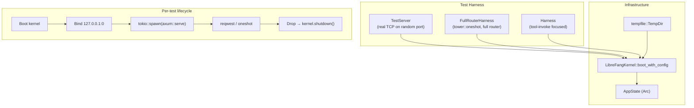

# Other — librefang-api-tests

# LibreFang API Integration Tests

## Overview

The `librefang-api/tests/` directory contains integration tests that exercise the full HTTP API stack end-to-end. Every test boots a real `LibreFangKernel`, binds an actual `axum` HTTP server to a random port, and fires real TCP requests via `reqwest`. There are no mocks, no in-memory router shortcuts, and no test-only shortcuts in the application code.

Tests that require a live LLM (e.g., sending a message through Groq and getting a response) are gated behind the `GROQ_API_KEY` environment variable and gracefully skip when the key is absent.

### Run commands

```bash
# All API integration tests
cargo test -p librefang-api --test api_integration_test -- --nocapture

# Load tests (includes some #[ignore] stress tests)
cargo test -p librefang-api --test load_test -- --nocapture

# Daemon lifecycle tests
cargo test -p librefang-api --test daemon_lifecycle_test -- --nocapture

# Tool invoke security tests
cargo test -p librefang-api --test tools_invoke_test -- --nocapture

# OpenAPI spec generation
cargo test -p librefang-api --test openapi_spec_test -- --nocapture

# Include ignored (flaky) stress tests
cargo test -p librefang-api -- --include-ignored -- --nocapture
```

---

## Architecture



---

## Test Harness Infrastructure

### `TestServer` — real TCP server

Defined in `api_integration_test.rs` and `load_test.rs`. Boots a kernel, constructs a full `AppState`, mounts a minimal or full route set on an `axum::Router`, binds to `127.0.0.1:0` (OS-assigned random port), and spawns the server in a background tokio task.

The `Drop` impl calls `state.kernel.shutdown()`, ensuring clean teardown even if a test panics. The `_tmp: tempfile::TempDir` field keeps the temporary home directory alive for the test's duration and cleans it up on drop.

Three factory functions exist:

| Function | Provider | Use case |
|---|---|---|
| `start_test_server()` | ollama (no key needed) | Most tests — kernel boots without LLM credentials |
| `start_test_server_with_llm()` | groq / `GROQ_API_KEY` | Tests that need a real LLM round-trip |
| `start_test_server_with_provider()` | arbitrary | Configurable provider for specialized tests |
| `start_test_server_with_auth(api_key)` | ollama + Bearer token | Auth middleware integration tests |

### `FullRouterHarness` — in-process router

Defined in `api_integration_test.rs`. Uses `server::build_router()` to construct the same router the production daemon uses, including versioned API aliases (`/api/v1/*`), dashboard locale serving, provider endpoints, and API key middleware. Tests hit this via `tower::ServiceExt::oneshot` — no TCP involved. This catches routing, middleware, and versioning bugs that a minimal test router would miss.

### `Harness` — tool-invoke security harness

Defined in `tools_invoke_test.rs`. Minimal router mounting only `POST /api/tools/{name}/invoke`. Accepts a `ToolInvokeConfig` parameter so each test can control whether the endpoint is enabled, which tools are allowlisted, etc. Uses `tower::oneshot` for speed.

---

## Test Files

### `api_integration_test.rs`

The largest test file. Covers the core API surface:

**Health and status**
- `test_health_endpoint` — public health returns `{ "status": "ok" }`, redacted details, includes `x-request-id`
- `test_status_endpoint` — returns running state, agent count, uptime, default provider
- `test_request_id_header_is_uuid` — validates the UUID format

**API versioning**
- `test_build_router_exposes_versioned_api_aliases` — both `/api/health` and `/api/v1/health` work, `x-api-version: v1` header present
- `test_build_router_path_version_beats_unknown_accept_header` — path-based version wins over content negotiation
- `test_build_router_unauthorized_responses_include_api_version_header` — even 401s carry the version header

**Agent lifecycle**
- `test_spawn_list_kill_agent` — full CRUD cycle: spawn → list (find by name) → kill → verify removal
- `test_multiple_agents_lifecycle` — spawn 3 agents, verify counts, kill incrementally
- `test_agent_session_empty` — newly spawned agent has zero messages
- `test_agent_monitoring_endpoints` — `/metrics` returns token usage and tool call stats; `/logs` supports level filtering
- `test_send_message_with_llm` — gated behind `GROQ_API_KEY`; sends a message, verifies non-empty response and token counts

**Pagination, sorting, search** (agent list)
- `test_agent_list_paginated_response_format` — `{ items, total, offset, limit }`
- `test_agent_list_invalid_sort_returns_400` — typo in `sort=` parameter
- `test_agent_list_valid_sort_fields` — `name`, `created_at`, `last_active`, `state`
- `test_agent_list_limit_clamped_to_max` — `limit=9999` clamped to 100
- `test_agent_list_pagination` — offset/limit cursor through results
- `test_agent_list_text_search` — `q=` parameter filters by name/description

**Workflows and triggers**
- `test_workflow_crud` — create, list, verify step count
- `test_trigger_crud` — create with `lifecycle` pattern, list (unfiltered and filtered by `agent_id`), delete, verify empty

**Error handling**
- `test_invalid_agent_id_returns_400` — non-UUID path parameter on message/kill/session
- `test_kill_nonexistent_agent_returns_404` — valid UUID that doesn't exist
- `test_spawn_invalid_manifest_returns_400` — malformed TOML in manifest

**Authentication**
- `test_auth_health_is_public` — `/api/health` accessible without token
- `test_auth_rejects_no_token` — protected endpoint without header → 401 "Missing"
- `test_auth_rejects_wrong_token` — wrong Bearer token → 401 "Invalid"
- `test_auth_accepts_correct_token` — correct token → 200
- `test_auth_disabled_when_no_key` — empty API key means auth disabled entirely

**MCP bridge** (`/mcp` endpoint)
- `test_mcp_http_rehydrates_caller_context_from_agent_header` — `X-LibreFang-Agent-Id` header restores caller identity; without it, tools requiring agent context fail
- `test_mcp_http_invalid_agent_header_falls_back_to_unauthenticated` — garbage/unknown UUID degrades gracefully
- `test_mcp_http_unrestricted_agent_can_call_any_tool` — manifest with no `[capabilities]` section means all tools allowed
- `test_mcp_http_enforces_agent_tool_allowlist` — agent without `cron_list` in capabilities is denied even through `/mcp`

**Providers and localization**
- `test_build_router_providers_marks_local_providers` — Ollama is flagged `is_local: true`
- `test_build_router_serves_dashboard_locales` — `/locales/{en,zh-CN,ja}.json` return correct translations

**Migration and config**
- `test_run_migrate_uses_daemon_home_when_target_dir_is_empty` — OpenClaw migration writes to daemon home
- `test_config_reload_hot_reloads_proxy_changes` — proxy settings applied without restart; `hot_actions_applied` includes `ReloadProxy`

**Hands**
- `list_active_hands_includes_definition_metadata` — installs a hand definition, activates it, verifies the `/api/hands/active` response includes `hand_name`, `hand_icon`, `coordinator_role`, and `agent_ids`

---

### `daemon_lifecycle_test.rs`

Tests the daemon startup/shutdown lifecycle:

- `test_daemon_info_serde_roundtrip` — `DaemonInfo` serializes to JSON and back
- `test_read_daemon_info_from_file` — reads `daemon.json` from disk
- `test_read_daemon_info_missing_file` — returns `None` for absent file
- `test_read_daemon_info_corrupt_json` — returns `None` for invalid JSON
- `test_full_daemon_lifecycle` — boot kernel, start server, write daemon info, hit health/status, call shutdown, verify file cleanup
- `test_stale_daemon_info_detection` — reads file with implausible PID (stale detection is the caller's responsibility)
- `test_server_immediate_responsiveness` — health endpoint responds in <1s from server start

---

### `tools_invoke_test.rs`

Security-focused tests for `POST /api/tools/{name}/invoke`. Each test configures a different `ToolInvokeConfig` to exercise a specific access-control branch:

| Test | Config | Expected |
|---|---|---|
| `test_invoke_disabled_returns_403` | `enabled: false` (default) | 403 |
| `test_invoke_tool_not_in_allowlist_returns_403` | `enabled: true, allowlist: ["notify_owner"]` | 403 for `web_search` |
| `test_invoke_unknown_tool_returns_404` | `enabled: true, allowlist: ["*"]` | 404 |
| `test_invoke_approval_gated_without_agent_id_returns_400` | `enabled: true, allowlist: ["shell_exec"]` | 400 (no `?agent_id=`) |
| `test_invoke_malformed_agent_id_returns_400` | `enabled: true, allowlist: ["notify_owner"]` | 400 for `?agent_id=not-a-uuid` |
| `test_invoke_allowlisted_non_approval_tool_succeeds` | `enabled: true, allowlist: ["notify_owner"]` | 200 |
| `test_invoke_writes_audit_entry` | `enabled: true, allowlist: ["notify_owner"]` | 200 + `AuditAction::ToolInvoke` entry |
| `test_invoke_file_read_uses_plumbed_workspace_root` | `enabled: true, allowlist: ["file_read"]` | 200, reads file from sandbox |

---

### `load_test.rs`

Performance and concurrency tests. Most print throughput/latency metrics to stderr (visible with `--nocapture`):

- `load_endpoint_latency` — measures p50/p95/p99 for 8 GET endpoints over 100 requests each; gates on p95 < 1s
- `load_concurrent_reads` — 50 simultaneous requests across health/agents/status/metrics
- `load_session_management` — creates 10 sessions, lists them, switches through them
- `load_workflow_operations` — 15 concurrent workflow creates, then list
- `load_metrics_sustained` — 200 sequential hits to `/api/metrics`, verifies Prometheus output
- `load_concurrent_agent_spawns` — `#[ignore]` 20 parallel agent spawns
- `load_spawn_kill_cycle` — `#[ignore]` 10 sequential spawn+kill cycles

The `#[ignore]` tests have known race conditions in the agent registry under high concurrency and are excluded from normal CI runs.

---

### `openapi_spec_test.rs`

Single test that generates the full OpenAPI spec from `utoipa` annotations, validates it has 100+ paths, and writes it to `<repo_root>/openapi.json` for SDK codegen and CI consumption.

---

## Conventions and Patterns

**Temp directory lifecycle.** Every harness stores a `tempfile::TempDir` in a `_tmp` field. The leading underscore is intentional — the field is never read, but dropping it cleans up the kernel's home directory. The `Drop` impl on each harness struct calls `kernel.shutdown()` to stop async workers.

**Multi-threaded tokio runtime.** All async tests use `#[tokio::test(flavor = "multi_thread")]` because the kernel spawns background tasks that require a multi-threaded runtime.

**Manifest constants.** Test agent manifests (`TEST_MANIFEST`, `LLM_MANIFEST`, `MCP_TEST_MANIFEST`) are TOML strings embedded as constants. The ollama-based manifests don't make real LLM calls; the Groq-based manifest is only used when `GROQ_API_KEY` is set.

**Default assistant.** The kernel auto-spawns a default "assistant" agent on boot. Tests account for this by expecting `agent_count >= 1` and filtering by name when looking for test-spawned agents.

**Warmup rounds.** The latency test runs 10 warmup requests before measuring to avoid cold-start noise from lazy cache initialization, which caused flaky failures on Windows CI.