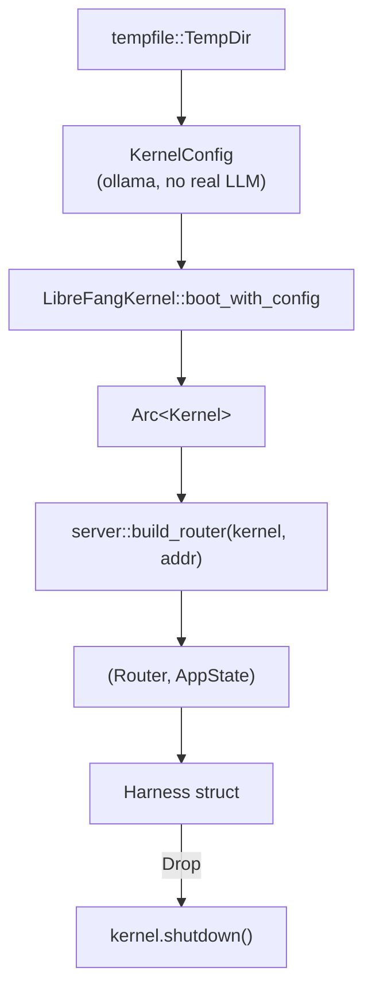

# Other — librefang-api-tests

# librefang-api-tests

Integration test suite for the LibreFang HTTP API. Tests exercise the production router, middleware stack, and kernel against real axum request handling — no mocks on the HTTP layer.

## Purpose

These tests close the gap between unit-tested handlers and a running production server. They verify that route registration, auth middleware, handler wiring, and response serialization all compose correctly end-to-end. They guard against regressions in auth policy, cross-agent isolation, input validation, and API contract shape.

## Test Strategies

The suite uses two complementary approaches:

| Strategy | Mechanism | When used |
|----------|-----------|-----------|
| **In-process** | `tower::ServiceExt::oneshot` against the production `Router` | Route-family tests (agents, A2A, authz, workflows, users, budgets, channels) |
| **Real HTTP** | `tokio::net::TcpListener` on port 0 + `reqwest::Client` | Broad integration tests, SSE streaming, multi-client fan-out, cookie-based sessions |

In-process tests are faster and avoid port allocation. Real-HTTP tests are necessary when the behavior depends on HTTP-level concerns (SSE framing, `Content-Disposition` headers, streaming chunk boundaries).

## Harness Architecture

Every test file follows the same harness pattern:



### Key harness responsibilities

1. **Isolated filesystem** — `tempfile::TempDir` provides a fresh home directory per test. The `TempDir` is stored in the harness (as `_tmp`) so it lives for the test duration and cleans up on drop.

2. **Registry sync** — `librefang_runtime::registry_sync::sync_registry` populates the model catalog cache into the temp directory so the kernel boots without network access.

3. **Fake LLM provider** — All harnesses configure `provider: "ollama"` with `model: "test-model"`. No real API keys are needed. Tests requiring actual LLM responses gate behind `GROQ_API_KEY` and use `start_test_server_with_llm()`.

4. **Self-handle** — `kernel.set_self_handle()` is called after boot, matching production initialization order.

5. **Cleanup** — The `Drop` impl calls `kernel.shutdown()`, ensuring background tasks (audit writers, stream hubs) terminate between tests.

### Common harness helpers

| Helper | Purpose |
|--------|---------|
| `send(harness, method, path, body, authed)` | In-process oneshot with optional Bearer header; returns `(StatusCode, Value)` |
| `get(path)` / `get_with(path, bearer)` | Builder for GET requests |
| `patch_json(path, body, bearer)` | Builder for PATCH with JSON content-type |
| `spawn_named(state, name)` | Kernel-level agent spawn for test setup |
| `auth_header(harness)` | Extracts `(key, value)` for Bearer auth |
| `loopback_get(uri)` | GET with injected `ConnectInfo` (loopback addr) for auth middleware bypass |

## Test Files and Coverage

### Route-family tests (in-process, `tower::oneshot`)

| File | Route prefix | Key behaviors tested |
|------|-------------|---------------------|
| `agents_routes_integration.rs` | `/api/agents` | List (filter, pagination, sort), GET by ID (valid/invalid/unknown), PATCH (name/description update, validation, read-after-write), auth gate |
| `a2a_routes_integration.rs` | `/api/a2a/*` | Agent list (empty envelope, public-read policy), GET by ID (404, auth), discover (missing URL, invalid URL, SSRF guard), send (validation, trust gate), task status (validation, trust gate, auth), approve (unknown→404, auth) |
| `workflows_routes_integration.rs` | `/api/workflows/*`, `/api/cron/*`, `/api/schedules/*` | CRUD, template instantiate/save, cron job list/delete, schedule GET, invalid ID handling |
| `authz_routes_integration.rs` | `/api/authz/*` | Effective permissions, channel-scoped queries, explicit deny |
| `users_test.rs` | `/api/users/*` | Create (duplicate rejection, invalid role), list (summary flags, no policy leak), update, import, policy PUT/GET round-trip, key rotation (persists hash, invalidates sessions, snapshot consistency), RBAC policy field preservation |
| `budget_routes_test.rs` | `/api/budget/*` | Agent budget status (percentages, limits, resource quotas) |
| `network_routes_integration.rs` | `/api/network/*` | Peer registration and lookup |
| `channels_routes_test.rs` | `/api/channels/*` | Channel CRUD with various configs |
| `channel_webhooks_test.rs` | Webhook routes | Webhook delivery and verification |
| `approvals_routes_integration.rs` | Approval routes | Approval workflow |
| `system_tools_sessions_test.rs` | Session tools | Session listing with pagination, agent-scoped isolation |
| `totp_flow_test.rs` | TOTP enrollment | Setup, confirm, revoke flows |
| `pairing_test.rs` | Pairing routes | Device pairing lifecycle |
| `daemon_lifecycle_test.rs` | `/api/shutdown`, startup | Full daemon boot → serve → shutdown cycle, immediate responsiveness |

### Broad integration tests (real HTTP, `reqwest`)

`api_integration_test.rs` covers cross-cutting concerns that require a real HTTP server:

| Test area | What's verified |
|-----------|----------------|
| **Health/Status** | `/api/health` returns `{"status":"ok"}` with version, no sensitive fields; `/api/status` returns agent count, uptime, provider |
| **API versioning** | `/api/v1/*` aliases work; `x-api-version: v1` header on all responses including 401; `/api/versions` endpoint; path version beats `Accept` header |
| **Locales** | Dashboard locale files (`/locales/{lang}.json`) serve correct translations |
| **Providers** | `/api/providers` marks local providers (`is_local: true`) |
| **Agent lifecycle** | Spawn → list → kill → verify removal; multiple agents; auto-spawned default assistant |
| **Sessions** | Empty session, cross-agent session isolation (agent A cannot read agent B's session via `?session_id=`), malformed UUID → 400 |
| **Trajectory export** | JSON and JSONL formats; `Content-Disposition` header; metadata fields (schema_version, system_prompt_sha256); 404 on unknown session |
| **Monitoring** | `/api/agents/{id}/metrics` (token usage, tool calls, response time), `/api/agents/{id}/logs` with level filtering |
| **Triggers/Workflows** | Full CRUD lifecycle; workflow list includes `run_count`, `last_run`, `success_rate` (null before first run) |
| **Tools** | List tools, get tool by name (with `input_schema`), 404 on unknown |
| **Config reload** | Hot-reload proxy changes without restart (`ReloadProxy` in `hot_actions_applied`) |
| **Migration** | OpenClaw import writes config + agent + report to daemon home |
| **Pagination** | `limit`/`offset` parameters; limit clamped to max (500); text search (`q=` parameter) |
| **Auth** | Public routes (health, status) vs protected; Bearer token validation; auth disabled when no key configured |
| **Hands** | `/api/hands/active` enriched response (hand_name, hand_icon, coordinator_role, agent_ids); hand runtime config PATCH (tri-state: set/preserve/clear nullable fields) |
| **MCP bridge** | `/mcp` rehydrates caller context from `X-LibreFang-Agent-Id` header; unrestricted agents can call any tool; tool allowlist enforced; invalid/unknown agent IDs degrade gracefully |
| **SSE streaming** | Multi-client fan-out via `/api/agents/{id}/sessions/{sid}/stream`; broadcast to N subscribers; 404 for unknown agent |
| **Memory** | `/api/memory` and `/api/memory/stats` return 200 with `proactive_enabled: false` when disabled (not 500) |
| **RBAC** | Audit query/export rejects anonymous and non-admin; CSV export headers; budget user detail includes `enforced` flag |

## Auth Middleware Interaction

Tests exercise three distinct auth configurations:

1. **No api_key** (`boot("")`) — Open dev mode. Public routes (`PUBLIC_ROUTES_DASHBOARD_READS`) are accessible without credentials. Non-public routes are also accessible when `require_auth_for_reads` is false.

2. **api_key set** (`boot("test-secret")`) — Production mode. Requests without `Bearer` header get 401 on non-public routes. The `ConnectInfo` extension determines loopback fast-path (in-process oneshot has no `ConnectInfo`, so requests are treated as remote).

3. **RBAC users** (`start_test_server_with_rbac_users`) — User-level auth with role-based access. Tests pin the two-layer defense: middleware checks Bearer validity, then in-handler `require_admin` gates sensitive endpoints against viewer/limited roles.

### Injecting loopback context

For in-process tests that need to match production localhost behavior:

```rust
fn loopback_get(uri: &str) -> Request<Body> {
    let mut request = Request::builder().uri(uri).body(Body::empty()).unwrap();
    request.extensions_mut().insert(axum::extract::ConnectInfo(
        std::net::SocketAddr::from(([127, 0, 0, 1], 0)),
    ));
    request
}
```

Without this, `tower::oneshot` requests have no `ConnectInfo` extension and the auth middleware treats them as non-loopback.

## Security Regression Guards

Several tests exist specifically to prevent security regressions:

- **`send_to_untrusted_url_blocked_by_trust_gate`** — Guards against regression from #3786 where A2A `/send` bypassed the trust check.
- **`test_get_agent_session_rejects_cross_agent_session_id`** — Prevents one agent from reading another's conversation by guessing a session UUID (PR #3071).
- **`discover_localhost_url_blocked_by_ssrf_guard`** — Ensures SSRF protection blocks localhost URLs before any outbound socket.
- **`test_mcp_http_enforces_agent_tool_allowlist`** — Prevents privilege escalation through the MCP bridge.
- **`test_audit_query_rejects_viewer_admin_returns_200`** — Pins the in-handler `require_admin` gate so a middleware refactor can't silently expose the audit chain to viewers.

## Running

```bash
# All API integration tests
cargo test -p librefang-api

# Specific test file
cargo test -p librefang-api --test a2a_routes_integration
cargo test -p librefang-api --test agents_routes_integration
cargo test -p librefang-api --test api_integration_test

# LLM-requiring test (needs GROQ_API_KEY)
GROQ_API_KEY=... cargo test -p librefang-api --test api_integration_test -- test_send_message_with_llm
```

All tests use `#[tokio::test(flavor = "multi_thread")]` because the kernel spawns background tasks that require a multi-threaded runtime.

## Dependencies on Other Crates

| Crate | Role in tests |
|-------|--------------|
| `librefang-api` | Production router (`server::build_router`), route handlers, middleware, `AppState` |
| `librefang-kernel` | `LibreFangKernel::boot_with_config`, agent registry, audit, session stream hub, hands subsystem, auth roles |
| `librefang-types` | `AgentId`, `AgentManifest`, `KernelConfig`, `DefaultModelConfig`, `UserConfig`, `WebSearchAugmentationMode`, `ProactiveMemoryConfig` |
| `librefang-runtime` | Registry sync (offline boot), audit actions, LLM stream events |
| `librefang-testing` | `MockKernelBuilder`, `TestAppState` (for real-HTTP server setup) |
| `tempfile` | Isolated temporary directories |
| `tower` | `ServiceExt::oneshot` for in-process requests |
| `reqwest` | HTTP client for real-server tests |