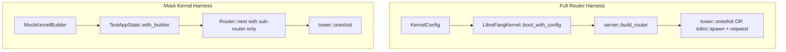

# Other — librefang-api-tests

# librefang-api Integration Tests

## Purpose

This directory contains **end-to-end integration tests** for the LibreFang HTTP API layer. Every test exercises the production router (`server::build_router`) with the full middleware stack—authentication, rate-limiting, error-envelope formatting, request logging, body-size limits—so that regressions in handler wiring, middleware ordering, or status-code mapping are caught before they reach a running daemon.

No test makes a real LLM call. The kernel boots with `provider: "ollama"` and a fake model name, making every test hermetic and fast.

## Running

```bash
# All integration tests in this crate
cargo test -p librefang-api --test '*'

# Single test file
cargo test -p librefang-api --test agents_routes_integration
cargo test -p librefang-api --test a2a_routes_integration
```

All tests use `#[tokio::test(flavor = "multi_thread")]` because the kernel spawns background tasks during boot.

## Architecture

### Two Harness Patterns


```mermaid
graph TD
    subgraph "Full Router Harness"
        A[KernelConfig] --> B[LibreFangKernel::boot_with_config]
        B --> C[server::build_router]
        C --> D["tower::oneshot OR tokio::spawn + reqwest"]
    end
    subgraph "Mock Kernel Harness"
        E[MockKernelBuilder] --> F[TestAppState::with_builder]
        F --> G["Router::nest with sub-router only"]
        G --> H["tower::oneshot"]
    end
```

**Full Router Harness** — Used by most test files (`agents_routes_integration`, `a2a_routes_integration`, `agent_identity_registry_test`, `agent_channels_routes_test`, `agents_capabilities_files_integration`, `agents_clone_bulk_integration`). Boots the real kernel and the complete production router. Tests send requests via `tower::ServiceExt::oneshot` (no network) or, for the identity registry tests, spawn a real TCP listener and use `reqwest`.

**Mock Kernel Harness** — Used by `access_log_agent_id_test`, `access_log_session_id_test`, and `agent_kv_authz_integration`. Uses `librefang_testing::MockKernelBuilder` and `TestAppState` to boot a lighter-weight kernel, then mounts only the relevant sub-router. Auth middleware is NOT in play; tests inject `AuthenticatedApiUser` directly into request extensions when needed.

### Common Helpers

| Helper | Purpose |
|--------|---------|
| `spawn_named(state, name)` | Creates an agent via `kernel.spawn_agent_typed(AgentManifest { name, .. })` and returns its `AgentId` |
| `send(app, req)` | Fires a request through `app.clone().oneshot(req)`, returns `(StatusCode, serde_json::Value)` |
| `get(path)` / `post_json(path, body)` / `put_json(path, body)` / `delete(path)` | Build authenticated `Request<Body>` with the `Authorization: Bearer` header pre-set |
| `auth_header(h)` | Returns `(String, String)` tuple for the Bearer header — used in A2A tests |

### Temp Directory Lifecycle

Full-router tests create a `tempfile::TempDir` stored in the `Harness` struct. On `Drop`, `kernel.shutdown()` is called before the temp directory is cleaned up. The `registry_sync::sync_registry` call populates the model catalog cache so the kernel boots without network access.

## Test Files

### `a2a_routes_integration.rs`

**Routes covered:**
- `GET /a2a/agents` — public federation listing (no `/api/` prefix, always public)
- `GET /api/a2a/agents` — dashboard-scoped listing
- `GET /api/a2a/agents/{id}` — single agent detail
- `POST /api/a2a/discover` — discover remote agents
- `POST /api/a2a/send` — send message to remote agent
- `GET /api/a2a/tasks/{id}/status` — poll outbound task status
- `POST /api/a2a/agents/{id}/approve` — approve a pending agent

**Key behaviors tested:**
- Canonical `PaginatedResponse{items,total,offset,limit}` envelope shape — the legacy `{agents,total}` field must not coexist
- Public routes (`/a2a/agents`) remain reachable even with an `api_key` configured
- SSRF guard blocks localhost URLs in `/discover`
- Trust gate blocks `/send` to unapproved targets before any outbound HTTP
- Auth gate: non-public routes return 401 without a valid token

Mutating endpoints that require real outbound HTTP (`/discover` happy path, `/send` happy path) are **intentionally out of scope** — they would need a live external A2A server.

### `access_log_agent_id_test.rs`

Tests that `AgentIdField` is present in `response.extensions()` for routes that parse an agent ID from the path. The access-log middleware reads this marker to emit a structured `agent_id` field.

- **404 path**: even when the agent doesn't exist, the handler must tag the response with the parsed ID
- **Malformed path**: `AgentIdPath` extractor rejects with 400 before the handler runs — no marker is set (correct behavior)
- Covers `PUT /api/auto-dream/agents/{id}/enabled` and `GET /api/budget/agents/{id}`

### `access_log_session_id_test.rs`

Companion to the agent ID tests. Validates `SessionIdField` in response extensions.

- `GET /api/agents/{id}/session` — marker present on success/404 when the agent exists
- Unknown agent → marker absent (no session was resolved)
- SSE stream endpoint (`GET /api/agents/{id}/sessions/{session_id}/stream`) — marker absent on 404 since the stream never starts

### `agent_channels_routes_test.rs`

**Routes:** `GET` and `PUT /api/agents/{id}/channels`

- Fresh agent returns `{assigned: [], mode: "all"}` (backward-compatible default)
- PUT-then-GET round-trip persists an allowlist (`mode: "allowlist"`)
- PUT with empty array clears the allowlist, reverts to `mode: "all"`
- Non-UUID agent ID → 400; valid but unknown UUID → 404 on GET, 400 on PUT

### `agent_identity_registry_test.rs`

**Routes:**
- `POST /api/agents` (spawn — registers canonical UUID)
- `DELETE /api/agents/{id}` (confirm gate)
- `GET /api/agents/identities`
- `POST /api/agents/identities/{name}/reset` (confirm gate)

Uses a **real TCP listener** with `reqwest` (not `oneshot`) to test the full network path including `into_make_service_with_connect_info`.

**Key behaviors:**
- Spawn registers a deterministic UUID via `AgentId::from_name`
- `DELETE` without `?confirm=true` returns 409 with warning about canonical UUID irreversibility; the binding survives
- `DELETE` with confirm purges the binding; a re-spawn recovers the same deterministic UUID
- `reset` endpoint also gates on `?confirm=true`
- Auth layer test: with a configured `api_key`, unauthenticated writes are rejected 401 and reads of `/api/agents/identities` are also gated (it is not in the dashboard-reads allowlist)

### `agent_kv_authz_integration.rs`

Tests owner-scoping on per-agent KV store endpoints. Uses mock kernel harness with direct `AuthenticatedApiUser` injection.

**Routes tested:**
- `GET /api/memory/agents/{id}/kv` (list)
- `GET/PUT/DELETE /api/memory/agents/{id}/kv/{key}` (single key)
- `GET /api/agents/{id}/memory/export`
- `POST /api/agents/{id}/memory/import`

**Authorization matrix:**
| Caller | Own agent | Other agent |
|--------|-----------|-------------|
| Admin | ✓ (200) | ✓ (200) |
| Owner (viewer role) | ✓ (200) | ✗ (404) |
| Non-owner (viewer role) | ✗ (404) | ✗ (404) |
| Anonymous (no middleware) | ✓ (200)* | ✓ (200)* |

\* The owner-check helper intentionally fails open when no `AuthenticatedApiUser` is present — the global auth middleware enforces the gate in production.

### `agents_capabilities_files_integration.rs`

**Files routes:**
- `GET/PUT/DELETE /api/agents/{id}/files/{filename}` — identity file CRUD
- `GET /api/agents/{id}/files` — list identity files

**Capabilities routes:**
- `GET/PUT /api/agents/{id}/tools`
- `GET/PUT /api/agents/{id}/skills`
- `GET/PUT /api/agents/{id}/mcp_servers`

**Security-critical tests:**
- Path traversal (`../../etc/passwd`) rejected with 400 by the filename whitelist (`KNOWN_IDENTITY_FILES`) before any filesystem operation
- Non-whitelisted filenames also rejected with 400
- After traversal rejection, read-back confirms nothing was written outside the workspace
- Unknown agent on write → 404 (not 500)

### `agents_clone_bulk_integration.rs`

**Routes covered:**
- `POST /api/agents/{id}/clone` — clone with optional `include_skills` flag
- `POST /api/agents/{id}/reload` — reload manifest from disk
- `POST /api/agents/{id}/push` — push message through channel adapter
- `POST /api/agents/bulk` — bulk create
- `DELETE /api/agents/bulk` — bulk delete
- `POST /api/agents/bulk/start` — bulk set to Full mode
- `POST /api/agents/bulk/stop` — bulk stop active runs

**Notable tests:**
- Duplicate clone name → 409 Conflict (not 500)
- Clone with `include_skills: false` strips skills and sets `skills_disabled: true`
- Reload test plants an `agent.toml` at `<home>/workspaces/agents/<name>/agent.toml` and verifies the kernel picks up the change
- Push happy path is not tested (needs a live channel adapter); 502 BAD_GATEWAY is asserted when no adapter is wired
- Bulk size guard rejects >50 entries with 400 before any spawn
- Bulk operations report per-row success/failure rather than failing the entire batch

### `agents_routes_integration.rs`

Core agent CRUD and lifecycle routes.

**Routes covered:**
- `GET /api/agents` — list with pagination and filtering
- `GET /api/agents/{id}` — single agent detail
- `PATCH /api/agents/{id}` — partial update (name, description, schedule, system prompt)
- `PUT /api/agents/{id}/suspend` — suspend agent
- `PUT /api/agents/{id}/resume` — resume agent
- `PUT /api/agents/{id}/mode` — set agent mode
- `DELETE /api/agents/{id}` — delete (with confirm gate)
- `POST /api/agents` — spawn from manifest TOML

**Key patterns:**
- Invalid UUID in path → 400 with `code: "invalid_agent_id"`
- Unknown valid UUID → 404 (not 500)
- Read-after-write: PATCH/PUT followed by GET to confirm persistence
- PATCH rejects invalid schedule strings with 400
- Spawn rejects workspace paths that escape the home directory (path traversal defense)
- DELETE is idempotent — deleting twice returns 200 both times
- Unauthenticated mutation → 401

## Conventions

1. **Status codes over error text**: Assertions primarily check HTTP status codes. Error envelope shape (`body["error"]` or `body["message"]`) is checked for existence, not exact wording.

2. **Not 500**: Several tests explicitly assert `status != INTERNAL_SERVER_ERROR` to catch the common regression where a kernel error is incorrectly mapped to a blanket 500 instead of the appropriate 4xx.

3. **Confirm gates**: Any destructive operation (delete agent, reset identity) requires `?confirm=true`. Tests assert both the rejected case (409) and the confirmed case (200).

4. **Auth gate tests**: Most test files include at least one test that sends a request without a Bearer token and asserts 401, confirming the route is not accidentally on a public allowlist.

5. **Hermetic agents**: Agents spawned in tests use `AgentManifest::default()` with a unique name. The kernel's auto-spawned default assistant is excluded by using specific `q=` filters when testing the "empty" case.