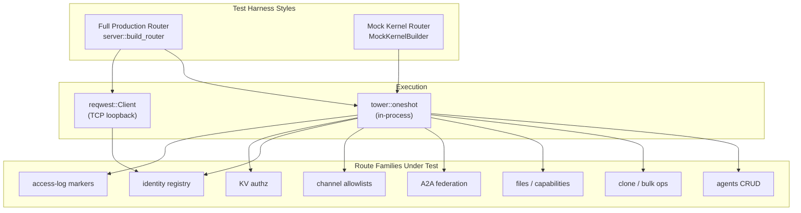

# Other — librefang-api-tests

# librefang-api Integration Tests

## Overview

This is the integration test suite for the `librefang-api` HTTP layer. It exercises the **production router** — real middleware stack, real route registration, real handler wiring — without making any outbound network calls or LLM requests. Every test is hermetic and runs against a temporary directory that is cleaned up on drop.


```mermaid
graph TD
    subgraph "Test Harness Styles"
        A["Full Production Router<br/>server::build_router"]
        B["Mock Kernel Router<br/>MockKernelBuilder"]
    end
    subgraph "Execution"
        C["tower::oneshot<br/>(in-process)"]
        D["reqwest::Client<br/>(TCP loopback)"]
    end
    A --> C
    A --> D
    B --> C
    subgraph "Route Families Under Test"
        E[agents CRUD]
        F[clone / bulk ops]
        G[files / capabilities]
        H[A2A federation]
        I[channel allowlists]
        J[identity registry]
        K[KV authz]
        L[access-log markers]
    end
    C --> E
    C --> F
    C --> G
    C --> H
    C --> I
    C --> J
    C --> K
    C --> L
    D --> J
```

## Running

```bash
# All integration tests in this crate
cargo test -p librefang-api

# Individual test files
cargo test -p librefang-api --test agents_routes_integration
cargo test -p librefang-api --test a2a_routes_integration
cargo test -p librefang-api --test agent_identity_registry_test
# ... etc
```

All tests use `#[tokio::test(flavor = "multi_thread")]` because the kernel's async runtime requires a multi-threaded Tokio context.

## Harness Architecture

There are two harness styles, chosen based on what the test needs to exercise.

### Full Production Router

Used by most test files. Boots the real `LibreFangKernel` and the full `server::build_router` including auth middleware, rate limiting, error envelope, and body-size layers.

```rust
async fn boot(api_key: &str) -> Harness {
    let tmp = tempfile::tempdir().expect("tempdir");

    // Pre-populate registry cache so kernel boots without network
    librefang_kernel::registry_sync::sync_registry(tmp.path(), /* ... */);

    let config = KernelConfig {
        home_dir: tmp.path().to_path_buf(),
        api_key: api_key.to_string(),
        default_model: DefaultModelConfig { provider: "ollama", /* ... */ },
        ..KernelConfig::default()
    };

    let kernel = Arc::new(LibreFangKernel::boot_with_config(config).expect("kernel boot"));
    kernel.set_self_handle();

    let (app, state) = server::build_router(kernel, "127.0.0.1:0".parse().unwrap()).await;
    Harness { app, state, _tmp: tmp }
}
```

Key properties:
- **`tempfile::TempDir`** — each test gets an isolated home directory; dropped on harness drop
- **`provider: "ollama"` with fake model** — no real LLM calls
- **`api_key` parameter** — empty string enables dev-mode (no auth required); non-empty enables bearer-token auth, letting tests assert 401 behavior
- **`kernel.shutdown()`** called in `Harness::drop` to clean up background tasks

Requests are sent via `tower::ServiceExt::oneshot` (in-process, no TCP):

```rust
async fn send(app: Router, req: Request<Body>) -> (StatusCode, serde_json::Value) {
    let resp = app.oneshot(req).await.expect("oneshot");
    let status = resp.status();
    let bytes = axum::body::to_bytes(resp.into_body(), usize::MAX).await.expect("body");
    let json = serde_json::from_slice(&bytes).unwrap_or(Value::Null);
    (status, json)
}
```

### TCP Loopback Server

Used by `agent_identity_registry_test.rs` where the test needs a real HTTP client (e.g., to verify `ConnectInfo<SocketAddr>` injection for loopback auth bypass). The harness binds a random loopback port and spawns `axum::serve` in a background task:

```rust
async fn start_full_router(api_key: &str) -> TestServer {
    // ... kernel boot ...
    let (app, state) = server::build_router(kernel, addr).await;
    let listener = tokio::net::TcpListener::bind("127.0.0.1:0").await.unwrap();
    let addr = listener.local_addr().unwrap();

    tokio::spawn(async move {
        axum::serve(
            listener,
            app.into_make_service_with_connect_info::<SocketAddr>(),
        )
        .await
        .unwrap();
    });

    TestServer { base_url: format!("http://{}", addr), state, _tmp }
}
```

Tests then use `reqwest::Client` to make real HTTP requests.

### Mock Kernel Router

Used by `access_log_agent_id_test.rs`, `access_log_session_id_test.rs`, and `agent_kv_authz_integration.rs` — tests that don't need the full middleware stack but do need route-specific handler wiring:

```rust
fn boot_agents() -> Harness {
    let test = TestAppState::with_builder(MockKernelBuilder::new().with_config(|cfg| { /* ... */ }));
    let state = test.state.clone();
    let app = Router::new()
        .nest("/api", routes::agents::router())
        .with_state(state);
    Harness { app, _test: test }
}
```

This nests only the route module under test, without the global auth middleware. Tests that need to inject `AuthenticatedApiUser` do so by inserting it directly into `request.extensions_mut()`.

## Test Files and Route Coverage

### `agents_routes_integration.rs` — Core Agent CRUD + Lifecycle

| Route | What's tested |
|---|---|
| `GET /api/agents` | Empty listing, populated listing with filters |
| `GET /api/agents/{id}` | Happy path, invalid UUID → 400, unknown → 404 |
| `PATCH /api/agents/{id}` | Field update + read-after-write, unknown → 404, auth gate → 401 |
| `PUT /api/agents/{id}/suspend` | State transitions to Suspended |
| `PUT /api/agents/{id}/resume` | State transitions to Running |
| `PUT /api/agents/{id}/mode` | Mode change persisted + read-after-write |

### `agents_clone_bulk_integration.rs` — Clone, Reload, Push, Bulk Ops

| Route | What's tested |
|---|---|
| `POST /api/agents/{id}/clone` | Independent copy, duplicate name → 409, unknown source → 404, `include_skills: false` stripping |
| `POST /api/agents/{id}/reload` | Disk manifest changes applied, unknown → 404 |
| `POST /api/agents/{id}/push` | Validation → 400, unknown → 404, no adapter → 502 |
| `POST /api/agents/bulk` | Multi-create + read-back, empty array → 400, oversize → 400 |
| `DELETE /api/agents/bulk` | Multi-delete, per-row failure reporting |
| `POST /api/agents/bulk/start` | Sets Full mode, unknown → per-row failure |
| `POST /api/agents/bulk/stop` | No-op success for inactive agents |

Bulk operations enforce a size limit (50 entries). Requests exceeding this get 400 before any kernel interaction.

### `agents_capabilities_files_integration.rs` — Files, Tools, Skills, MCP Servers

| Route | What's tested |
|---|---|
| `GET/PUT /api/agents/{id}/files/{filename}` | Write + read round-trip, delete + read-back gone |
| Path traversal defense | `../../etc/passwd` → 400 (whitelist boundary, not just `..` detection) |
| Non-whitelisted filenames | → 400 |
| `GET/PUT /api/agents/{id}/tools` | Allowlist + blocklist round-trip, empty body → 400 |
| `GET/PUT /api/agents/{id}/skills` | Empty allowlist, valid allowlist with mode flip, unknown skill → 4xx |
| `GET/PUT /api/agents/{id}/mcp_servers` | Empty allowlist, mode = "none" |

The **path-traversal test** (`test_files_write_path_traversal_rejected_4xx`) is the highest-security-value test in the suite — it confirms `KNOWN_IDENTITY_FILES` whitelist rejection fires before any filesystem path resolution.

### `agent_channels_routes_test.rs` — Per-Agent Channel Allowlist

| Route | What's tested |
|---|---|
| `GET /api/agents/{id}/channels` | Default shape: empty assigned, mode = "all" |
| `PUT /api/agents/{id}/channels` | Round-trip set + read-back, clear reverts to "all" |
| Malformed agent ID | → 400 |
| Unknown agent | GET → 404, PUT → 400 |

### `agent_identity_registry_test.rs` — Canonical UUID Registry

Tests the identity registry at the API ↔ kernel boundary:

- `spawn_agent` registers a canonical UUID matching the agent's id
- `DELETE` without `?confirm=true` → 409 (preserves registry); with `confirm=true` → purges
- Respawn after confirmed delete recovers the same deterministic UUID via `AgentId::from_name`
- `GET /api/agents/identities` surfaces registry contents
- `POST /api/agents/identities/{name}/reset` gates on `?confirm=true`
- **Auth layer enforcement** — with a non-empty `api_key`, unauthenticated writes are rejected 401 (regression test for middleware bug #3558)

### `agent_kv_authz_integration.rs` — KV Store Owner-Scoping

Tests the `assert_kv_owner_or_admin` authorization helper for per-agent key-value storage:

- **List** (`GET /api/memory/agents/{id}/kv`) — admin reads any agent, viewer reads own only, other → 404
- **Single-key get/set/delete** — non-owner viewer → 404 on all three
- **Bulk export/import** — non-owner viewer → 404
- Anonymous (no `AuthenticatedApiUser` extension) — fails open (global middleware enforces auth separately)

The `AuthenticatedApiUser` is injected directly into request extensions since these tests use the mock-kernel harness without global auth middleware.

### `a2a_routes_integration.rs` — Agent-to-Agent Federation

| Route | What's tested |
|---|---|
| `GET /a2a/agents` | Public federation listing, canonical `PaginatedResponse` envelope, no legacy `agents` field |
| `GET /api/a2a/agents` | Dashboard listing, reachable in no-auth dev mode |
| `GET /api/a2a/agents/{id}` | Unknown → 404, requires auth |
| `POST /api/a2a/discover` | Missing URL → 400, invalid URL → 400, localhost → 400 (SSRF guard) |
| `POST /api/a2a/send` | Missing fields → 400, untrusted URL → 400 (trust gate) |
| `GET /api/a2a/tasks/{id}/status` | Missing URL param → 400, untrusted URL → 400 |
| `POST /api/a2a/agents/{id}/approve` | Unknown → 404, requires auth |

Mutating endpoints that would make real outbound HTTP (`/discover`, `/send`, `/tasks/{id}/status`) are only tested on their **validation, SSRF, and trust-gate** paths — happy-path discovery requires a live external A2A server and is intentionally out of scope.

### `access_log_agent_id_test.rs` & `access_log_session_id_test.rs` — Response Extension Markers

These test the contract between handlers and the access-log middleware:

- Handlers call `with_agent_id` / `with_session_id` to set `AgentIdField` / `SessionIdField` in `response.extensions()`
- The middleware reads these markers to emit structured `tracing` fields
- Tests assert on the extensions directly — they do **not** instrument a tracing subscriber
- On 404 for an unknown agent, `AgentIdField` is still present (the path was well-formed)
- On 400 for a malformed UUID, no marker is set (the handler never ran)
- `SessionIdField` is present only when a session was actually resolved

## Common Patterns

### Auth Token Handling

Tests that exercise the production router include a bearer token:

```rust
const TEST_TOKEN: &str = "test-secret";

fn get(path: &str) -> Request<Body> {
    Request::builder()
        .method(Method::GET)
        .uri(path)
        .header("authorization", format!("Bearer {TEST_TOKEN}"))
        .body(Body::empty())
        .unwrap()
}
```

To test the auth gate, send a request without the header and assert 401:

```rust
let req = Request::builder()
    .method(Method::PUT)
    .uri(format!("/api/agents/{id}/tools"))
    .body(Body::from(body.to_string()))
    .unwrap();
// No authorization header → 401
```

### Agent Spawning

Tests that need an agent in the registry use `spawn_agent_typed`:

```rust
fn spawn_named(state: &Arc<AppState>, name: &str) -> AgentId {
    let manifest = AgentManifest { name: name.to_string(), ..Default::default() };
    state.kernel.spawn_agent_typed(manifest).expect("spawn_agent")
}
```

For ownership-sensitive tests (KV authz), the manifest's `author` field determines ownership:

```rust
fn spawn_owned_by(state: &Arc<AppState>, name: &str, author: &str) -> AgentId {
    let manifest = AgentManifest {
        name: name.to_string(),
        author: author.to_string(),
        ..Default::default()
    };
    state.kernel.spawn_agent_typed(manifest).expect("spawn_agent")
}
```

### Registry Sync

Tests using the full production kernel call `sync_registry` to populate the model catalog cache before boot, avoiding network access:

```rust
librefang_kernel::registry_sync::sync_registry(
    tmp.path(),
    librefang_kernel::registry_sync::DEFAULT_CACHE_TTL_SECS,
    "",
);
```

### Skill Seeding

Tests exercising non-empty skill allowlists install a real `skill.toml` into the temp home directory and trigger a reload:

```rust
fn install_skill(home: &Path, name: &str) {
    let skill_dir = home.join("skills").join(name);
    fs::create_dir_all(&skill_dir).expect("mkdir");
    fs::write(skill_dir.join("skill.toml"), manifest_toml).expect("write");
}

// After install:
h.state.kernel.reload_skills();
```

## Design Decisions

**Why `tower::oneshot` instead of a real TCP server?** Most tests don't need a real HTTP client — `oneshot` is faster, simpler, and avoids port allocation. Tests that need `ConnectInfo<SocketAddr>` (loopback auth bypass) use the TCP variant.

**Why not test the tracing subscriber directly?** The middleware reads `response.extensions().get::<AgentIdField>()` — a one-liner. The only thing that can break is a handler forgetting to call `with_agent_id`. Asserting on extensions directly is the precise contract; testing through a subscriber would couple the test to subscriber configuration.

**Why mock kernel for some tests?** Tests that need fine-grained control over extensions (injecting `AuthenticatedApiUser`) or that only exercise a single route module benefit from the mock's simpler setup. Tests that need the full middleware stack (auth, rate-limit, error-envelope) use the production router.