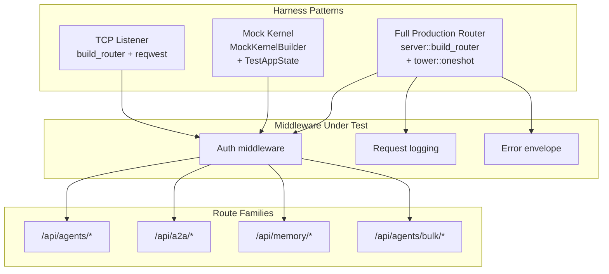

# Other — librefang-api-tests

# librefang-api-tests

Integration test suite for the LibreFang HTTP API layer. Every test exercises route handlers through the real router and middleware stack—either via `tower::ServiceExt::oneshot` against an in-process `axum::Router` or via `reqwest` against a live loopback TCP listener. No test makes outbound network calls or hits a real LLM provider.

## Architecture


```mermaid
graph TD
    subgraph "Harness Patterns"
        FP["Full Production Router<br/>server::build_router<br/>+ tower::oneshot"]
        MK["Mock Kernel<br/>MockKernelBuilder<br/>+ TestAppState"]
        TCP["TCP Listener<br/>build_router + reqwest"]
    end

    subgraph "Middleware Under Test"
        AUTH["Auth middleware"]
        LOG["Request logging"]
        ERR["Error envelope"]
    end

    subgraph "Route Families"
        AGENTS["/api/agents/*"]
        A2A["/api/a2a/*"]
        MEMORY["/api/memory/*"]
        BULK["/api/agents/bulk/*"]
    end

    FP --> AUTH
    FP --> LOG
    FP --> ERR
    MK --> AUTH
    TCP --> AUTH
    AUTH --> AGENTS
    AUTH --> A2A
    AUTH --> MEMORY
    AUTH --> BULK
```

## Test Files and Coverage

| File | Route Family | Issue Ref | Harness Type |
|---|---|---|---|
| `agents_routes_integration.rs` | CRUD + lifecycle (GET, PATCH, suspend, resume, mode) | #3571 | Full router |
| `agents_clone_bulk_integration.rs` | Clone, reload, push, bulk create/delete/start/stop | agents-mutation umbrella | Full router |
| `agents_capabilities_files_integration.rs` | Identity files, tools, skills, MCP servers | agents-mutation slice 2 | Full router |
| `agent_channels_routes_test.rs` | Per-agent channel allowlist (GET/PUT) | #4961 | Full router |
| `agent_identity_registry_test.rs` | Canonical UUID registry, delete confirm, respawn | #4614 | TCP + reqwest |
| `agent_kv_authz_integration.rs` | Owner-scoping on KV get/set/delete/export/import | #3749 | Mock kernel |
| `a2a_routes_integration.rs` | A2A federation, discover, send, trust gates, SSRF | #3571 | Full router |
| `access_log_agent_id_test.rs` | `AgentIdField` response extension marker | #3511 | Mock kernel |
| `access_log_session_id_test.rs` | `SessionIdField` response extension marker | #3511 | Mock kernel |

## Harness Patterns

### Full Production Router (most tests)

Boots `LibreFangKernel::boot_with_config` with a temp directory, then calls `server::build_router` to get the complete middleware stack. Requests are dispatched with `tower::oneshot`—no TCP listener needed.

```rust
struct Harness {
    app: axum::Router,
    state: Arc<AppState>,
    _tmp: tempfile::TempDir,
}

async fn boot(api_key: &str) -> Harness {
    let tmp = tempfile::tempdir().expect("tempdir");
    librefang_kernel::registry_sync::sync_registry(tmp.path(), /* ... */);
    let config = KernelConfig {
        home_dir: tmp.path().to_path_buf(),
        api_key: api_key.to_string(),
        default_model: DefaultModelConfig {
            provider: "ollama".to_string(),
            model: "test-model".to_string(),
            // ...
        },
        ..KernelConfig::default()
    };
    let kernel = Arc::new(LibreFangKernel::boot_with_config(config).expect("kernel boot"));
    kernel.set_self_handle();
    let (app, state) = server::build_router(kernel, "127.0.0.1:0".parse().unwrap()).await;
    Harness { app, state, _tmp: tmp }
}
```

Key details:
- **`_tmp` must be a named field**, not `_`. The `TempDir` is dropped when the struct drops, cleaning up the kernel's home directory.
- **`kernel.shutdown()` in `Drop`** ensures background tasks stop before the tempdir is removed.
- **`api_key` parameter** controls whether auth is enforced. Empty string `""` activates the single-user dev fast-path; a non-empty string requires `Bearer` tokens.

### Mock Kernel (authz / extension marker tests)

Uses `librefang_testing::MockKernelBuilder` and `TestAppState` for tests that don't need the full middleware pipeline. Route modules are mounted directly on a bare `Router::new().nest(...)`. The `AuthenticatedApiUser` extension is inserted manually to simulate the auth middleware.

```rust
fn boot() -> Harness {
    let test = TestAppState::with_builder(MockKernelBuilder::new());
    let state = test.state.clone();
    let app = Router::new()
        .nest("/api", routes::memory::router().merge(routes::agents::router()))
        .with_state(state.clone());
    Harness { app, state, _test: test }
}
```

### TCP Listener (identity registry tests)

Binds a real `tokio::net::TcpListener` on `127.0.0.1:0` and serves the router with `into_make_service_with_connect_info::<SocketAddr>()`. This is necessary because the auth middleware reads `ConnectInfo<SocketAddr>` to determine loopback vs. remote callers.

```rust
async fn start_full_router(api_key: &str) -> TestServer {
    // ... kernel boot ...
    let listener = tokio::net::TcpListener::bind("127.0.0.1:0").await.unwrap();
    let addr = listener.local_addr().unwrap();
    tokio::spawn(async move {
        axum::serve(listener, app.into_make_service_with_connect_info::<SocketAddr>()).await.unwrap();
    });
    TestServer { base_url: format!("http://{}", addr), state, _tmp: tmp }
}
```

## Request Helpers

Every test file provides a small set of typed request builders:

| Helper | Purpose |
|---|---|
| `send(app, req)` | Dispatch a request, return `(StatusCode, serde_json::Value)` |
| `get(path)` | Authenticated GET with `Bearer` header |
| `post_json(path, body)` | Authenticated POST with JSON body |
| `put_json(path, body)` | Authenticated PUT with JSON body |
| `put_empty(path, bearer)` | PUT with no body (lifecycle routes) |
| `delete(path)` | Authenticated DELETE |
| `patch_json(path, body, bearer)` | PATCH with optional bearer |
| `spawn_named(state, name)` | Create an agent via the kernel and return its `AgentId` |

## Cross-Cutting Concerns Verified

### Auth Middleware

Tests confirm that routes not on the public allowlist return `401 Unauthorized` when no token is provided, and that routes on `PUBLIC_ROUTES` or `PUBLIC_ROUTES_DASHBOARD_READS` remain accessible. The identity registry tests (`agent_identity_registry_test.rs`) are the most thorough: they boot the router with a real `api_key`, make unauthenticated and authenticated requests, and assert the auth layer blocks writes and gated reads while allowing public endpoints through.

### Error Envelope

Every error response is verified to contain a structured JSON body with at least an `error` or `message` field. Status codes are checked individually—tests explicitly guard against regressions where a kernel error was previously mapped to `500 Internal Server Error` (e.g., clone duplicate name → `409 Conflict`, unknown agent → `404 Not Found`).

### Path Traversal Defense

The files cluster (`agents_capabilities_files_integration.rs`) tests that filenames like `%2e%2e%2f%2e%2e%2fetc%2fpasswd` and `arbitrary.txt` are rejected at the `KNOWN_IDENTITY_FILES` whitelist boundary with `400 Bad Request`, never `500`. Read-back after a rejected write confirms nothing was persisted outside the workspace.

### SSRF and Trust Gates

The A2A discover endpoint tests confirm that `localhost` URLs are rejected by `is_url_safe_for_ssrf` before any outbound socket is opened. The A2A send endpoint tests confirm that unapproved targets are rejected at the trust gate with a message containing "trusted" or "approve".

### Response Extension Markers

The access-log tests (`access_log_agent_id_test.rs`, `access_log_session_id_test.rs`) verify that handlers set `AgentIdField` and `SessionIdField` on `response.extensions()` so the `request_logging` middleware can emit structured fields. Tests cover three cases:

1. **Happy path** — marker present on success responses
2. **Unknown entity** — marker still present when the agent ID was parsed but the entity doesn't exist
3. **Malformed path** — marker absent when the `AgentIdPath` extractor rejects before the handler runs

### Owner-Scoping / Authorization

`agent_kv_authz_integration.rs` verifies that the `assert_kv_owner_or_admin` helper blocks non-owner viewers from KV list, get, set, delete, export, and import endpoints (returning `404`), while admins and the agent owner get `200 OK`. The anonymous (no `AuthenticatedApiUser` extension) path intentionally fails open—the global auth middleware handles that case in production.

### Bulk Size Guards

Bulk operations (`agents_clone_bulk_integration.rs`) enforce a maximum of 50 agent IDs via `validate_bulk_size`. Empty arrays also return `400 Bad Request`. Tests verify the guard fires before any spawn/allocation occurs by checking that no agents were created in the registry after a rejected request.

### Pagination Envelope

A2A agent listing tests pin the `PaginatedResponse{items, total, offset, limit}` envelope shape per #3842, and explicitly assert the legacy `agents` field is absent.

## Running the Tests

```bash
# All API integration tests
cargo test -p librefang-api --test '*_integration' --test '*_test'

# Individual files
cargo test -p librefang-api --test agents_routes_integration
cargo test -p librefang-api --test a2a_routes_integration
cargo test -p librefang-api --test agent_identity_registry_test

# With output
cargo test -p librefang-api --test agents_clone_bulk_integration -- --nocapture
```

All tests use `#[tokio::test(flavor = "multi_thread")]` because the kernel spawns background tasks during boot.

## Adding a New Test

1. **Pick the right harness.** If you need the full auth/rate-limit/error-envelope middleware, use the full router pattern (`server::build_router`). If you're testing handler-level logic or authz with injected `AuthenticatedApiUser`, the mock kernel is simpler.

2. **Boot with the appropriate `api_key`.** Use `""` for the dev fast-path or a fixed string like `"test-secret"` to exercise auth enforcement. Every request helper should include the `Bearer` header when the key is non-empty.

3. **Clean up.** Ensure `kernel.shutdown()` runs in `Harness::Drop` and the `TempDir` outlives the kernel.

4. **Assert status + body.** Always check both `StatusCode` and at least one field in the JSON body. For error cases, verify the error envelope exists and that the status is never `500` for expected failures.