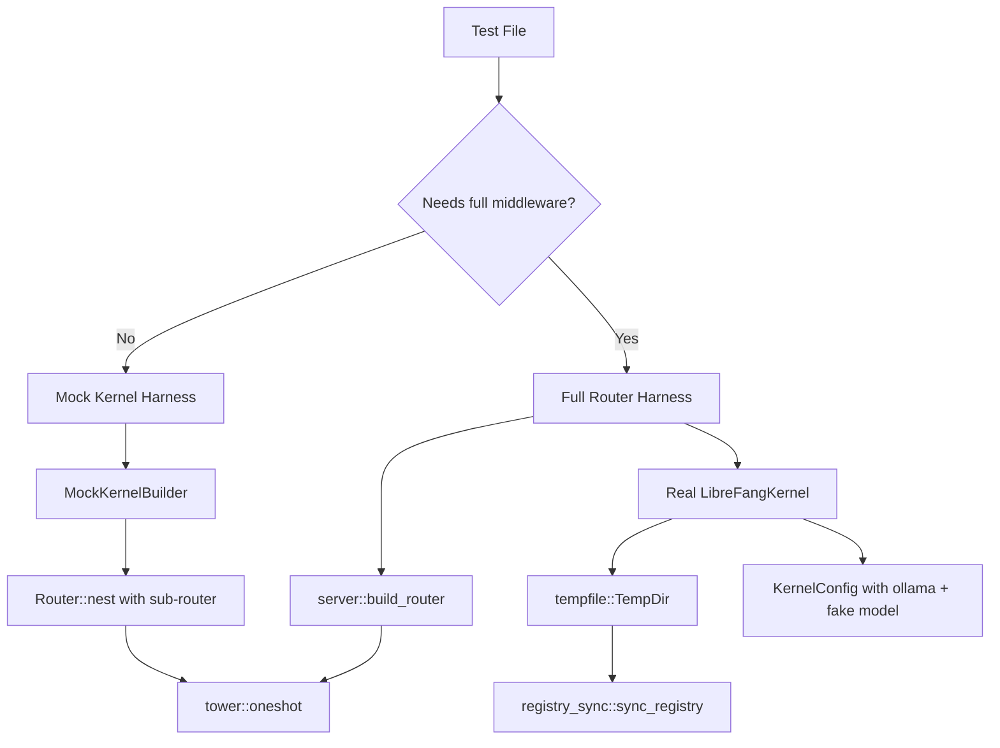

# Other — librefang-api-tests

# librefang-api Integration Tests

## Purpose

This module is the integration test suite for the `librefang-api` HTTP layer. It boots **real route handlers**, **real middleware**, and **real kernel instances** (backed by a temporary filesystem and a no-op `ollama` provider) to verify that route registration, authentication, authorization, input validation, error mapping, and handler logic all compose correctly end-to-end.

The tests exist because unit-testing individual handlers in isolation cannot catch the class of bugs where a route is registered but never exercised, where middleware silently rejects a request before the handler runs, or where a status code is mapped incorrectly through the full stack.

## How to Run

```bash
# All integration tests in this crate
cargo test -p librefang-api

# A single test file
cargo test -p librefang-api --test a2a_routes_integration

# A single test case
cargo test -p librefang-api --test agents_routes_integration -- test_patch_agent_read_after_write
```

All tests use `#[tokio::test(flavor = "multi_thread")]` because the kernel spawns background tasks during boot.

## Architecture

There are two harness strategies used across the test files. The choice depends on whether the test needs the full middleware stack (auth, rate-limit, error-envelope) or just a specific sub-router with injected authentication state.


```mermaid
graph TD
    A[Test File] --> B{Needs full middleware?}
    B -->|Yes| C[Full Router Harness]
    B -->|No| D[Mock Kernel Harness]
    C --> E[server::build_router]
    E --> F[tower::oneshot]
    D --> G[MockKernelBuilder]
    G --> H[Router::nest with sub-router]
    H --> F
    C --> I[Real LibreFangKernel]
    I --> J[tempfile::TempDir]
    J --> K[registry_sync::sync_registry]
    I --> L[KernelConfig with ollama + fake model]
```

### Full Router Harness

Used by most test files (`a2a_routes_integration`, `agents_routes_integration`, `agent_identity_registry_test`, `agents_capabilities_files_integration`, `agents_clone_bulk_integration`, `agent_channels_routes_test`).

Boots `LibreFangKernel::boot_with_config` with:
- A temporary home directory (`tempfile::tempdir`)
- Pre-populated registry cache (`registry_sync::sync_registry`) to avoid network access
- Provider set to `ollama` with model `test-model` (no real LLM calls)
- An optional `api_key` — empty string enables the dev-mode loopback fast-path; a non-empty string enforces bearer-token auth

Then calls `server::build_router(kernel, addr)` to get the full `axum::Router` with all middleware layers, and drives requests through `tower::ServiceExt::oneshot`.

The `agent_identity_registry_test` variant additionally spawns a real `tokio::net::TcpListener` and uses `reqwest::Client` for HTTP-over-TCP tests (needed when `ConnectInfo<SocketAddr>` must be present for auth-layer loopback detection). The `into_make_service_with_connect_info::<SocketAddr>()` call mirrors production wiring.

### Mock Kernel Harness

Used by `access_log_agent_id_test`, `access_log_session_id_test`, and `agent_kv_authz_integration`.

Uses `librefang_testing::{MockKernelBuilder, TestAppState}` to construct a lightweight kernel substitute, then nests only the relevant sub-router (e.g., `routes::agents::router()`, `routes::memory::router()`) under `/api`. Authentication state is injected directly via `request.extensions_mut().insert(AuthenticatedApiUser { ... })` rather than passing through the real auth middleware.

This approach is chosen when the test surface is handler-internal (e.g., response extensions for access-log markers) rather than the middleware stack itself.

## Test Files and Route Coverage

### `a2a_routes_integration.rs`

**Refs:** #3571  
**Routes:**
| Route | What is tested |
|-------|---------------|
| `GET /a2a/agents` | Public federation listing returns canonical `PaginatedResponse` envelope; legacy `agents` field must not coexist |
| `GET /api/a2a/agents` | Empty-kernel returns paginated envelope with `total=0`; reachable without auth in dev mode |
| `GET /api/a2a/agents/{id}` | Unknown id → 404; requires auth when api_key is set |
| `POST /api/a2a/discover` | Missing URL → 400; invalid URL → 400; localhost URL blocked by SSRF guard → 400 |
| `POST /api/a2a/send` | Missing URL → 400; missing message or untrusted → 400; untrusted URL blocked by trust gate → 400 |
| `GET /api/a2a/tasks/{id}/status` | Missing URL param → 400; untrusted URL → 400; requires auth |
| `POST /api/a2a/agents/{id}/approve` | Unknown pending → 404; requires auth |

Mutating endpoints that trigger outbound HTTP (`/discover`, `/send`, `/tasks/{id}/status`) are only tested on validation/trust-gate/error paths. Happy-path would require a live external A2A server and is intentionally out of scope.

### `access_log_agent_id_test.rs`

**Refs:** #3511  
**Surface:** `AgentIdField` response extension marker.

Verifies that handlers set the `AgentIdField` marker via `with_agent_id()` on response extensions so the access-log middleware can emit a structured `agent_id` field. Tests against `auto_dream` and `budget` sub-routers. Key invariants:
- 404 for an unknown agent still carries the marker (the path was well-formed, intent is clear)
- Malformed UUID in path → 400 with **no** marker (the `AgentIdPath` extractor rejects before the handler runs)

### `access_log_session_id_test.rs`

**Refs:** #3511  
**Surface:** `SessionIdField` response extension marker.

Same pattern as the agent-id test, but for `SessionIdField`. Tests the `GET /api/agents/{id}/session` and `GET /api/agents/{id}/sessions/{session_id}/stream` endpoints. When the agent or session is not found, the handler returns before the tagging site and the marker is absent — this is the correct contract.

### `agent_channels_routes_test.rs`

**Refs:** #4961  
**Routes:**
| Route | What is tested |
|-------|---------------|
| `GET /api/agents/{id}/channels` | Fresh agent returns empty `assigned` + `mode="all"` |
| `PUT /api/agents/{id}/channels` | Round-trip set + read-back; clear reverts to `mode="all"`; bad UUID → 400; unknown agent → 404 (GET) / 400 (PUT) |

### `agent_identity_registry_test.rs`

**Refs:** #4614  
**Routes:**
| Route | What is tested |
|-------|---------------|
| `POST /api/agents` | Spawn registers a canonical UUID in the identity registry |
| `DELETE /api/agents/{id}` | Without `?confirm=true` → 409 with warning; with confirm → purges identity + kills agent |
| `GET /api/agents/identities` | Lists registered entries with `canonical_uuid` and `created_at` |
| `POST /api/agents/identities/{name}/reset` | Without `?confirm=true` → 409; with confirm → purges binding; missing name → 404 |

Also tests auth-layer enforcement: with a configured `api_key`, unauthenticated requests to spawn/list/reset are rejected 401 without touching the identity registry.

**Deterministic UUID recovery:** After a confirmed delete + respawn, the same `AgentId::from_name` derivation produces the same UUID (v5 deterministic), so sessions/memories from the prior lifecycle remain accessible after non-explicit resets.

### `agent_kv_authz_integration.rs`

**Refs:** #3749  
**Routes:**
| Route | What is tested |
|-------|---------------|
| `GET /api/memory/agents/{id}/kv` | Admin can read any; viewer-owner can read own; viewer-non-owner → 404 |
| `GET /api/memory/agents/{id}/kv/{key}` | Viewer-non-owner → 404 |
| `PUT /api/memory/agents/{id}/kv/{key}` | Viewer-non-owner → 404 |
| `DELETE /api/memory/agents/{id}/kv/{key}` | Viewer-non-owner → 404 |
| `GET /api/agents/{id}/memory/export` | Viewer-non-owner → 404 |
| `POST /api/agents/{id}/memory/import` | Viewer-non-owner → 404 |

Uses `AuthenticatedApiUser` injection with `UserRole::Admin` and `UserRole::Viewer` to assert the `assert_kv_owner_or_admin` helper gates access correctly. Anonymous callers (no extension) intentionally proceed — the global auth middleware enforces the outer gate.

### `agents_capabilities_files_integration.rs`

**Refs:** Critical umbrella for untested mutation routes  
**Routes:**
| Route | What is tested |
|-------|---------------|
| `PUT /api/agents/{id}/files/{filename}` | Round-trip write + read; path traversal (`../../etc/passwd`) → 400; non-whitelisted name → 400; unknown agent → 404; invalid UUID → 400 |
| `GET /api/agents/{id}/files/{filename}` | Read-back after write; deleted file → 404 |
| `DELETE /api/agents/{id}/files/{filename}` | Delete + confirm gone |
| `GET /api/agents/{id}/files` | Lists files with `exists` and `size_bytes` |
| `GET/PUT /api/agents/{id}/tools` | Round-trip allowlist/blocklist; empty body → 400; unknown agent → 404 |
| `GET/PUT /api/agents/{id}/skills` | Empty round-trip; valid allowlist flips `mode` to `"allowlist"`; unknown skill name → 4xx without mutation |
| `GET/PUT /api/agents/{id}/mcp_servers` | Empty allowlist round-trip with `mode="none"` |
| All capability GETs on unknown agent | → 404 |
| All capability PUTs without auth | → 401 |

The path-traversal test (`test_files_write_path_traversal_rejected_4xx`) is the highest-security-value test: it confirms the `KNOWN_IDENTITY_FILES` whitelist rejects traversal attempts before any filesystem path resolution occurs.

### `agents_clone_bulk_integration.rs`

**Routes:**
| Route | What is tested |
|-------|---------------|
| `POST /api/agents/{id}/clone` | 201 + independent copy; duplicate name → 409; unknown source → 404; invalid ID → 400; empty name → 400; `include_skills=false` strips skills |
| `POST /api/agents/{id}/reload` | Applies on-disk `agent.toml` changes; invalid ID → 400; unknown agent → 404 |
| `POST /api/agents/{id}/push` | Unknown agent → 404; invalid ID → 400; missing fields → 400; no channel adapter → 502 |
| `POST /api/agents/bulk` | Multi-create + read-back; empty array → 400; oversize (>50) → 400 with no spawns |
| `DELETE /api/agents/bulk` | Multi-delete + confirm gone; per-row failure reporting |
| `POST /api/agents/bulk/start` | Sets agents to Full mode; unknown id reports per-row failure |
| `POST /api/agents/bulk/stop` | No-op success when no active runs; empty array → 400; oversize → 400 |

### `agents_routes_integration.rs`

**Routes:**
| Route | What is tested |
|-------|---------------|
| `GET /api/agents` | Empty filter + populated; invalid sort field rejected |
| `GET /api/agents/{id}` | Happy path + invalid ID → 400 + unknown → 404 |
| `PATCH /api/agents/{id}` | Success + read-after-write; invalid payload; unknown → 404; auth gate → 401 |
| `PUT /api/agents/{id}/suspend` | State transitions to Suspended; unknown → 404; invalid ID → 400 |
| `PUT /api/agents/{id}/resume` | State transitions to Running; unknown → 404 |
| `PUT /api/agents/{id}/mode` | Mode change persisted + read-after-write; unknown → 404; invalid ID → 400 |

Also tests incognito field handling, schedule patching with background loop lifecycle, session compaction, and workspace path-traversal rejection on spawn.

## Common Patterns

### Harness Construction

Every full-router test follows this sequence:

```
1. tempfile::tempdir()           — isolated filesystem
2. sync_registry(tmp, ...)       — pre-populate model catalog (no network)
3. KernelConfig { ollama, ... }  — fake provider, no real LLM
4. LibreFangKernel::boot_with_config(config)
5. kernel.set_self_handle()      — kernel can reference itself
6. server::build_router(kernel, addr)
7. tower::ServiceExt::oneshot    — in-process request dispatch
```

The `Drop` impl on each `Harness` struct calls `state.kernel.shutdown()` to clean up background tasks.

### Request Helpers

Each file defines thin helpers (`get`, `post_json`, `put_json`, `delete`, `patch_json`) that build `Request<Body>` instances with the appropriate method, URI, headers, and optional bearer token. These keep test bodies concise and consistent.

### Response Assertion

The `send` helper returns `(StatusCode, serde_json::Value)`. Tests assert on status codes and probe the JSON body with index access (`body["error"]`, `body["total"]`, etc.). This avoids deserializing into specific response types and keeps assertions readable.

### Agent Spawning

`spawn_named(state, name)` creates an agent via `kernel.spawn_agent_typed(AgentManifest { name, ..Default::default() })`. For authz tests, `spawn_owned_by(state, name, author)` sets the `author` field so owner-scoping can be exercised.

## Key Design Decisions

1. **No real LLM calls** — the `ollama` provider with `test-model` ensures every test is hermetic and fast.

2. **Full router, not handler-only** — most tests use `server::build_router` rather than mounting individual handlers, so the auth middleware, rate limiter, and error-envelope layers are exercised. The handler-only mock (`librefang-testing::TestAppState`) is used only when the test surface is response extensions (access-log markers).

3. **Negative paths over happy paths for outbound calls** — endpoints that make outbound HTTP requests (A2A discover/send, push) are tested only on validation, trust-gate, and error paths. Happy paths would require live external services.

4. **`tower::oneshot` over HTTP-in-TCP** — most tests dispatch requests in-process via `tower::ServiceExt::oneshot`. The `reqwest`-based approach is reserved for tests that need `ConnectInfo<SocketAddr>` (loopback auth fast-path).

5. **Bulk size guard** — the `validate_bulk_size` function caps arrays at 50 entries. Tests assert the guard short-circuits before any allocation or spawn occurs.