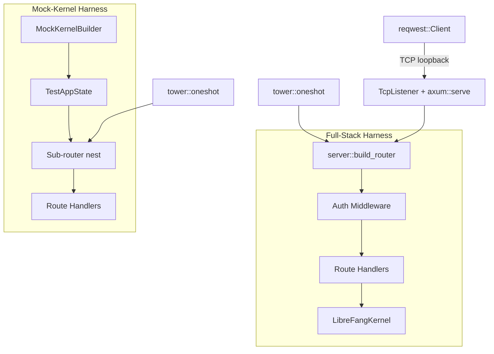

# Other — librefang-api-tests

# librefang-api Integration Tests

## Purpose

This module is the integration test suite for the `librefang-api` HTTP layer. It exercises the **production router** (`server::build_router`) end-to-end — route registration, auth middleware, handler wiring, validation, error envelopes, and security boundaries — without making real LLM calls. Every test is hermetic: the kernel boots with a fake `ollama` provider, a temporary home directory, and no outbound network access.

These tests serve as the canonical regression guard for the API contract, replacing the older manual curl checklist referenced in CLAUDE.md (#3721).

## Test Files and Route Coverage

| File | Routes / Surface |
|------|-----------------|
| `agents_routes_integration.rs` | `GET /api/agents`, `GET/PATCH /api/agents/{id}`, `PUT …/suspend`, `PUT …/resume`, `PUT …/mode`, schedule field |
| `agents_capabilities_files_integration.rs` | `GET/PUT/DELETE /api/agents/{id}/files/{filename}`, `GET/PUT …/tools`, `…/skills`, `…/mcp_servers` |
| `agents_clone_bulk_integration.rs` | `POST …/clone`, `POST …/reload`, `POST …/push`, `POST/DELETE /api/agents/bulk`, `POST …/bulk/start`, `POST …/bulk/stop` |
| `a2a_routes_integration.rs` | `GET /a2a/agents`, `GET /api/a2a/agents`, `GET …/{id}`, `POST /discover`, `POST /send`, `GET /tasks/{id}/status`, `POST …/approve` |
| `agent_identity_registry_test.rs` | Agent UUID registry: spawn registers, delete with/without confirm, respawn recovery, `GET /identities`, `POST …/reset` |
| `agent_kv_authz_integration.rs` | Owner-scoping on KV endpoints: `GET/PUT/DELETE /memory/agents/{id}/kv*`, `GET/POST …/memory/{export,import}` |
| `access_log_agent_id_test.rs` | `AgentIdField` response extension marker for access-log emission |
| `access_log_session_id_test.rs` | `SessionIdField` response extension marker for access-log emission |

## Architecture


```mermaid
graph TD
    subgraph "Full-Stack Harness"
        A[server::build_router] --> B[Auth Middleware]
        B --> C[Route Handlers]
        C --> D[LibreFangKernel]
    end
    subgraph "Mock-Kernel Harness"
        E[MockKernelBuilder] --> F[TestAppState]
        F --> G[Sub-router nest]
        G --> C2[Route Handlers]
    end
    H[tower::oneshot] --> A
    H2[tower::oneshot] --> G
    I[reqwest::Client] -->|TCP loopback| J[TcpListener + axum::serve]
    J --> A
```

## Two Harness Patterns

### Full Production Router

Used by most test files. Boots the real kernel and the complete middleware stack:

```rust
async fn boot(api_key: &str) -> Harness {
    let tmp = tempfile::tempdir().expect("tempdir");
    librefang_kernel::registry_sync::sync_registry(tmp.path(), /* … */);

    let config = KernelConfig {
        home_dir: tmp.path().to_path_buf(),
        api_key: api_key.to_string(),
        default_model: DefaultModelConfig { provider: "ollama", model: "test-model", /* … */ },
        ..KernelConfig::default()
    };

    let kernel = Arc::new(LibreFangKernel::boot_with_config(config).expect("kernel boot"));
    kernel.set_self_handle();

    let (app, state) = server::build_router(kernel, "127.0.0.1:0".parse().unwrap()).await;
    Harness { app, _tmp: tmp, state, /* … */ }
}
```

Requests go through `tower::ServiceExt::oneshot` — no TCP socket, no ConnectInfo. This means loopback auth bypass does **not** apply; requests are treated as remote, which is the strictest auth posture.

**Files using this pattern:** `agents_routes_integration.rs`, `agents_capabilities_files_integration.rs`, `agents_clone_bulk_integration.rs`, `a2a_routes_integration.rs`.

### Mock Kernel with Sub-Router Nesting

Used by access-log and KV authz tests that only need specific route modules, not the full stack:

```rust
fn boot_agents() -> Harness {
    let test = TestAppState::with_builder(MockKernelBuilder::new().with_config(|cfg| { /* … */ }));
    let state = test.state.clone();
    let app = Router::new()
        .nest("/api", routes::agents::router())
        .with_state(state);
    Harness { app, _test: test }
}
```

**Files using this pattern:** `access_log_agent_id_test.rs`, `access_log_session_id_test.rs`, `agent_kv_authz_integration.rs`.

### TCP Listener Variant

`agent_identity_registry_test.rs` uses a real `tokio::net::TcpListener` with `reqwest::Client` so that `into_make_service_with_connect_info::<SocketAddr>()` injects peer address data the auth middleware needs for loopback classification.

## Key Testing Conventions

### Auth Configuration

- **Empty `api_key`** (`""`) → single-user dev fast-path: all routes accessible without a Bearer token.
- **Non-empty `api_key`** → token auth enforced. Tests pass `format!("Bearer {}", api_key)` via the `authorization` header.

### Request Helpers

Most files define a common `send()` function:

```rust
async fn send(app: Router, req: Request<Body>) -> (StatusCode, serde_json::Value)
```

And convenience builders: `get(path)`, `post_json(path, body)`, `put_json(path, body)`, `delete(path)`, `patch_json(path, body)` — each attaching the Bearer token from `TEST_TOKEN`.

### Cleanup

Every `Harness` implements `Drop` to call `state.kernel.shutdown()`, ensuring no leaked kernel tasks between tests. `_tmp: tempfile::TempDir` is held for the same lifetime so the temp directory persists until the harness drops.

### Agent Spawning

```rust
fn spawn_named(state: &Arc<AppState>, name: &str) -> AgentId {
    let manifest = AgentManifest { name: name.to_string(), ..AgentManifest::default() };
    state.kernel.spawn_agent_typed(manifest).expect("spawn_agent")
}
```

This bypasses the HTTP layer to create agents directly in the kernel registry. It is the standard way to set up test preconditions for GET/PATCH/DELETE tests.

## Security Boundaries Tested

### Path Traversal Defense (`agents_capabilities_files_integration.rs`)

The `KNOWN_IDENTITY_FILES` whitelist rejects filenames like `../../etc/passwd` before any filesystem resolution. Tests assert the rejection is a clean 400, not a 500, and confirm via read-back that nothing was written outside the sandbox.

### SSRF Guard (`a2a_routes_integration.rs`)

`/api/a2a/discover` calls `is_url_safe_for_ssrf` which blocks localhost/private-network URLs. Tests verify `http://localhost:1/agent` returns 400 before any outbound socket is opened.

### Trust Gate (`a2a_routes_integration.rs`)

`/api/a2a/send` and `/api/a2a/tasks/{id}/status` enforce that the target URL is an approved/trusted A2A peer. Unapproved targets are rejected with 400 and an error message containing "trusted" or "approve" — this is a regression guard for #3786.

### Owner-Scoping on KV (`agent_kv_authz_integration.rs`)

The helper `assert_kv_owner_or_admin` gates per-agent KV operations. A viewer (`UserRole::Viewer`) who is not the agent's author receives 404; the agent's owner and admins proceed. This covers list, single-key get/set/delete, and bulk export/import.

### Auth Layer on Identity Routes (`agent_identity_registry_test.rs`)

With a configured `api_key`, unauthenticated writes (spawn, identity reset) are rejected 401 before reaching the handler. GET `/api/agents/identities` is also auth-gated because it is not in the dashboard-reads allowlist. This was a gap the mock-router approach could not catch.

## Response Shape Contracts

### PaginatedResponse Envelope

A2A listing endpoints and agent listings return the canonical `PaginatedResponse` shape:

```json
{ "items": [], "total": 0, "offset": 0, "limit": null }
```

Tests in `a2a_routes_integration.rs` explicitly assert the legacy `{ "agents": […] }` field is **absent** to prevent dual-shape regressions (#3842).

### Error Envelopes

All error responses carry at least one of `error` or `message` fields. Tests assert the presence and content of these fields rather than just checking status codes.

### Access Log Extension Markers

Handlers set `AgentIdField` and `SessionIdField` as response extensions so the `request_logging` middleware can emit structured fields. Tests assert on `resp.extensions().get::<AgentIdField>()` directly — the precise contract the middleware reads.

Key invariant: **the marker must be present even on 404 responses** where the path contained a valid but unknown ID (the handler resolved the ID from the path and tagged it before the kernel lookup failed). The marker must be **absent** when the path ID was malformed (the `AgentIdPath` extractor rejected before the handler ran).

## Running the Tests

```bash
# All integration tests in the crate
cargo test -p librefang-api

# Individual test files
cargo test -p librefang-api --test agents_routes_integration
cargo test -p librefang-api --test a2a_routes_integration
cargo test -p librefang-api --test agent_identity_registry_test
cargo test -p librefang-api --test agents_capabilities_files_integration
cargo test -p librefang-api --test agents_clone_bulk_integration
cargo test -p librefang-api --test agent_kv_authz_integration
cargo test -p librefang-api --test access_log_agent_id_test
cargo test -p librefang-api --test access_log_session_id_test
```

All tests use `#[tokio::test(flavor = "multi_thread")]` because the kernel spawns background tasks during boot.

## Out-of-Scope Paths

Several endpoints initiate real outbound HTTP that the hermetic harness cannot satisfy:

- **A2A `/discover` happy path** — requires a live external A2A server responding with an agent card.
- **A2A `/send` happy path** — requires an approved, reachable target peer.
- **A2A `/tasks/{id}/status` happy path** — same outbound dependency.
- **`/push` happy path** — requires a wired channel adapter (Telegram, Slack, etc.). Tests cover the 502 BAD_GATEWAY response when no adapter is configured.

These are covered only on their validation, trust-gate, and error paths. Happy-path coverage would require either a mock HTTP server or an external test fixture, which is intentionally deferred.