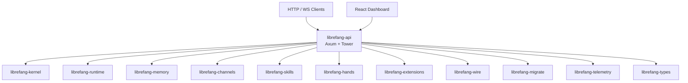

# Other — librefang-api

# librefang-api

The HTTP/WebSocket API server for the LibreFang Agent OS daemon. This crate exposes the daemon's capabilities — agent management, channel orchestration, skill execution, memory, extensions, and telemetry — through a RESTful HTTP API and WebSocket endpoints. It also embeds and serves the React-based dashboard UI.

## Architecture



The API layer is a thin HTTP/WS façade over the `librefang-kernel` core. It does not implement business logic itself — it translates HTTP requests into kernel operations and serializes responses.

## Feature Flags

Feature flags control which channel backends and telemetry integrations are compiled in. All flags are additive.

### Presets

| Feature | Description |
|---|---|
| `default` | Enables `all-channels` + `telemetry` |
| `all-channels` | Every channel backend (~40 platforms) |
| `mini` | 12 core channels: Telegram, Discord, Slack, Matrix, Email, Webhook, WhatsApp, Signal, Teams, Mattermost, IRC, Google Chat |
| `telemetry` | OpenTelemetry tracing export + Prometheus metrics endpoint |

### Individual Channel Flags

Each channel is toggled by a `channel-<name>` feature. These are forwarded directly to `librefang-channels`, so the API crate itself remains channel-agnostic — it simply ensures the selected backends are compiled into the final binary.

Available channels: `telegram`, `discord`, `slack`, `matrix`, `email`, `voice`, `webhook`, `whatsapp`, `signal`, `teams`, `mattermost`, `irc`, `google-chat`, `twitch`, `rocketchat`, `zulip`, `xmpp`, `bluesky`, `feishu`, `line`, `mastodon`, `messenger`, `reddit`, `revolt`, `viber`, `flock`, `guilded`, `keybase`, `nextcloud`, `nostr`, `pumble`, `threema`, `twist`, `webex`, `dingtalk`, `discourse`, `gitter`, `gotify`, `linkedin`, `mumble`, `ntfy`, `qq`, `wechat`, `wecom`.

### Telemetry Feature

When enabled, pulls in:
- `opentelemetry` / `opentelemetry_sdk` / `opentelemetry-otlp` — distributed tracing export via OTLP
- `tracing-opentelemetry` — bridges `tracing` spans to OpenTelemetry
- `metrics` / `metrics-exporter-prometheus` — Prometheus-compatible metrics endpoint

## Key Dependencies and Their Roles

| Crate | Role in the API |
|---|---|
| `axum` + `tower` + `tower-http` | HTTP framework, middleware stack (CORS, compression, tracing, rate limiting) |
| `governor` | Request rate limiting middleware |
| `jsonwebtoken` | JWT issuance and validation for API authentication |
| `argon2` | Password hashing for user credential storage |
| `hmac` + `sha2` | HMAC-SHA256 for webhook signature verification and token integrity |
| `subtle` | Constant-time comparison for security-sensitive equality checks |
| `utoipa` | OpenAPI 3.x spec generation with Axum integration |
| `include_dir` | Embeds the compiled React dashboard into the binary |
| `dashmap` | Concurrent hash maps for in-memory request/session state |
| `tokio-stream` + `futures` | Async stream utilities for WebSocket and SSE endpoints |
| `flate2` + `tar` + `zip` | Archive handling for extension packaging/upload |
| `reqwest` | Outbound HTTP client (health checks, extension downloads, OAuth flows) |
| `portable-pty` | PTY allocation for interactive terminal WebSocket sessions |
| `toml` + `toml_edit` | Configuration file reading and programmatic editing |
| `socket2` | Low-level socket configuration for the HTTP listener |

## Build Script (`build.rs`)

The build script performs three tasks:

1. **Ensures the static dashboard directory exists.** The path `static/react/` is gitignored because it contains build artifacts from the dashboard's `npm run build`. If the directory is missing (fresh clone, CI without dashboard build), it creates an empty placeholder so `include_dir!` compiles without error. At runtime, if the embedded directory is empty, assets are served from `~/.librefang/dashboard/` instead.

2. **Captures build metadata** and injects it as compile-time environment variables:

   | Variable | Source | Example |
   |---|---|---|
   | `GIT_SHA` | `git rev-parse --short HEAD` | `a3f7c2d` |
   | `BUILD_DATE` | `date -u +%Y-%m-%d` | `2025-01-15` |
   | `RUSTC_VERSION` | `rustc --version` | `rustc 1.82.0` |

   These are available throughout the crate via `env!("GIT_SHA")`, etc., and are typically exposed through a `/api/version` or `/health` endpoint.

3. **Graceful fallback.** If `git`, `date`, or `rustc` aren't available (e.g., cross-compilation environments), the value defaults to `"unknown"`.

### Build-Time Constants Reference

```rust,ignore
// Available anywhere in librefang-api after compilation
env!("GIT_SHA")       // e.g., "a3f7c2d"
env!("BUILD_DATE")    // e.g., "2025-01-15"
env!("RUSTC_VERSION") // e.g., "rustc 1.82.0 (..."
```

## Dashboard Embedding Strategy

The dashboard is a React application compiled to static files. The embedding uses `include_dir!` from the `include_dir` crate:

- **At compile time:** `static/react/` is embedded into the binary. If the directory is empty (no dashboard build), nothing is embedded.
- **At runtime:** The server falls back to serving files from `~/.librefang/dashboard/`, allowing dashboard updates without recompiling the daemon.

This two-tier approach means:
- Release binaries ship with the dashboard baked in.
- Development builds can skip the dashboard npm build step.
- Operators can override the embedded dashboard by placing files in the runtime directory.

## Authentication Model

Based on the dependency set (`jsonwebtoken`, `argon2`, `hmac`/`sha2`, `subtle`):

- **Password authentication** uses Argon2 hashing for stored credentials.
- **JWT tokens** are issued after authentication and validated on subsequent requests.
- **Webhook verification** uses HMAC-SHA256 signatures.
- **Constant-time comparison** (`subtle`) prevents timing attacks on token/signature checks.

## Platform-Specific Dependencies

On Unix targets, the crate depends on `rustix` with the `process` feature, used for low-level process management operations (likely for PTY handling and process supervision beyond what `portable-pty` provides).

## Relationship to Other Crates

```
librefang-types       ← Shared type definitions (request/response DTOs, error types)
librefang-kernel      ← Core agent orchestration logic
librefang-runtime     ← Process lifecycle and registry management
librefang-memory      ← Agent memory and context storage
librefang-channels    ← Channel backend implementations (feature-gated)
librefang-wire        ← Protocol/message serialization
librefang-skills      ← Skill registry and execution
librefang-hands       ← Tool/hand capabilities for agents
librefang-extensions  ← Extension loading and vault management
librefang-migrate     ← Database schema migrations
librefang-telemetry   ← Shared telemetry primitives
```

The API crate is the top-level integration point — it pulls in every other workspace crate to present a unified HTTP interface. It does not define new domain concepts; it maps HTTP semantics onto the existing kernel operations.