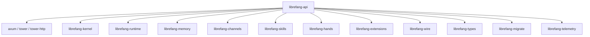

# Other — librefang-api

# librefang-api

The HTTP/WebSocket API server for the LibreFang Agent OS daemon. This crate exposes the agent's runtime, channels, skills, extensions, and management capabilities through a RESTful JSON API and WebSocket endpoints.

## Architecture

`librefang-api` sits at the top of the crate dependency graph, integrating nearly every other librefang crate into a unified network-facing service:



The API layer is responsible for request routing, authentication, rate limiting, request/response serialization, and WebSocket session management. All core logic lives in the downstream crates — the API translates HTTP concerns into library calls.

## Feature Flags

Feature flags control which channel backends and telemetry integrations are compiled in. This is the primary mechanism for producing smaller binaries when only specific channels are needed.

### Channel Features

Each channel is an individual feature that forwards directly to `librefang-channels`:

| Feature | Platform |
|---------|----------|
| `channel-telegram` | Telegram |
| `channel-discord` | Discord |
| `channel-slack` | Slack |
| `channel-matrix` | Matrix |
| `channel-email` | Email (SMTP/IMAP) |
| `channel-webhook` | Generic webhooks |
| `channel-whatsapp` | WhatsApp |
| `channel-signal` | Signal |
| `channel-teams` | Microsoft Teams |
| `channel-mattermost` | Mattermost |
| `channel-irc` | IRC |
| `channel-google-chat` | Google Chat |
| `channel-voice` | Voice channel |
| ... | (30+ additional platforms) |

### Meta-Features

- **`all-channels`** — Enables all channel backends. Included in `default`.
- **`mini`** — Enables 12 core channels (Telegram, Discord, Slack, Matrix, Email, Webhook, WhatsApp, Signal, Teams, Mattermost, IRC, Google Chat). Use this for a lighter build with the most common platforms.
- **`telemetry`** — Enables OpenTelemetry trace export and Prometheus metrics scraping. Included in `default`. Pulls in `opentelemetry`, `opentelemetry_sdk`, `opentelemetry-otlp`, `tracing-opentelemetry`, `metrics`, and `metrics-exporter-prometheus`.

### Default Features

```toml
default = ["all-channels", "telemetry"]
```

To build without any channels or telemetry:

```toml
librefang-api = { path = "...", default-features = false }
```

To build the mini profile:

```toml
librefang-api = { path = "...", default-features = false, features = ["mini", "telemetry"] }
```

## Build Script

The `build.rs` script performs three tasks at compile time:

### 1. Dashboard Static Directory

Creates a placeholder `static/react/` directory inside the crate root so that `include_dir!` (which embeds the React dashboard at compile time) never fails on fresh clones. The directory is gitignored — in development, running `npm run build` in the dashboard subcrate populates it. When empty, nothing is embedded and the runtime falls back to serving assets from `~/.librefang/dashboard/`.

### 2. Build Metadata

Captures three environment variables baked into the binary:

| Variable | Source | Example |
|----------|--------|---------|
| `GIT_SHA` | `git rev-parse --short HEAD` | `a3f7c2d` |
| `BUILD_DATE` | `date -u +%Y-%m-%d` | `2025-01-15` |
| `RUSTC_VERSION` | `rustc --version` | `rustc 1.82.0` |

These are accessed at runtime via `env!("GIT_SHA")`, `env!("BUILD_DATE")`, and `env!("RUSTC_VERSION")` — typically exposed through a `/version` or `/health` endpoint. If any command fails (e.g., building from a tarball without git), the value falls back to `"unknown"`.

## Key Dependencies and Their Roles

### HTTP Stack

- **`axum`** — Router, handlers, extractors, WebSocket upgrades. With `utoipa`'s `axum_extras` feature for OpenAPI spec generation.
- **`tower`** / **`tower-http`** — Middleware layers: CORS, tracing, compression, timeout, auth.
- **`governor`** — Token-bucket rate limiting per IP or per route.

### Authentication

- **`jsonwebtoken`** — JWT creation and validation for API tokens and sessions.
- **`argon2`** — Password hashing for credential storage and verification.
- **`hmac`** + **`sha2`** — HMAC-SHA256 for webhook signature verification and token signing.
- **`subtle`** — Constant-time comparison for timing-attack-safe auth checks.

### Concurrency

- **`dashmap`** — Lock-free concurrent hash maps for connection/session registries.
- **`tokio-stream`** + **`futures`** — Async stream composition for WebSocket message routing and event broadcasting.

### Terminal

- **`portable-pty`** — PTY allocation for interactive terminal sessions over WebSocket.

### Archival and File Handling

- **`flate2`** + **`tar`** — `.tar.gz` creation/extraction for backup and export endpoints.
- **`zip`** — ZIP archive support.
- **`walkdir`** — Recursive directory traversal for file management endpoints.

### Static Asset Serving

- **`include_dir`** — Embeds the compiled React dashboard into the binary for single-file deployment.

## Relationship to Other Crates

```
librefang-api
├── librefang-types      ← request/response DTOs, shared enums
├── librefang-kernel     ← agent lifecycle, task orchestration
├── librefang-runtime    ← sandboxed execution of agent logic
├── librefang-memory     ← conversation/context memory stores
├── librefang-channels   ← inbound/outbound message channel backends
├── librefang-wire       ← wire protocol serialization
├── librefang-skills     ← skill registry and invocation
├── librefang-hands      ← tool/hand execution
├── librefang-extensions ← vault, plugins, extension loading
├── librefang-migrate    ← database schema migrations
└── librefang-telemetry  ← tracing and metrics infrastructure
```

API handlers delegate to these crates rather than implementing business logic directly. For example, a channel configuration endpoint reads/writes through `librefang-channels`, while a skill execution endpoint dispatches through `librefang-skills` and `librefang-runtime`.

## Building and Running

```bash
# Full build with all channels and telemetry
cargo build -p librefang-api

# Minimal build with 12 core channels
cargo build -p librefang-api --no-default-features --features mini

# No channels, no telemetry (API only — useful for testing/development)
cargo build -p librefang-api --no-default-features
```

## Notes for Contributors

- When adding a new route, annotate it with `utoipa` attributes (`#[utoipa::path(...)]`) so it appears in the generated OpenAPI spec.
- Channel features are exclusively pass-through to `librefang-channels`. Do not add channel-specific logic in this crate — all channel behavior should live behind the channel trait in `librefang-channels`.
- The `static/react/` directory is auto-created by the build script and is gitignored. Never manually commit dashboard build artifacts there.
- On Unix targets, `rustix` (with `process` feature) is included for low-level process operations.