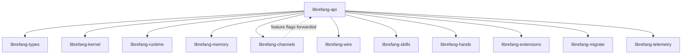

# Other — librefang-api

# librefang-api

HTTP/WebSocket API server for the LibreFang Agent OS daemon. This crate exposes the daemon's capabilities—agent management, channel orchestration, skill execution, memory, extensions, and telemetry—through a network-accessible API.

## Architecture



The API crate sits at the top of the dependency graph. It aggregates nearly every other `librefang-*` crate and wires them together behind an `axum`-based HTTP server with `tower` middleware.

## Key Dependencies and Their Roles

| Crate | Purpose in the API |
|---|---|
| `librefang-types` | Shared domain types (request/response bodies, identifiers, enums) |
| `librefang-kernel` | Core agent lifecycle, configuration, and state management |
| `librefang-runtime` | Process registry and execution sandboxing |
| `librefang-memory` | Agent memory and conversation history persistence |
| `librefang-channels` | Messaging channel integrations (Telegram, Discord, Slack, etc.) |
| `librefang-wire` | Wire protocol definitions for inter-service communication |
| `librefang-skills` | Skill registry and execution |
| `librefang-hands` | Tool/action ("hands") execution framework |
| `librefang-extensions` | Extension system including vault for secret management |
| `librefang-migrate` | Database schema migrations |
| `librefang-telemetry` | Logging, tracing, and metrics infrastructure |

Additional runtime dependencies include:

- **`axum` / `tower` / `tower-http`** — HTTP framework, middleware, and utilities (CORS, compression, tracing, etc.)
- **`governor`** — Rate limiting
- **`jsonwebtoken`** — JWT authentication
- **`argon2`** — Password hashing
- **`hmac` / `sha2` / `subtle`** — HMAC-based request signing and constant-time comparison
- **`dashmap`** — Concurrent in-memory state maps
- **`portable-pty`** — Pseudo-terminal allocation (for interactive shell sessions over WebSocket)
- **`utoipa`** — OpenAPI schema generation with `axum_extras` support
- **`include_dir`** — Embeds the static dashboard assets at compile time

## Feature Flags

Feature flags control which channel backends and telemetry integrations are compiled in. This is critical for binary size and dependency management—each channel pulls in its own SDK/client.

### Feature Groups

**`default`** — `all-channels` + `telemetry`

**`all-channels`** — Enables all 44 channel backends. Full list:

```
telegram, discord, slack, matrix, email, webhook, whatsapp, signal,
teams, mattermost, irc, google-chat, twitch, rocketchat, zulip, xmpp,
bluesky, feishu, line, mastodon, messenger, reddit, revolt, viber,
flock, guilded, keybase, nextcloud, nostr, pumble, threema, twist,
webex, dingtalk, discourse, gitter, gotify, linkedin, mumble, ntfy,
qq, voice, wechat, wecom
```

**`mini`** — 12 core channels only: `telegram`, `discord`, `slack`, `matrix`, `email`, `webhook`, `whatsapp`, `signal`, `teams`, `mattermost`, `irc`, `google-chat`

**`telemetry`** — Enables OpenTelemetry trace export (via `opentelemetry-otlp`) and Prometheus metrics exposition.

### Forwarding Mechanism

All `channel-*` features are forwarded directly to `librefang-channels` using the same name:

```toml
channel-telegram = ["librefang-channels/channel-telegram"]
```

This means enabling a channel feature on the API crate automatically enables it in the shared channels crate.

### Selecting a Minimal Build

For deployments that only need specific channels:

```toml
# In a downstream Cargo.toml or via cargo flags
librefang-api = { default-features = false, features = ["channel-telegram", "channel-discord"] }
```

## Build Script (`build.rs`)

The build script performs three tasks:

### 1. Static Dashboard Directory Scaffolding

```rust
let dashboard_dir = "...librefang-api/static/react";
```

Ensures `static/react/` exists before compilation. This directory is gitignored because it contains build artifacts from the dashboard frontend (produced by `npm run build`). If the directory is empty, `include_dir!` embeds nothing and the runtime falls back to serving assets from `~/.librefang/dashboard/`.

This prevents `include_dir!` from failing on fresh clones or worktrees where the frontend hasn't been built yet.

### 2. Build Metadata Injection

Three environment variables are embedded at compile time via `cargo:rustc-env`:

| Variable | Source | Example Value |
|---|---|---|
| `GIT_SHA` | `git rev-parse --short HEAD` | `a1b2c3d` |
| `BUILD_DATE` | `date -u +%Y-%m-%d` | `2025-01-15` |
| `RUSTC_VERSION` | `rustc --version` | `rustc 1.82.0 ...` |

Each falls back to `"unknown"` if the command fails (e.g., building from a tarball without git). These are accessible at runtime via `env!()` macros and are typically exposed through a `/version` or `/health` endpoint.

### 3. Unix-Specific Dependency

On Unix targets, `rustix` (with `process` feature) is included for low-level process operations.

## Authentication and Security

The dependency set indicates three authentication mechanisms:

- **JWT** (`jsonwebtoken`) — Token-based session authentication for API consumers
- **Password hashing** (`argon2`) — Credential storage for local user accounts
- **HMAC signing** (`hmac` + `sha2` + `subtle`) — Request signing with constant-time signature verification

Rate limiting is provided by `governor`.

## OpenAPI Documentation

The `utoipa` dependency with `axum_extras` support means the crate automatically generates an OpenAPI specification from route definitions. This is typically served at a well-known path (e.g., `/docs/openapi.json`) and can power interactive API documentation.

## WebSocket Support

WebSocket endpoints are supported through `axum`'s native WebSocket handling. Key use cases indicated by dependencies:

- **Interactive terminals** (`portable-pty`) — WebSocket-based shell sessions
- **Real-time streaming** (`tokio-stream`, `futures`) — Event streams, agent output, and notification delivery

## Connection to the Rest of the Codebase

The build script reaches into:

- `librefang-runtime/src/process_registry.rs` — references the process registry at build time for validation
- `librefang-extensions/src/vault.rs` — checks vault path existence during the build

At runtime, the API crate is the integration point that initializes the kernel, runs migrations, starts channel listeners, registers skills and hands, and binds the HTTP/WebSocket listener. All other crates provide the individual capabilities; this crate wires them into a coherent server.