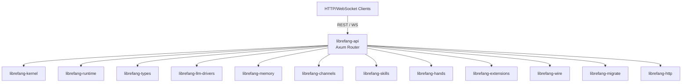

# Other — librefang-api

# librefang-api

HTTP/WebSocket API server for the LibreFang Agent OS daemon. This crate exposes the agent's runtime capabilities — conversations, skills, memory, channel management, extensions, and terminal sessions — over a RESTful HTTP API and WebSocket endpoints, backed by Axum.

## Architecture Overview



The API crate is the top-level integration point. It wires together the kernel, runtime, LLM drivers, channel adapters, and extension subsystem into a unified server that serves both the agent API and the embedded React dashboard.

## Feature Flags

Feature flags control which channel adapters are compiled in and whether telemetry is enabled. This keeps default build times fast — only five lightweight adapters ship by default.

### Channel Features

| Feature Group | Description |
|---|---|
| `default` | Enables `core-channels` + `telemetry` |
| `core-channels` | Telegram, Discord, Slack, Webhook, Ntfy — five lightweight adapters using only the workspace HTTP stack (`reqwest` + `rustls`) |
| `mini` | 12 core channels (Telegram, Discord, Slack, Matrix, Email, Webhook, WhatsApp, Signal, Teams, Mattermost, IRC, Google Chat) |
| `all-channels` | Every available channel adapter |
| `all-channels-no-email` | All channels except Email — used for Android targets where `rustls-platform-verifier` lacks `new_with_extra_roots` support |
| `channel-<name>` | Individual channel feature — forwarded directly to `librefang-channels` |

To build with all channels:

```bash
cargo build -p librefang-api --features all-channels
```

For release packaging, opt in explicitly via `--features all-channels`. Plain `cargo build` compiles only the core set.

### Telemetry Feature

The `telemetry` feature (enabled by default) pulls in:

- **OpenTelemetry** tracing export (`opentelemetry`, `opentelemetry-otlp`)
- **Prometheus** metrics export (`metrics`, `metrics-exporter-prometheus`)
- `tracing-opentelemetry` bridge

Disable for lighter builds:

```bash
cargo build -p librefang-api --no-default-features --features core-channels
```

## Build Script (`build.rs`)

The build script performs three tasks:

1. **Dashboard static directory** — Ensures `static/react/` exists so the `include_dir!` macro (which embeds dashboard assets at compile time) never fails on fresh clones. The directory is gitignored because it's populated either by `npm run build` in the dashboard subcrate or by downloading release assets at runtime. When empty, nothing is embedded and the runtime falls back to `~/.librefang/dashboard/`.

2. **Build metadata** — Injects the following as compile-time environment variables, accessible via `env!()`:
   - `GIT_SHA` — Short git commit hash (e.g. `a1b2c3d`), or `"unknown"`
   - `BUILD_DATE` — UTC date in `YYYY-MM-DD` format
   - `RUSTC_VERSION` — Full `rustc --version` output

3. **No outgoing calls** — The build script is self-contained; it does not call into other crates at build time.

## Key Dependencies and Their Roles

### Web Framework Stack

- **`axum`** + **`tower`** + **`tower-http`** — HTTP server, middleware, and utility layers (CORS, compression, tracing, etc.)
- **`utoipa`** (with `axum_extras`) — OpenAPI 3.0 schema generation; the API is self-documenting
- **`governor`** — Rate limiting middleware

### Authentication & Security

- **`jsonwebtoken`** — JWT token creation and validation
- **`argon2`** — Password hashing for credential storage
- **`hmac`** + **`sha2`** — HMAC-SHA256 for API key signing and webhook verification
- **`subtle`** — Constant-time comparisons to prevent timing attacks
- **`base64`** — Encoding for tokens and keys

### Core Integration Crates

| Crate | Purpose |
|---|---|
| `librefang-types` | Shared type definitions (request/response schemas, domain types) |
| `librefang-kernel` | Agent kernel — orchestration, conversation management |
| `librefang-runtime` | Process registry, runtime state management |
| `librefang-llm-drivers` | LLM provider integrations (OpenAI, Anthropic, local models, etc.) |
| `librefang-memory` | Conversation history, long-term memory storage |
| `librefang-channels` | Messaging channel adapters (Telegram, Discord, etc.) |
| `librefang-wire` | Wire protocol definitions for inter-service communication |
| `librefang-skills` | Skill/plugin execution framework |
| `librefang-hands` | Tool-use / action execution capabilities |
| `librefang-extensions` | Extension system, including vault for secrets |
| `librefang-migrate` | Database schema migrations |
| `librefang-http` | Shared HTTP client configuration |
| `librefang-telemetry` | Tracing and metrics infrastructure |

### Utility Dependencies

- **`dashmap`** — Concurrent hash maps for in-memory state
- **`portable-pty`** — Pseudo-terminal management for interactive shell sessions
- **`tokio-stream`** — Async stream utilities for WebSocket/SSE endpoints
- **`tokio`** — Async runtime
- **`flate2`** + **`tar`** + **`zip`** — Archive handling (likely for extension packaging, backup/restore)
- **`walkdir`** — Directory traversal for file operations
- **`url`** — URL parsing and manipulation
- **`serde`** + **`serde_json`** + **`toml`** + **`toml_edit`** — Serialization and configuration
- **`schemars`** — JSON Schema generation from Rust types (works with `utoipa` for OpenAPI docs)
- **`include_dir`** — Embeds the React dashboard at compile time

### Platform-Specific (Unix only)

- **`rustix`** (with `process` feature) — Low-level Unix process operations
- **`libc`** — FFI bindings for system calls

## Adding a New Channel Adapter

1. Implement the channel in `librefang-channels` behind a new feature flag (e.g. `channel-mychannel`).
2. Add a corresponding feature in `librefang-api/Cargo.toml`:
   ```toml
   channel-mychannel = ["librefang-channels/channel-mychannel"]
   ```
3. If it should be in `core-channels`, add it there — but verify its dependency tree is lightweight (only `reqwest` + `rustls`). If it pulls in heavy or unmaintained transitive dependencies, leave it out of `core-channels` and document it as opt-in.
4. Add it to `all-channels` (and `all-channels-no-email` if it isn't `channel-email`).
5. Update `librefang-cli`'s feature forwarding if applicable.

## Development Dependencies

- **`tempfile`** — Temporary directories for test fixtures
- **`librefang-testing`** — Test utilities and mock infrastructure
- **`http-body-util`** — HTTP body inspection in tests
- **`totp-rs`** — TOTP generation/verification for 2FA testing