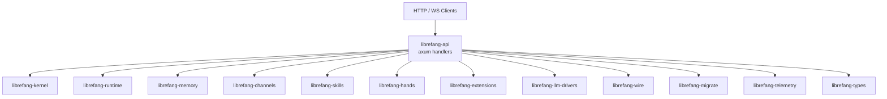

# Other — librefang-api

# librefang-api

The HTTP/WebSocket API server for the LibreFang Agent OS daemon. This crate is the primary entry point for external clients — dashboard UIs, CLI tools, and programmatic integrations — exposing the full agent lifecycle over a RESTful and real-time WebSocket surface.

## Architecture

`librefang-api` sits at the top of the crate dependency graph, importing nearly every other `librefang-*` crate to compose a unified server. It does not contain business logic itself; instead it wires together the kernel, runtime, memory, channels, skills, and extensions behind HTTP/WebSocket handlers.



## Key Dependencies and Their Roles

| Dependency | Role in the API |
|---|---|
| `axum` / `tower` / `tower-http` | HTTP framework, middleware stack (CORS, compression, tracing, etc.) |
| `utoipa` | OpenAPI schema generation from handler signatures |
| `governor` | Request rate limiting |
| `jsonwebtoken`, `argon2`, `hmac`, `sha2` | Authentication — JWT issuance/verification, password hashing, HMAC signatures |
| `tokio` / `tokio-stream` | Async runtime and stream utilities for WebSocket handling |
| `portable-pty` | PTY allocation for interactive terminal sessions over WebSocket |
| `dashmap` | Concurrent maps for in-process state (active sessions, connections) |
| `include_dir` | Embeds the React dashboard static assets at compile time |
| `schemars` | JSON Schema generation for API types (used alongside `utoipa`) |

## Feature Flags

The crate uses feature flags extensively to control which communication channels are compiled in, plus an optional telemetry stack. All features are additive.

### Channel Features

Each `channel-*` feature is forwarded directly to the corresponding feature in `librefang-channels`. The supported channels are:

`telegram`, `discord`, `slack`, `matrix`, `email`, `voice`, `webhook`, `whatsapp`, `signal`, `teams`, `mattermost`, `irc`, `google-chat`, `twitch`, `rocketchat`, `zulip`, `xmpp`, `bluesky`, `feishu`, `line`, `mastodon`, `messenger`, `reddit`, `revolt`, `viber`, `flock`, `guilded`, `keybase`, `nextcloud`, `nostr`, `pumble`, `threema`, `twist`, `webex`, `dingtalk`, `discourse`, `gitter`, `gotify`, `linkedin`, `mumble`, `ntfy`, `qq`, `wechat`, `wecom`

### Feature Groups

| Feature | Description |
|---|---|
| `default` | Enables `all-channels` + `telemetry` |
| `all-channels` | Every channel listed above |
| `all-channels-no-email` | All channels except `email`. Required for Android targets where `rustls-platform-verifier` lacks `new_with_extra_roots` support. |
| `mini` | 12 core channels: telegram, discord, slack, matrix, email, webhook, whatsapp, signal, teams, mattermost, irc, google-chat |
| `telemetry` | OpenTelemetry tracing export + Prometheus metrics endpoint (`opentelemetry`, `opentelemetry_sdk`, `opentelemetry-otlp`, `tracing-opentelemetry`, `metrics`, `metrics-exporter-prometheus`) |

### Selecting a Minimal Build

To compile only the channels you need and skip telemetry:

```toml
# In the workspace or overriding librefang-api
[dependencies]
librefang-api = { path = "librefang-api", default-features = false, features = [
    "channel-telegram",
    "channel-discord",
] }
```

## Build Script (`build.rs`)

The build script performs three tasks at compile time:

### 1. Static Dashboard Directory Scaffolding

Creates `static/react/` inside the crate root if it doesn't exist. This directory is gitignored and normally populated by building the React dashboard (or downloading release assets). `include_dir!` embeds whatever is present at compile time; when the directory is empty, the runtime falls back to serving assets from `~/.librefang/dashboard/`.

### 2. Build Metadata Injection

Three environment variables are emitted and available to the binary via `env!()`:

| Variable | Source | Example Value |
|---|---|---|
| `GIT_SHA` | `git rev-parse --short HEAD` | `a3f9c12` |
| `BUILD_DATE` | `date -u +%Y-%m-%d` | `2025-01-15` |
| `RUSTC_VERSION` | `rustc --version` | `rustc 1.82.0` |

If any command fails (e.g., building outside a git repo), the variable defaults to `"unknown"`.

### Platform-Specific Dependency

On Unix targets, the crate depends on `rustix` with the `process` feature. This is used for low-level process operations not covered by the standard library.

## Authentication and Security

The dependency set indicates a multi-layered auth model:

- **Password hashing**: `argon2` for secure credential storage
- **JWT**: `jsonwebtoken` for stateless token-based auth on API endpoints
- **HMAC/SHA-256**: `hmac` + `sha2` for webhook signature verification and request integrity
- **Constant-time comparison**: `subtle` for timing-safe equality checks (token comparison, signature validation)
- **Rate limiting**: `governor` provides per-IP or per-key request throttling

## API Surface

The crate exposes both REST and WebSocket endpoints. Based on the dependency set:

- **REST endpoints** — CRUD operations for agent configuration, channel management, extension lifecycle, memory inspection, skill invocation, and LLM driver configuration. Schema documentation is auto-generated via `utoipa`.
- **WebSocket endpoints** — Real-time event streaming, interactive terminal sessions (via `portable-pty`), and agent output streaming (via `tokio-stream`/`futures`).
- **Dashboard** — The React frontend is embedded via `include_dir` and served as static files, with fallback to a user-local directory at runtime.

## Configuration

The crate uses `toml` and `toml_edit` for reading and modifying persistent configuration files. `toml_edit` preserves formatting and comments when writing back, making it suitable for user-editable config files that the API updates programmatically.

## Migration

`librefang-migrate` is included to run database schema migrations at startup, ensuring the storage layer is up to date before the API begins serving requests.

## Testing

Dev dependencies include `tempfile` for filesystem-based tests, `uuid` for generating test identifiers, and `http-body-util` for low-level HTTP body inspection in integration tests.