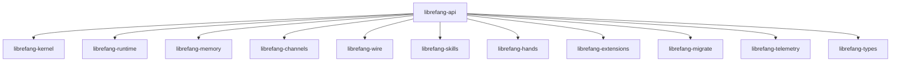

# Other — librefang-api

# librefang-api

The HTTP/WebSocket API server for LibreFang Agent OS. This crate is the top-level aggregation point that wires together the kernel, runtime, memory, channels, skills, extensions, and telemetry subsystems into a unified network-facing service.

## Role in the System

`librefang-api` sits at the outermost layer of the LibreFang architecture. It does not implement domain logic itself — instead it composes the other crates into a deployable server that exposes REST endpoints, WebSocket streams, and a embedded web dashboard.



### What each dependency provides

| Crate | Role in the API server |
|---|---|
| `librefang-types` | Shared domain types, request/response structs |
| `librefang-kernel` | Core agent lifecycle and orchestration |
| `librefang-runtime` | Task execution runtime |
| `librefang-memory` | Conversation and state persistence |
| `librefang-channels` | Messaging channel integrations (Telegram, Discord, Slack, etc.) |
| `librefang-wire` | Wire protocol definitions |
| `librefang-skills` | Skill registration and execution |
| `librefang-hands` | Tool/hand interfaces |
| `librefang-extensions` | Extension loading, including vault access |
| `librefang-migrate` | Database schema migrations |
| `librefang-telemetry` | Observability primitives |

## Feature Flags

Features control two orthogonal dimensions: **channel availability** and **telemetry**.

### Build Variants

| Feature set | Description |
|---|---|
| `default` (`all-channels` + `telemetry`) | Full production build with every channel and OpenTelemetry/Prometheus |
| `mini` | 12 core channels only, no telemetry — smaller binary and faster compile |

### Channels

Every channel is individually gateable. The `all-channels` feature activates all of them at once. To build a minimal server with only the channels you need:

```toml
[dependencies]
librefang-api = { path = "../librefang-api", default-features = false, features = [
    "channel-telegram",
    "channel-discord",
    "telemetry",
] }
```

Available channel features: `channel-telegram`, `channel-discord`, `channel-slack`, `channel-matrix`, `channel-email`, `channel-webhook`, `channel-whatsapp`, `channel-signal`, `channel-teams`, `channel-mattermost`, `channel-irc`, `channel-google-chat`, `channel-twitch`, `channel-rocketchat`, `channel-zulip`, `channel-xmpp`, `channel-bluesky`, `channel-feishu`, `channel-line`, `channel-mastodon`, `channel-messenger`, `channel-reddit`, `channel-revolt`, `channel-viber`, `channel-flock`, `channel-guilded`, `channel-keybase`, `channel-nextcloud`, `channel-nostr`, `channel-pumble`, `channel-threema`, `channel-twist`, `channel-webex`, `channel-dingtalk`, `channel-discourse`, `channel-gitter`, `channel-gotify`, `channel-linkedin`, `channel-mumble`, `channel-ntfy`, `channel-qq`, `channel-voice`, `channel-wechat`, `channel-wecom`.

Each `channel-*` feature is forwarded directly to `librefang-channels` — the API crate does not re-implement any channel logic.

### Telemetry

The `telemetry` feature pulls in OpenTelemetry tracing export and Prometheus metrics collection:

- `opentelemetry` / `opentelemetry_sdk` / `opentelemetry-otlp` — OTLP trace export
- `tracing-opentelemetry` — bridges `tracing` spans to OpenTelemetry
- `metrics` / `metrics-exporter-prometheus` — Prometheus scrape endpoint

## Build Script (`build.rs`)

The build script performs three tasks before compilation:

### 1. Dashboard asset placeholder

Creates `static/react/` if it doesn't exist. This directory is the target for the React dashboard build output. It's gitignored because the actual assets are either:

- Built locally via `npm run build` in the dashboard subcrate, or
- Downloaded from release assets at runtime into `~/.librefang/dashboard/`

When the directory is empty, `include_dir!` (from the `include_dir` crate) embeds nothing, and the runtime fallback path serves assets instead.

### 2. Build metadata injection

Three environment variables are set at compile time via `cargo:rustc-env`:

| Variable | Source | Example value |
|---|---|---|
| `GIT_SHA` | `git rev-parse --short HEAD` | `a1b2c3d` |
| `BUILD_DATE` | `date -u +%Y-%m-%d` | `2025-01-15` |
| `RUSTC_VERSION` | `rustc --version` | `rustc 1.82.0` |

All three fall back to `"unknown"` if the command fails (e.g., building from a tarball without git). These are accessible at runtime via `env!()` macros:

```rust
let version = env!("GIT_SHA");
let built = env!("BUILD_DATE");
let compiler = env!("RUSTC_VERSION");
```

### 3. Unix-specific dependency

On Unix targets, `rustix` (with `process` features) is included. This is likely used for process management capabilities such as signal handling, privilege manipulation, or process forking in the API server runtime.

## Key External Dependencies

### HTTP framework

- **`axum`** + **`tower`** + **`tower-http`** — The HTTP server stack. `tower-http` provides middleware for CORS, compression, tracing, and static file serving.
- **`utoipa`** (with `axum_extras`) — OpenAPI spec generation from handler signatures.

### Authentication & security

- **`jsonwebtoken`** — JWT token creation and validation.
- **`argon2`** — Password hashing for local authentication.
- **`hmac`** + **`sha2`** — HMAC-SHA256 for webhook signature verification and token signing.
- **`subtle`** — Constant-time comparison for timing-safe auth checks.
- **`governor`** — Rate limiting middleware.

### Terminal emulation

- **`portable-pty`** — PTY allocation for terminal/Shell WebSocket streams. Enables interactive shell sessions through the API.

### Data handling

- **`serde`** / **`serde_json`** / **`toml`** / **`toml_edit`** — Serialization and configuration file manipulation.
- **`flate2`** + **`tar`** + **`zip`** — Archive handling for extension packaging and backup import/export.

### Async runtime

- **`tokio`** — The async runtime driving the entire server.
- **`tokio-stream`** + **`futures`** — Stream utilities for WebSocket and event pipelines.
- **`dashmap`** — Concurrent hashmap for in-memory state (e.g., active sessions, connection registries).

## Development

```bash
# Full build (all channels + telemetry)
cargo build -p librefang-api

# Minimal build (12 core channels, no telemetry)
cargo build -p librefang-api --no-default-features --features mini

# Single channel
cargo build -p librefang-api --no-default-features --features channel-telegram,telemetry
```

Tests use `tokio-test`, `tempfile`, and `http-body-util` for async handler testing with temporary filesystem fixtures.