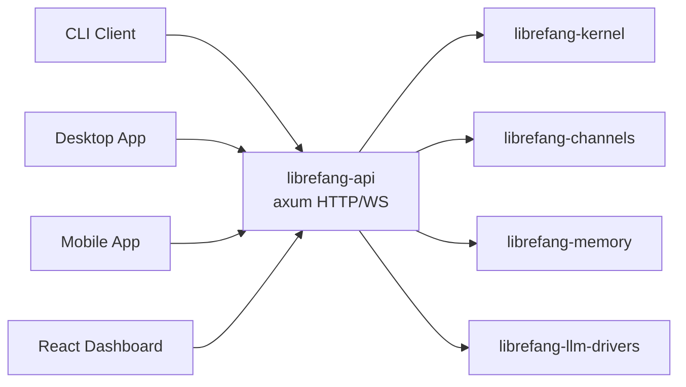

# Other — librefang-api

# librefang-api

HTTP and WebSocket API server for the LibreFang Agent OS daemon. This crate is the primary network entry point for all external clients — CLI tools, desktop applications, mobile apps, and the bundled React dashboard — communicating with the in-process agent kernel.

## Architecture

The API server hosts the `librefang-kernel` inside the same process. All client interactions flow through this surface:

The kernel is not a remote service — it is instantiated directly and accessed through in-process calls. The API layer translates between HTTP/WS protocols and kernel operations.

## Entry Point

`server::build_router(kernel, addr)` assembles the complete axum `Router` along with the shared `AppState`. This is the single public function that consumers (such as `librefang-cli`) call to obtain a runnable server.

## Key Components

### Routes (`routes::*`)

Endpoint handlers organized by domain — agent management, sessions, channels, approvals, MCP (Model Context Protocol), peer/A2A networking, and administrative operations. All routes return JSON and follow REST conventions.

### Middleware (`middleware`)

- **Authentication** — JWT-based with three route visibility tiers:
  - `PUBLIC_ROUTES_ALWAYS` — accessible without credentials (e.g., login)
  - `PUBLIC_ROUTES_GET_ONLY` — read-only public access
  - `PUBLIC_ROUTES_DASHBOARD_READS` — unauthenticated dashboard read paths
- **Rate limiting** — powered by the `governor` crate
- **Telemetry** — request tracing and metrics (gated behind the `telemetry` feature)

### WebSocket (`ws`)

WebSocket authentication handshake and streaming handlers. Used for real-time session streaming, agent event subscriptions, and terminal/pty interactions.

### Dashboard SPA

The TypeScript/React/TanStack Query dashboard lives under `dashboard/`. It is built externally via `cargo xtask build-web` and embedded into the binary at compile time using `include_dir!`. The embedded assets are served as static files. At runtime, the directory `~/.librefang/dashboard/` can override the embedded assets, allowing updates without recompilation.

The build script (`build.rs`) ensures the `static/react` placeholder directory exists so `include_dir!` compiles cleanly on fresh clones where no dashboard build has occurred yet.

### OpenAPI

An `openapi.json` is committed at the workspace root, generated by `cargo xtask codegen --openapi` using `utoipa` with `schemars` schema derivation. CI verifies this file for drift against hash baselines in `xtask/baselines/`.

## Feature Flags

Features control which channel adapters and telemetry capabilities are compiled in. Channel features are forwarded directly to `librefang-channels`.

| Feature | Description |
|---|---|
| `default` | `core-channels` + `telemetry` |
| `telemetry` | OpenTelemetry tracing export + Prometheus metrics endpoint |
| `core-channels` | Telegram, Discord, Slack, Webhook, ntfy — lightweight, `reqwest`-only adapters |
| `all-channels` | Every channel adapter |
| `all-channels-no-email` | All channels except email (for Android targets where `rustls-platform-verifier` lacks `new_with_extra_roots` support) |
| `mini` | 12 commonly-used channels (core 5 + Matrix, Email, WhatsApp, Signal, Teams, Mattermost, IRC, Google Chat) |
| `channel-*` | Individual channel toggle (e.g., `channel-telegram`) |

**Why the granularity:** A plain `cargo build` compiles only the five core channels to keep build times fast for library consumers and development. Release and packaging pipelines opt into `all-channels` explicitly. Adding a new channel to `core-channels` requires verifying its dependency tree stays lightweight.

## Build-Time Metadata

The build script captures three environment variables available at runtime:

| Variable | Source | Example |
|---|---|---|
| `GIT_SHA` | `git rev-parse --short HEAD` | `a1b2c3d` |
| `BUILD_DATE` | `date -u +%Y-%m-%d` | `2025-01-15` |
| `RUSTC_VERSION` | `rustc --version` | `rustc 1.82.0` |

These are embedded in the binary and exposed through the version/health endpoint.

## Platform-Specific Dependencies

**Unix:** `rustix` (with `process` feature) and `libc` for POSIX process operations.

**Windows:** `windows-sys` with `Win32_Security` and `Win32_Security_Authorization` features. Used exclusively for the ACP named-pipe listener — `ConvertStringSecurityDescriptorToSecurityDescriptorW` restricts the pipe DACL to the daemon's owner SID so other local users cannot connect. Since `windows-sys` is already in the transitive dependency tree via tokio, this adds no additional compile-time cost.

## Authentication Stack

The cryptographic dependencies indicate the auth layer uses:

- **JWT** (`jsonwebtoken`, `hmac`, `sha2`) — token issuance and validation, with JWKS support for OIDC integration
- **Password hashing** (`argon2`) — credential storage
- **Constant-time comparison** (`subtle`) — timing-safe token/secret checks
- **TOTP** (`totp-rs` in dev-dependencies) — two-factor authentication, tested via `librefang-testing`

## Relationship to Other Crates

This crate is the integration hub — it depends on nearly every other LibreFang crate but nothing depends on it (except the CLI binary which calls `build_router`). It does not publish types or utilities for reuse; its role is to bind the kernel, channels, memory, LLM drivers, skills, hands, and extensions together behind a unified HTTP/WS interface.