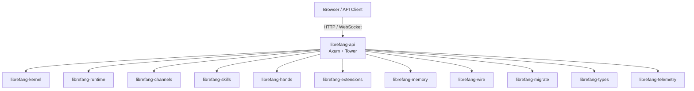

# Other — librefang-api

# librefang-api

The HTTP/WebSocket API server for the LibreFang Agent OS daemon. This crate exposes a RESTful API and WebSocket endpoints for managing agents, channels, skills, sessions, extensions, and all other LibreFang subsystems. It also serves the embedded React-based dashboard UI.

## Architecture



The API layer is a thin coordination surface. Nearly all business logic lives in the kernel and domain crates; the API handlers translate HTTP requests into calls against those crates and serialize responses.

## Key Dependencies and Their Roles

| Dependency | Role |
|---|---|
| `axum` + `tower` + `tower-http` | HTTP framework, middleware stack, CORS, compression, tracing layers |
| `utoipa` | OpenAPI 3.x spec generation from handler signatures and types |
| `schemars` | JSON Schema generation for types (used by utoipa) |
| `librefang-kernel` | Core domain logic, state management, agent lifecycle |
| `librefang-runtime` | Process registry, execution runtime |
| `librefang-channels` | Messaging channel integrations (Telegram, Discord, Slack, etc.) |
| `librefang-skills` | Skill definitions and execution |
| `librefang-hands` | Tool/hand system for agent actions |
| `librefang-extensions` | Extension loading, vault for secrets |
| `librefang-memory` | Conversation and long-term memory storage |
| `librefang-wire` | Wire protocol types for inter-service communication |
| `librefang-migrate` | Database schema migrations |
| `librefang-telemetry` | Observability infrastructure |

## Authentication and Security

The crate pulls in several cryptography-adjacent crates:

- **`jsonwebtoken`** — JWT token issuance and validation for API authentication.
- **`argon2`** — Password hashing for user credentials.
- **`hmac`** + **`sha2`** — HMAC-based request signing or token verification.
- **`subtle`** — Constant-time comparisons to prevent timing attacks during auth checks.
- **`governor`** — Rate limiting middleware to protect endpoints from abuse.

## Feature Flags

Features control which channel backends and telemetry capabilities are compiled in.

### Channel Features

Each `channel-*` feature forwards directly to the corresponding feature in `librefang-channels`. Available channels include:

`telegram`, `discord`, `slack`, `matrix`, `email`, `voice`, `webhook`, `whatsapp`, `signal`, `teams`, `mattermost`, `irc`, `google-chat`, `twitch`, `rocketchat`, `zulip`, `xmpp`, `bluesky`, `feishu`, `line`, `mastodon`, `messenger`, `reddit`, `revolt`, `viber`, `flock`, `guilded`, `keybase`, `nextcloud`, `nostr`, `pumble`, `threema`, `twist`, `webex`, `dingtalk`, `discourse`, `gitter`, `gotify`, `linkedin`, `mumble`, `ntfy`, `qq`, `wechat`, `wecom`

### Feature Groups

| Feature | Description |
|---|---|
| `all-channels` | Enables all 44 channel backends. Included in `default`. |
| `mini` | Enables 12 core channels (Telegram, Discord, Slack, Matrix, Email, Webhook, WhatsApp, Signal, Teams, Mattermost, IRC, Google Chat). |
| `telemetry` | Enables OpenTelemetry tracing export and Prometheus metrics. Included in `default`. |
| `default` | `all-channels` + `telemetry` |

To build a minimal binary with only the channels you need:

```toml
# In a workspace override or direct dependency
[dependencies]
librefang-api = { path = "...", default-features = false, features = ["channel-telegram", "channel-discord"] }
```

### Telemetry Feature

When enabled, pulls in `opentelemetry`, `opentelemetry-otlp`, `tracing-opentelemetry`, `metrics`, and `metrics-exporter-prometheus`. This adds an OTLP trace exporter and a Prometheus metrics endpoint to the running server.

## Build Script (`build.rs`)

The build script performs three tasks:

1. **Dashboard static directory scaffolding** — Ensures `static/react/` exists so the `include_dir!` macro (which embeds the React dashboard at compile time) never fails on fresh clones. The directory is gitignored because actual assets are either built from the dashboard subcrate via `npm run build` or downloaded at runtime to `~/.librefang/dashboard/`. When empty at compile time, the embedded bundle is a no-op and the runtime path is used instead.

2. **Build metadata injection** — Captures three values and sets them as compile-time environment variables:

   | Variable | Source | Example |
   |---|---|---|
   | `GIT_SHA` | `git rev-parse --short HEAD` | `a3f7c2d` |
   | `BUILD_DATE` | `date -u +%Y-%m-%d` | `2025-01-15` |
   | `RUSTC_VERSION` | `rustc --version` | `rustc 1.82.0` |

   These are available in code via `env!("GIT_SHA")`, `env!("BUILD_DATE")`, and `env!("RUSTC_VERSION")`, typically exposed through a `/api/version` or `/api/health` endpoint.

3. **Platform-specific dependency** — On Unix targets, `rustix` (with `process` feature) is included, likely for privileged process operations like UID/GID management or daemonization.

## Dashboard Serving Strategy

The React dashboard follows a two-tier serving model:

1. **Compile-time embed** — `include_dir = "0.7"` embeds the contents of `static/react/` into the binary. If the dashboard was built before the Rust crate, the assets are served directly from memory with zero filesystem dependencies.

2. **Runtime fallback** — If the embedded directory is empty (the default for fresh clones), the server falls back to serving from `~/.librefang/dashboard/`. This allows dashboard updates without recompiling the API binary.

## Integration Points

The API is the primary entry point for external consumers:

- **Dashboard UI** — Served as static files at the root path.
- **REST API** — JSON endpoints under `/api/` for CRUD operations on agents, channels, skills, sessions, extensions, and configuration.
- **WebSocket** — Real-time event streaming for agent output, session updates, and telemetry.
- **OpenAPI spec** — Auto-generated via `utoipa`, likely served at `/api/docs/openapi.json` with a Swagger UI.
- **Prometheus metrics** — When the `telemetry` feature is enabled, a `/metrics` endpoint exports runtime metrics.
- **Terminal/PTY** — `portable-pty` is included, suggesting WebSocket-based terminal sessions for interactive agent debugging.

## Configuration

The crate depends on both `toml` and `toml_edit`, indicating it reads structured TOML configuration files and also provides API endpoints to modify configuration persistently (using `toml_edit` to preserve comments and formatting when writing back).