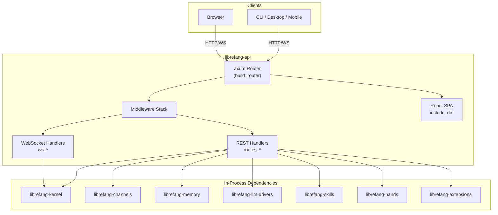

# Other — librefang-api

# librefang-api

HTTP/WebSocket API server for the LibreFang Agent OS daemon. This crate exposes the entire agent management surface — sessions, channels, approvals, MCP, peer/A2A networking, and the React dashboard SPA — over JSON REST and WebSocket endpoints. The kernel runs in-process; CLI, desktop, and mobile clients all connect through this layer.

## Architecture



The API server is a thin HTTP transport layer. All business logic lives in the kernel and its satellite crates. The server assembles an `AppState` struct shared across handlers, wires axum middleware (auth, rate limiting, telemetry), and embeds the pre-built React dashboard as static assets.

## Entry Points

- **`server::build_router(kernel, addr)`** — assembles the complete axum `Router` with all routes, middleware, and shared `AppState`. This is the primary public API. Callers pass an initialised kernel handle and a listen address.
- **`routes::*`** — endpoint handlers organised by domain (agents, sessions, channels, approvals, MCP, peers, etc.).
- **`middleware`** — authentication gate, rate limiting (`governor`), and telemetry injection. Three route-visibility tiers control which paths skip auth:
  - `PUBLIC_ROUTES_ALWAYS` — no auth required for any method.
  - `PUBLIC_ROUTES_GET_ONLY` — GET requests skip auth; mutations require authentication.
  - `PUBLIC_ROUTES_DASHBOARD_READS` — dashboard read-only paths accessible without credentials.
- **`ws`** — WebSocket authentication handshake and streaming message handlers for real-time session updates.

## Feature Flags

The crate uses feature flags extensively to control which channel adapters are compiled in. This avoids pulling in heavy or unmaintained transitive dependencies for users who only need a subset.

| Feature | Description |
|---|---|
| `default` | Enables `core-channels` + `telemetry`. Sufficient for most deployments. |
| `core-channels` | Telegram, Discord, Slack, Webhook, ntfy — five lightweight HTTP-based adapters. |
| `all-channels` | Every channel adapter. Used by release packaging pipelines. |
| `all-channels-no-email` | All channels except email. Required for Android targets where `rustls-platform-verifier` lacks `new_with_extra_roots` support. |
| `mini` | 12 common channels (core + Matrix, Email, WhatsApp, Signal, Teams, Mattermost, IRC, Google Chat). |
| `telemetry` | OpenTelemetry tracing export + Prometheus metrics endpoint. |
| `channel-*` | Individual channel toggles, forwarded directly to `librefang-channels`. |

```toml
# Example: build with only Telegram and Discord
cargo build -p librefang-api --no-default-features \
    --features channel-telegram,channel-discord
```

When adding a channel to `core-channels`, verify its dependency tree doesn't introduce heavyweight or unmaintained crates. Anything beyond the curated set should go through `all-channels` or individual features.

## Authentication and Security

The middleware layer enforces authentication using a combination of:

- **JWT** (`jsonwebtoken`) — token-based session authentication.
- **HMAC-SHA256** (`hmac` + `sha2`) — request signing for webhook channels.
- **Argon2** (`argon2`) — password hashing for local accounts.
- **Constant-time comparison** (`subtle`) — timing-safe secret validation.
- **Rate limiting** (`governor`) — per-IP request throttling.

## Key Dependencies

| Crate | Role |
|---|---|
| `librefang-kernel` / `librefang-kernel-handle` | Core agent runtime, session management |
| `librefang-channels` | Channel adapter multiplexer |
| `librefang-memory` | Conversation memory and context |
| `librefang-llm-drivers` | LLM provider integrations |
| `librefang-skills` | Skill registry and execution |
| `librefang-hands` | Tool/hand implementations |
| `librefang-extensions` | Extension loading and vault |
| `librefang-migrate` | Database migrations |
| `librefang-telemetry` | Tracing and metrics infrastructure |
| `librefang-wire` | Wire protocol types for WebSocket |
| `librefang-types` | Shared type definitions |
| `axum` + `tower-http` | HTTP framework and middleware |
| `utoipa` + `schemars` | OpenAPI schema generation |
| `include_dir` | Compile-time embedding of dashboard assets |

## Build Process

The `build.rs` script performs three tasks:

1. **Dashboard asset directory** — ensures `static/react/` exists so `include_dir!` compiles on fresh clones. The directory is gitignored because it contains build artifacts from `cargo xtask build-web`. When empty, the runtime falls back to serving assets from `~/.librefang/dashboard/`.

2. **Build metadata** — captures `GIT_SHA`, `BUILD_DATE`, and `RUSTC_VERSION` as compile-time environment variables, exposed through the API's health/version endpoint.

3. **No procedural macros** — the build script is straightforward with no outgoing calls beyond standard `std::process::Command` invocations.

## OpenAPI

An `openapi.json` is committed at the workspace root and regenerated by:

```bash
cargo xtask codegen --openapi
```

CI verifies this file for drift using hash baselines stored in `xtask/baselines/`. If you add or modify routes, run the codegen command and commit the updated spec.

## Dashboard SPA

The React dashboard lives under `dashboard/` as a separate TypeScript/React/TanStack Query project. It is built by `cargo xtask build-web`, which produces optimised static assets in `static/react/`. These are embedded into the API binary at compile time via `include_dir!` and served at the root path.

For development, you can run the dashboard dev server independently and proxy API requests to the running backend.