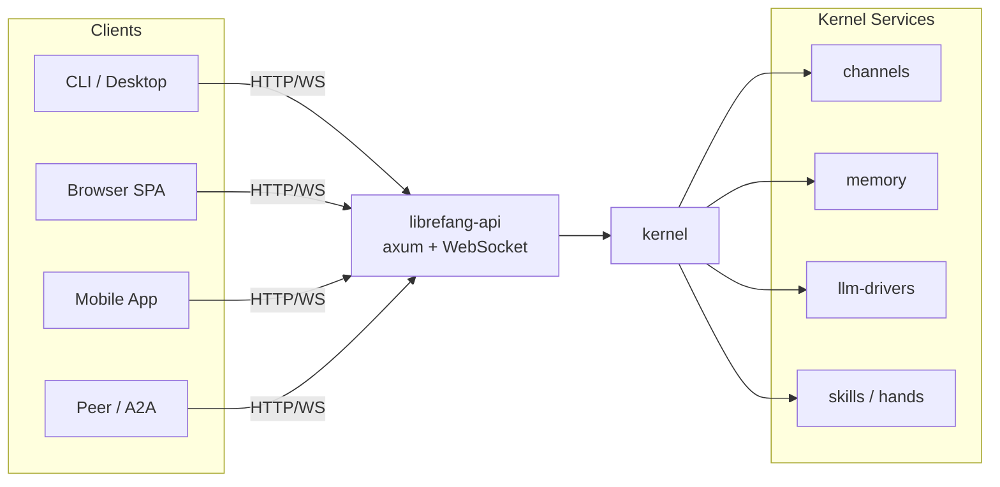

# Other — librefang-api

# librefang-api

HTTP and WebSocket API server for the LibreFang Agent OS daemon. This crate is the primary network-facing surface through which CLI clients, desktop applications, mobile apps, and web browsers interact with the in-process agent kernel.

## Role in the System

`librefang-api` sits between external consumers and the core `librefang-kernel`. It translates JSON REST requests and WebSocket frames into kernel operations, and streams results back. The kernel runs in the same process — there is no IPC boundary between the API layer and the agent runtime.



## Public Entry Points

| Symbol | Purpose |
|---|---|
| `server::build_router(kernel, addr)` | Assembles the complete axum `Router` with all routes, middleware, and shared `AppState`. This is the single function callers invoke to get a runnable server. |
| `routes::*` | Endpoint handlers organized by domain (sessions, channels, approvals, MCP, peers/A2A, etc.). |
| `middleware` | Authentication gates, rate limiting, and telemetry injection. Defines `PUBLIC_ROUTES_ALWAYS`, `PUBLIC_ROUTES_GET_ONLY`, and `PUBLIC_ROUTES_DASHBOARD_READS` for unauthenticated access control. |
| `ws` | WebSocket authentication and streaming handlers for real-time event delivery. |

## Architecture

### Router Construction

`build_router` wires together:

1. **Route definitions** from `routes::*` — REST endpoints grouped by domain
2. **Middleware stack** — authentication, rate limiting (via `governor`), request tracing
3. **Static file serving** — the embedded React dashboard SPA
4. **WebSocket upgrade paths** — for live session and event streams
5. **OpenAPI spec generation** — via `utoipa` with `axum_extras` support

### Shared State (`AppState`)

The router carries an `AppState` containing the kernel handle and any shared configuration. All route handlers receive this state through axum's state extraction.

### Authentication

The middleware layer categorizes routes into three access tiers:

- **`PUBLIC_ROUTES_ALWAYS`** — accessible without credentials (e.g., login, health checks)
- **`PUBLIC_ROUTES_GET_ONLY`** — readable without auth, writes require auth
- **`PUBLIC_ROUTES_DASHBOARD_READS`** — dashboard read-only endpoints accessible without full auth

All other routes require a valid authentication token (JWT via `jsonwebtoken`, verified with HMAC-SHA256 via `hmac`/`sha2`, passwords hashed with `argon2`).

### Rate Limiting

Request throttling uses the `governor` crate, applied at the middleware layer before route matching.

## Feature Flags

The crate has an extensive feature flag system controlling which channel adapters are compiled in. This avoids paying compile-time costs for adapters you don't use.

### Channel Features

Each `channel-<name>` flag forwards to the corresponding feature in `librefang-channels`. Available channels include: telegram, discord, slack, matrix, email, webhook, whatsapp, signal, teams, mattermost, irc, google-chat, twitch, rocketchat, zulip, xmpp, bluesky, feishu, line, mastodon, messenger, reddit, revolt, viber, flock, guilded, keybase, nextcloud, nostr, pumble, threema, twist, webex, dingtalk, discourse, gitter, gotify, linkedin, mumble, ntfy, qq, voice, wechat, wecom.

### Feature Groups

| Feature | Description |
|---|---|
| `default` | Enables `core-channels` + `telemetry` |
| `core-channels` | Telegram, Discord, Slack, Webhook, ntfy — lightweight adapters using only `reqwest` + `rustls` |
| `mini` | 12 channels covering the most common integration points |
| `all-channels` | Every channel adapter |
| `all-channels-no-email` | All channels except email (for Android targets where `rustls-platform-verifier` lacks `new_with_extra_roots` support) |
| `telemetry` | OpenTelemetry tracing export + Prometheus metrics endpoint |

When adding a channel to `core-channels`, verify its dependency tree stays light — each member should only use the workspace HTTP stack.

### Platform-Specific Dependencies

- **Unix**: `rustix` (process features) and `libc` for system-level operations
- **Windows**: `windows-sys` with `Win32_Security` features for ACP named-pipe listener — restricts the pipe DACL to the daemon's owner SID so other local users cannot connect

## Dashboard SPA

The React dashboard lives in `dashboard/` (TypeScript / React / TanStack Query). It is:

1. Built by `cargo xtask build-web`
2. Embedded into the binary via `include_dir!` from the `static/react/` directory
3. Served as static files by the API server

When the embedded directory is empty (fresh clones before a web build), the server falls back to serving assets from `~/.librefang/dashboard/` at runtime.

## Build Script (`build.rs`)

The build script performs three tasks:

1. **Ensures the `static/react/` directory exists** — creates it if absent so `include_dir!` doesn't fail on fresh clones. This directory is gitignored since it contains build artifacts.

2. **Captures build metadata** as environment variables available at runtime via `env!()`:
   - `GIT_SHA` — short commit hash (e.g., `a1b2c3d`)
   - `BUILD_DATE` — UTC date in `YYYY-MM-DD` format
   - `RUSTC_VERSION` — full `rustc --version` output

These are exposed through the API's version/info endpoint.

## OpenAPI Specification

The crate uses `utoipa` with the `axum_extras` feature for derive-based OpenAPI generation. The committed `openapi.json` at the workspace root is regenerated by:

```
cargo xtask codegen --openapi
```

Drift is detected in CI by comparing against hash baselines in `xtask/baselines/`.

## Key Dependencies

| Crate | Role |
|---|---|
| `librefang-kernel` | Core agent runtime — sessions, channels, approvals |
| `librefang-kernel-handle` | Typed handle to the kernel for ergonomic access |
| `librefang-types` | Shared type definitions across the workspace |
| `librefang-acp` | Agent Communication Protocol support (with `kernel-adapter` feature) |
| `librefang-channels` | Channel adapter implementations (feature-gated) |
| `librefang-llm-drivers` | LLM provider integrations |
| `librefang-memory` | Conversation and context memory |
| `librefang-skills` / `librefang-hands` | Skill execution and tool use |
| `librefang-extensions` | Extension loading and management |
| `librefang-wire` | Wire protocol types for WebSocket communication |
| `librefang-migrate` | Database migration orchestration |
| `librefang-http` | Shared HTTP client configuration |
| `librefang-telemetry` | Tracing and metrics infrastructure |
| `axum` + `tower-http` | HTTP framework and middleware |
| `tokio` | Async runtime |
| `serde` / `serde_json` / `schemars` | Serialization and JSON Schema generation |
| `governor` | Rate limiting |
| `jsonwebtoken` / `argon2` / `hmac` / `sha2` | Authentication and password hashing |

## Testing

Dev-dependencies include `librefang-testing` for test utilities, `librefang-runtime` for integration tests (particularly the tool-exec backend), `totp-rs` for two-factor authentication testing, and `tempfile` for filesystem-based test fixtures.