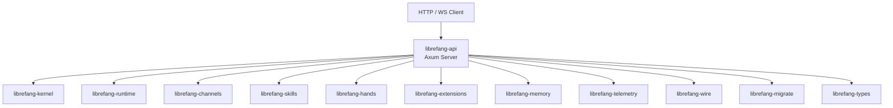

# Other — librefang-api

# librefang-api

HTTP/WebSocket API server for the LibreFang Agent OS daemon. This crate exposes the primary network interface through which external clients — browsers, CLI tools, and other agents — interact with the LibreFang runtime. It also embeds and serves the React-based dashboard UI.

## Architecture



The API crate is a thin orchestration layer. It wires Axum routes and WebSocket endpoints to the domain crates that do the real work. Business logic lives downstream; this crate is responsible for request parsing, authentication, rate limiting, serialization, and serving static assets.

## Feature Flags

Feature flags control which channel backends are compiled in and whether telemetry infrastructure is active.

### Telemetry

| Flag | Default | Effect |
|------|---------|--------|
| `telemetry` | ✓ | Enables OpenTelemetry trace export and Prometheus metrics endpoint |

When enabled, pulls in `opentelemetry`, `opentelemetry_sdk`, `opentelemetry-otlp`, `tracing-opentelemetry`, `metrics`, and `metrics-exporter-prometheus`.

### Channel Features

Every messaging channel is individually gated. The flag names follow the pattern `channel-<name>` and are forwarded directly to `librefang-channels`.

**Predefined feature groups:**

- **`all-channels`** (default) — compiles every supported channel backend (40+ protocols including Telegram, Discord, Slack, Matrix, WhatsApp, Signal, Teams, IRC, and many more).
- **`mini`** — a curated subset of 12 core channels (Telegram, Discord, Slack, Matrix, Email, Webhook, WhatsApp, Signal, Teams, Mattermost, IRC, Google Chat). Use this for smaller binary sizes when only the most common channels are needed.

To build with only specific channels, disable default features and enable only what you need:

```toml
# In a dependent Cargo.toml or via command line
librefang-api = { default-features = false, features = ["channel-telegram", "channel-discord", "telemetry"] }
```

## Build Script (`build.rs`)

The build script performs three tasks at compile time:

1. **Dashboard directory scaffolding** — Ensures `static/react/` exists so the `include_dir!` macro (used at runtime to embed dashboard assets) never fails on fresh clones. This directory is gitignored because it contains build artifacts from the dashboard's `npm run build` step. When empty, the runtime falls back to serving assets from `~/.librefang/dashboard/`.

2. **Git commit hash** — Captured via `git rev-parse --short HEAD` and exposed as the `GIT_SHA` environment variable, embedded into the binary for version reporting.

3. **Build date and compiler version** — `BUILD_DATE` (UTC date) and `RUSTC_VERSION` are similarly captured and embedded.

All three values gracefully degrade to `"unknown"` when the commands aren't available (e.g., building from a tarball without git).

## Key Dependencies and Their Roles

| Crate | Purpose within the API |
|-------|----------------------|
| `axum`, `tower`, `tower-http` | HTTP framework, middleware stack, CORS/compression/tracing layers |
| `governor` | Request rate limiting |
| `utoipa` | OpenAPI spec generation with Axum integration |
| `jsonwebtoken` | JWT validation for API authentication |
| `argon2` | Password hashing for local credential storage |
| `hmac`, `sha2`, `subtle` | HMAC-SHA256 signature verification (e.g., webhook validation) with constant-time comparison |
| `governor` | Token-bucket rate limiting per IP or API key |
| `include_dir` | Embeds the compiled React dashboard into the binary |
| `dashmap` | Concurrent in-memory state maps (e.g., active WebSocket sessions) |
| `portable-pty` | Terminal/PTY management for interactive shell endpoints |
| `flate2`, `tar`, `zip` | Archive handling for extension packaging/upload |
| `reqwest` | Outbound HTTP client for webhook dispatch and extension downloads |
| `toml`, `toml_edit` | Reading and programmatically modifying configuration files |

## Authentication Model

The API uses JWT-based authentication (`jsonwebtoken`) for session tokens and `argon2` for password hashing at the credential storage layer. Webhook endpoints use HMAC-SHA256 (`hmac` + `sha2`) with constant-time equality checks (`subtle`) to verify signed payloads from channel providers.

## API Documentation

OpenAPI documentation is generated at compile time via `utoipa` with the `axum_extras` feature. The generated spec is served from a route on the running server, providing interactive documentation for all registered endpoints.

## Connection to the Rest of the Codebase

This crate sits at the **edge** of the LibreFang system. It does not contain domain logic itself but delegates to:

- **librefang-kernel** — Core agent lifecycle and orchestration
- **librefang-runtime** — Execution environment management
- **librefang-channels** — Inbound/outbound message routing across channel backends
- **librefang-skills** — Skill registry and invocation
- **librefang-hands** — Tool/hand execution for agent actions
- **librefang-extensions** — Extension management, including vault access for secrets
- **librefang-memory** — Conversation and long-term memory storage
- **librefang-migrate** — Database schema migration
- **librefang-wire** — Wire protocol types shared between API and daemon
- **librefang-telemetry** — Telemetry infrastructure shared across crates
- **librefang-types** — Common type definitions

## Building

```bash
# Full build with all channels and telemetry
cargo build -p librefang-api

# Minimal build with select channels
cargo build -p librefang-api --no-default-features \
  --features "channel-telegram,channel-discord,telemetry"

# Mini preset (12 core channels)
cargo build -p librefang-api --no-default-features --features "mini,telemetry"
```

### Dashboard Assets

The React dashboard is embedded via `include_dir!`. To include compiled assets:

1. Build the dashboard (`npm run build` in the dashboard subcrate), which outputs into `librefang-api/static/react/`, or
2. Leave the directory empty — the server will serve assets from `~/.librefang/dashboard/` at runtime instead.