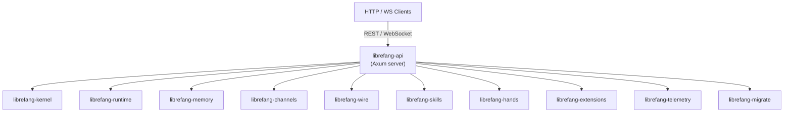

# Other — librefang-api

# librefang-api

HTTP and WebSocket API server for the LibreFang Agent OS daemon. This crate exposes the management surface of LibreFang — agent lifecycle, skill invocation, channel configuration, terminal access, and the embedded dashboard — through a unified REST/WebSocket interface built on Axum.

## Architecture

The API layer sits at the top of the dependency stack, composing nearly every other LibreFang crate into a coherent HTTP service. It does not implement business logic itself — it translates HTTP/WebSocket requests into calls against the kernel, runtime, skills, and channel subsystems.

## Build Process (`build.rs`)

The build script performs three tasks before compilation:

1. **Dashboard asset placeholder** — Creates `static/react/` if it doesn't exist. The `include_dir!` macro (from the `include_dir` crate) embeds this directory at compile time. On fresh clones the directory is empty, so nothing is embedded; the runtime falls back to serving assets from `~/.librefang/dashboard/`. This avoids build failures when the dashboard hasn't been built yet.

2. **Version metadata** — Captures three environment variables via `cargo:rustc-env`:
   - `GIT_SHA` — short commit hash (`git rev-parse --short HEAD`), falls back to `"unknown"`
   - `BUILD_DATE` — UTC date in `YYYY-MM-DD` format, falls back to `"unknown"`
   - `RUSTC_VERSION` — full rustc version string, falls back to `"unknown"`

   These are available at runtime via `env!()` macros and are typically exposed through a `/version` or `/health` endpoint.

## Feature Flags

Features control which channel backends are compiled in and whether telemetry infrastructure is included.

### Channel Features

Each channel feature is a passthrough to `librefang-channels`. Available channels:

| Category | Channels |
|----------|----------|
| Core messaging | `channel-telegram`, `channel-discord`, `channel-slack`, `channel-matrix`, `channel-irc` |
| Enterprise | `channel-teams`, `channel-google-chat`, `channel-mattermost`, `channel-webex` |
| Social | `channel-mastodon`, `channel-bluesky`, `channel-reddit`, `channel-linkedin`, `channel-twitch` |
| Messaging apps | `channel-whatsapp`, `channel-signal`, `channel-messenger`, `channel-viber`, `channel-line`, `channel-threema` |
| Chinese platforms | `channel-wechat`, `channel-wecom`, `channel-dingtalk`, `channel-qq` |
| Open/Federated | `channel-xmpp`, `channel-nostr`, `channel-mumble` |
| Notification | `channel-gotify`, `channel-ntfy` |
| Other | `channel-email`, `channel-webhook`, `channel-voice`, `channel-rocketchat`, `channel-zulip`, `channel-feishu`, `channel-revolt`, `channel-flock`, `channel-guilded`, `channel-keybase`, `channel-nextcloud`, `channel-pumble`, `channel-twist`, `channel-discourse`, `channel-gitter` |

Three meta-features are provided:

- **`all-channels`** — enables every channel listed above.
- **`mini`** — enables the 12 most common channels (Telegram, Discord, Slack, Matrix, Email, Webhook, WhatsApp, Signal, Teams, Mattermost, IRC, Google Chat).
- **`default`** — includes `all-channels` and `telemetry`.

### Telemetry Feature

`telemetry` enables OpenTelemetry trace export, Prometheus metrics, and the supporting crates (`opentelemetry`, `opentelemetry_sdk`, `opentelemetry-otlp`, `tracing-opentelemetry`, `metrics`, `metrics-exporter-prometheus`). When disabled, the server still logs via `tracing` but does not export traces or metrics.

## Key Dependencies and Their Roles

| Crate | Purpose in the API layer |
|-------|-------------------------|
| `axum` + `tower` + `tower-http` | HTTP framework, middleware stack (CORS, compression, tracing, rate limiting) |
| `governor` | Per-IP rate limiting on public endpoints |
| `jsonwebtoken`, `hmac`, `sha2` | JWT issuance and verification for API authentication |
| `argon2` | Password hashing for local admin accounts |
| `subtle` | Constant-time comparison for timing-safe auth checks |
| `portable-pty` | PTY allocation for WebSocket terminal sessions |
| `utoipa` | OpenAPI 3.x spec generation from route definitions |
| `include_dir` | Compile-time embedding of the React dashboard |
| `dashmap` | Concurrent maps for in-process state (e.g., active WebSocket sessions) |
| `tokio-stream`, `futures` | Async stream composition for WebSocket and SSE endpoints |

## Authentication and Security

The API uses JWT-based authentication with multiple layers:

- **Argon2** for password storage — resistant to GPU-based brute force.
- **HMAC-SHA256** for token signing (`hmac` + `sha2`).
- **`subtle`** for constant-time comparison on secret values, preventing timing side-channels.
- **`governor`** rate limiting on authentication endpoints to mitigate credential stuffing.

## Terminal Access

The `portable-pty` dependency enables interactive terminal sessions over WebSocket. The API server allocates a pseudo-terminal, proxies input/output through the WebSocket connection, and tracks active sessions in memory via `dashmap`.

## Dashboard Embedding

The React dashboard is embedded at compile time using `include_dir!("static/react")`. The build script ensures this directory exists (creating it empty if necessary). The workflow is:

1. **Development** — Dashboard is built separately (`npm run build`), output lands in `static/react/`, and gets embedded on the next `cargo build`.
2. **Fresh clone** — Directory is empty; nothing is embedded. The server serves assets from the runtime directory `~/.librefang/dashboard/` instead.
3. **Release builds** — CI populates `static/react/` before building the API crate.

## Platform-Specific Dependencies

On Unix targets (`cfg(unix)`), the crate depends on `rustix` with the `process` feature. This is used for low-level process operations (signal handling, fd management) that complement the `librefang-runtime` process registry.

## Relationship to Other Modules

The build script interacts with other crates in two minor ways:

- It reads `librefang-runtime`'s process registry pattern (the `output` function) as a reference for how subprocess metadata is captured.
- It checks a pattern similar to `librefang-extensions`'s vault `exists` method for file-existence gating logic.

At runtime, the API is the primary entry point for all external interaction with the LibreFang daemon. Downstream crates (channels, skills, hands) are invoked indirectly through the kernel and runtime, never directly from route handlers.