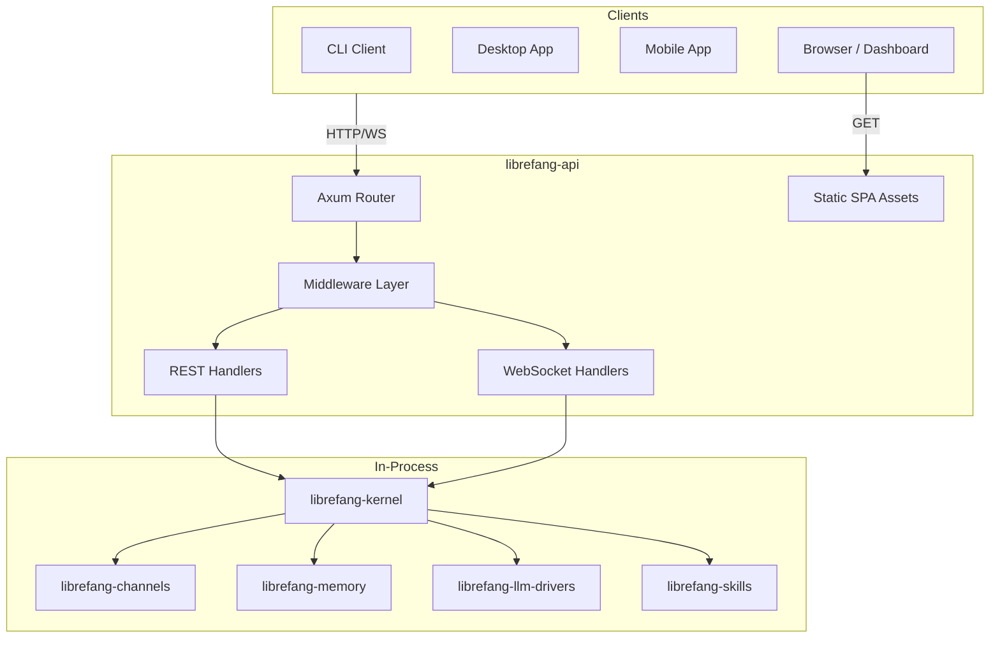

# Other — librefang-api

# librefang-api

HTTP/WebSocket API server for the LibreFang Agent OS daemon. This crate is the primary network surface through which CLI clients, desktop applications, mobile apps, and browser sessions interact with the LibreFang kernel.

## Architecture

The kernel runs in-process. All external clients connect over this API surface — JSON REST endpoints and WebSocket streams. The bundled React dashboard SPA is embedded into the binary at compile time and served as static assets.



## Public API Entry Points

| Entry Point | Purpose |
|---|---|
| `server::build_router(kernel, addr)` | Assembles the complete axum router and shared `AppState`. This is the main integration point. |
| `routes::*` | Endpoint handlers organized by domain (agents, sessions, channels, approvals, MCP, peer/A2A networking). |
| `middleware` | Authentication, rate limiting, and telemetry. Defines route visibility sets: `PUBLIC_ROUTES_ALWAYS`, `PUBLIC_ROUTES_GET_ONLY`, `PUBLIC_ROUTES_DASHBOARD_READS`. |
| `ws` | WebSocket authentication and streaming handlers. |

## Feature Flags and Channel Adapters

This crate exposes a granular feature flag system that controls which channel adapters are compiled in. Channel features are forwarded directly to `librefang-channels`.

### Feature Sets

| Feature | Description |
|---|---|
| `default` | Enables `core-channels` + `telemetry` |
| `telemetry` | OpenTelemetry tracing export + Prometheus metrics |
| `core-channels` | Telegram, Discord, Slack, Webhook, ntfy — lightweight HTTP-only adapters |
| `mini` | 12 core channels (core-channels + Matrix, Email, WhatsApp, Signal, Teams, Mattermost, IRC, Google Chat) |
| `all-channels` | Every available channel adapter |
| `all-channels-no-email` | All channels except email — used for Android targets where `rustls-platform-verifier` lacks `new_with_extra_roots` support |
| `channel-*` | Individual channel toggle (e.g., `channel-telegram`, `channel-discord`) |

### Default Selection Rationale

The `core-channels` set (5 adapters) keeps plain `cargo build` fast. Each member uses only the workspace HTTP stack (`reqwest` + `rustls`) — no heavy transitive dependencies. Release and packaging pipelines opt into `all-channels` explicitly.

To add a new member to `core-channels`, verify its dependency tree first. See issues #3655 / #3688 for context on the compilation cost decisions.

## Build Script (`build.rs`)

The build script performs three tasks:

1. **Dashboard embed directory** — Ensures `static/react/` exists so `include_dir!` never fails on fresh clones. This directory is gitignored since it contains build artifacts from `npm run build` in the dashboard subcrate or downloaded release assets. When empty, `include_dir!` embeds nothing and the runtime falls back to serving assets from `~/.librefang/dashboard/`.

2. **Git commit hash** — Captured via `git rev-parse --short HEAD` and exposed as the `GIT_SHA` environment variable.

3. **Build metadata** — `BUILD_DATE` (UTC date) and `RUSTC_VERSION` are captured and embedded for diagnostics.

## Platform-Specific Dependencies

### Unix

- `rustix` (with `process` feature) — used for process management operations.
- `libc` — low-level system interface.

### Windows

- `windows-sys` (with `Win32_Foundation`, `Win32_Security`, `Win32_Security_Authorization`) — used for SDDL → `SECURITY_DESCRIPTOR` conversion on the ACP named-pipe listener. This restricts the pipe DACL to the daemon's owner SID so other local users cannot connect. See issue #3313. Since `windows-sys` is already a transitive dependency through tokio, adding it as a direct dependency is effectively free.

## Key Dependencies

| Crate | Role |
|---|---|
| `librefang-kernel` | Core agent OS runtime — runs in-process |
| `librefang-kernel-handle` | Typed handle to the kernel instance |
| `librefang-types` | Shared type definitions across the workspace |
| `librefang-channels` | Channel adapter implementations (feature-gated) |
| `librefang-llm-drivers` | LLM provider integrations |
| `librefang-memory` | Conversation memory and context management |
| `librefang-wire` | Wire protocol types for WebSocket communication |
| `librefang-skills` | Agent skill system |
| `librefang-hands` | Tool/hand execution |
| `librefang-extensions` | Extension loading and management |
| `librefang-acp` | Agent Client Protocol implementation (with `kernel-adapter` feature) |
| `librefang-migrate` | Database schema migrations |
| `librefang-telemetry` | Telemetry infrastructure |
| `librefang-http` | Shared HTTP utilities |
| `axum` | Async web framework |
| `tower-http` | Middleware (CORS, compression, tracing, etc.) |
| `utoipa` | OpenAPI schema generation |
| `governor` | Rate limiting |

## Authentication and Middleware

The middleware layer controls route access through three route sets:

- **`PUBLIC_ROUTES_ALWAYS`** — Accessible without authentication (e.g., login, health checks).
- **`PUBLIC_ROUTES_GET_ONLY`** — Read-only endpoints that don't require auth for GET requests.
- **`PUBLIC_ROUTES_DASHBOARD_READS`** — Dashboard-specific read endpoints.

Authentication uses JWT tokens (`jsonwebtoken`), with password hashing via `argon2` and HMAC-SHA256 for signature verification (`hmac` + `sha2`). Constant-time comparison (`subtle`) prevents timing attacks on token validation.

## OpenAPI Specification

The committed `openapi.json` at the workspace root is generated by `utoipa` and regenerated via:

```bash
cargo xtask codegen --openapi
```

Drift is verified in CI using hash baselines stored in `xtask/baselines/`.

## Dashboard SPA

The React dashboard lives under `dashboard/` (TypeScript / React / TanStack Query). It is built by `cargo xtask build-web` and embedded into the binary via `include_dir!`. The dashboard source is a separate subcrate; this crate only consumes its build output.

## Telemetry

When the `telemetry` feature is enabled:

- **Tracing** — Exported via OpenTelemetry OTLP protocol.
- **Metrics** — Exposed through a Prometheus exporter endpoint.

Both are optional to keep the dependency tree minimal for embedded or resource-constrained deployments.