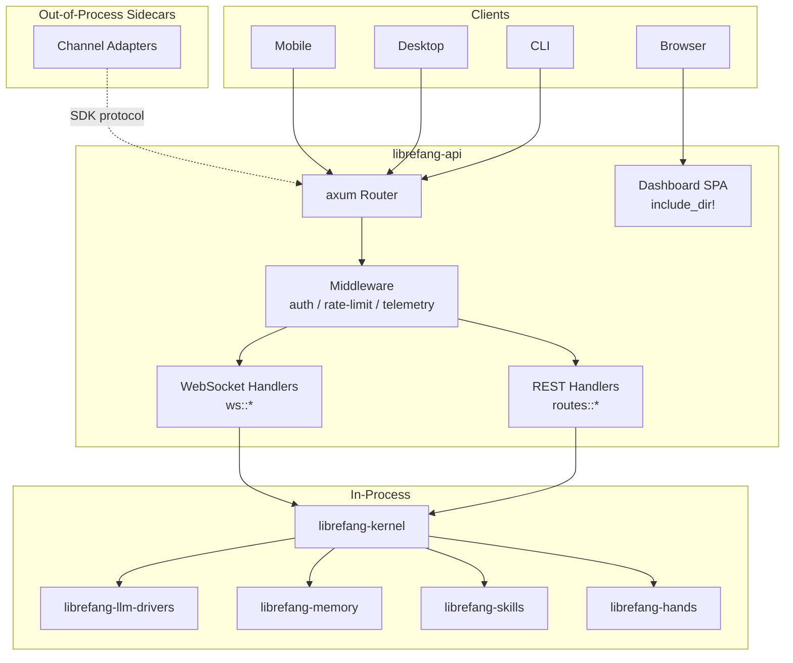

# Other — librefang-api

# librefang-api

HTTP and WebSocket API server for the LibreFang Agent OS daemon. This crate is the primary network interface between clients (CLI, desktop, mobile) and the in-process agent kernel. It exposes agent management, sessions, channels, approvals, MCP tool execution, peer/A2A networking, and a bundled React dashboard SPA.

## Architecture

```mermaid
graph TD
    subgraph Clients
        CLI[CLI]
        Desktop[Desktop]
        Mobile[Mobile]
        Browser[Browser]
    end

    subgraph "librefang-api"
        Router[axum Router]
        MW[Middleware<br/>auth / rate-limit / telemetry]
        REST[REST Handlers<br/>routes::*]
        WS[WebSocket Handlers<br/>ws::*]
        SPA[Dashboard SPA<br/>include_dir!]
    end

    subgraph "In-Process"
        Kernel[librefang-kernel]
        LLM[librefang-llm-drivers]
        Memory[librefang-memory]
        Skills[librefang-skills]
        Hands[librefang-hands]
    end

    subgraph "Out-of-Process Sidecars"
        ChannelAdapters[Channel Adapters]
    end

    CLI --> Router
    Desktop --> Router
    Mobile --> Router
    Browser --> SPA
    Router --> MW
    MW --> REST
    MW --> WS
    REST --> Kernel
    WS --> Kernel
    Kernel --> LLM
    Kernel --> Memory
    Kernel --> Skills
    Kernel --> Hands
    ChannelAdapters -.->|SDK protocol| Router
```

## Entry Points

| Symbol | Purpose |
|---|---|
| `server::build_router(kernel, addr)` | Assembles the complete axum `Router` with all routes, middleware, and shared `AppState`. This is the primary integration point. |
| `routes::*` | Domain-organised endpoint handlers (sessions, channels, approvals, MCP, peers, etc.). |
| `middleware` | Auth gate (with public-route allowlists), rate limiting via `governor`, and telemetry injection. |
| `ws` | WebSocket authentication handshake and streaming message handlers. |

## Dashboard SPA

The TypeScript/React dashboard (using TanStack Query) lives under `dashboard/`. It is built separately via `cargo xtask build-web` and embedded into the binary at compile time using `include_dir!` from the `static/react` directory. If the embedded directory is empty (fresh clones), the runtime falls back to serving assets from `~/.librefang/dashboard/`.

## Build Script (`build.rs`)

The build script performs three tasks:

1. **Ensures `static/react` exists** so `include_dir!` never fails on fresh clones. This directory is gitignored since it contains build artifacts.

2. **Captures build metadata** and emits it as compile-time environment variables:

   | Variable | Source |
   |---|---|
   | `GIT_SHA` | `GITHUB_SHA` env → `CI_COMMIT_SHA` env → `git rev-parse --short HEAD` → `"unknown"` |
   | `BUILD_DATE` | `chrono::Utc::now()` formatted as `%Y-%m-%d` |
   | `RUSTC_VERSION` | Output of `rustc --version` |

   The git SHA resolution uses `which::which("git")` rather than bare `git` to avoid relying on shell PATH lookup semantics. CI environment variables are preferred when available to avoid spawning a subprocess entirely.

3. **Declares rerun triggers** for `GITHUB_SHA`, `CI_COMMIT_SHA`, and `SOURCE_DATE_EPOCH`.

## Authentication & Security

The middleware layer enforces authentication via JWT validation (with optional OIDC/JWKS support and in-process caching through `validate_jwt_cached`). Three public-route allowlists control which endpoints bypass auth:

- `PUBLIC_ROUTES_ALWAYS` — unconditionally accessible (e.g., health checks).
- `PUBLIC_ROUTES_GET_ONLY` — readable without auth, mutations require auth.
- `PUBLIC_ROUTES_DASHBOARD_READS` — dashboard read paths accessible without auth.

Password hashing uses Argonautica (`argon2`). TOTP support is available for 2FA. On Windows, the ACP named-pipe listener restricts its DACL to the daemon's owner SID via SDDL/`SECURITY_DESCRIPTOR` conversion using `windows-sys`, preventing other local users from connecting.

## Feature Flags

| Feature | Default | Description |
|---|---|---|
| `telemetry` | Yes | Enables OpenTelemetry trace export and Prometheus metrics via `metrics-exporter-prometheus`. |

The historical `core-channels`, `all-channels`, `channel-*`, and `mini` features have been removed. All channel adapters now run as out-of-process sidecars, discovered through `SIDECAR_CATALOG` in `src/routes/channels.rs` and communicated with via the `librefang.sidecar.adapters.*` SDK.

## Key Dependencies

The crate integrates heavily with the rest of the LibreFang workspace:

- **`librefang-kernel`** / **`librefang-kernel-handle`** — The in-process agent kernel. All route handlers ultimately drive the kernel.
- **`librefang-acp`** — Agent Client Protocol, with `kernel-adapter` feature for kernel integration.
- **`librefang-llm-driver`** / **`librefang-llm-drivers`** — LLM provider abstraction and concrete driver implementations.
- **`librefang-memory`** — Agent memory/recall subsystem.
- **`librefang-channels`** / **`librefang-wire`** — Channel communication protocol (sidecar model) and wire types.
- **`librefang-skills`** / **`librefang-hands`** — Skill definitions and tool execution backends.
- **`librefang-extensions`** — Extension loading and management.
- **`librefang-import`** — Agent/workflow import.
- **`librefang-telemetry`** / **`librefang-http`** — Shared telemetry and HTTP utilities.
- **`librefang-types`** — Shared type definitions with `schemars`/`utoipa` derive support.
- **`axum`** + **`tower-http`** — HTTP framework and middleware layers.
- **`utoipa`** — OpenAPI 3.0 spec generation from handler signatures.

## OpenAPI

The committed `openapi.json` at the workspace root is regenerated by `cargo xtask codegen --openapi` and verified for drift in CI via hash baselines in `xtask/baselines/`. Schema generation uses `utoipa` with `schemars` for JSON Schema derivation from Rust types.

## Platform Notes

- **Unix**: Depends on `rustix` (with `process` feature) and `libc` for process-level operations.
- **Windows**: Depends on `windows-sys` with `Win32_Security` and `Win32_Security_Authorization` features for named-pipe DACL configuration.

## Testing

Dev-dependencies include `librefang-testing` for shared test utilities, `librefang-runtime` for tool-exec backend integration tests, and `rsa` for OIDC integration tests that generate RSA keypairs in-process, sign JWTs, and serve a local JWKS endpoint to drive `validate_jwt_cached` end-to-end without a live identity provider.