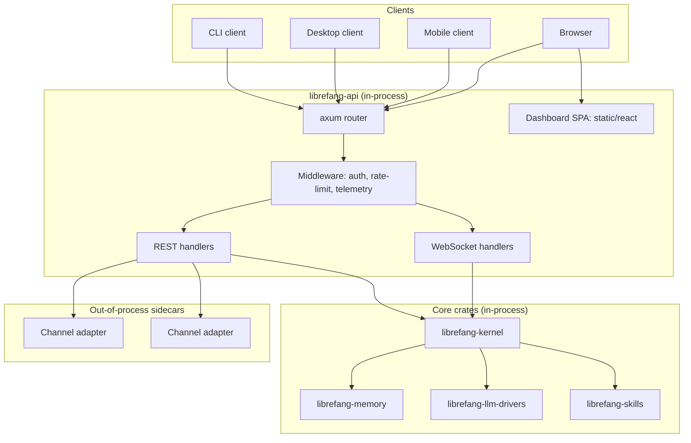

# Other — librefang-api

# librefang-api

HTTP/WebSocket API server for the LibreFang Agent OS daemon. Exposes agent management, sessions, channels, approvals, MCP, peer/A2A networking, and the React dashboard SPA over JSON REST and WebSocket endpoints. The kernel runs in-process; CLI, desktop, and mobile clients connect over this surface.

## Architecture

```mermaid
graph TD
    subgraph Clients
        CLI[CLI client]
        Desktop[Desktop client]
        Mobile[Mobile client]
        Browser[Browser]
    end

    subgraph "librefang-api (in-process)"
        Router[axum router]
        MW[Middleware: auth, rate-limit, telemetry]
        REST[REST handlers]
        WS[WebSocket handlers]
        SPA[Dashboard SPA: static/react]
    end

    subgraph "Core crates (in-process)"
        Kernel[librefang-kernel]
        Memory[librefang-memory]
        LLM[librefang-llm-drivers]
        Skills[librefang-skills]
    end

    subgraph "Out-of-process sidecars"
        SidecarA[Channel adapter]
        SidecarB[Channel adapter]
    end

    CLI --> Router
    Desktop --> Router
    Mobile --> Router
    Browser --> SPA
    Browser --> Router

    Router --> MW
    MW --> REST
    MW --> WS
    REST --> Kernel
    WS --> Kernel
    Kernel --> Memory
    Kernel --> LLM
    Kernel --> Skills
    REST --> SidecarA
    REST --> SidecarB
```

## Public API Entry Points

| Entry point | Purpose |
|---|---|
| `server::build_router(kernel, addr)` | Assembles the axum `Router`, shared `AppState`, and binds to the given address |
| `routes::*` | Endpoint handlers organised by domain (agents, sessions, channels, approvals, MCP, peers) |
| `middleware` | Authentication gates (`PUBLIC_ROUTES_ALWAYS`, `PUBLIC_ROUTES_GET_ONLY`, `PUBLIC_ROUTES_DASHBOARD_READS`), rate limiting, telemetry |
| `ws` | WebSocket authentication and streaming handlers |

## Dashboard SPA

The bundled React dashboard lives under `dashboard/` (TypeScript / React / TanStack Query). It is built by `cargo xtask build-web` and embedded into the binary via `include_dir!` from the `static/react` directory. When the embedded directory is empty (fresh clones without a web build), the runtime falls back to serving assets from `~/.librefang/dashboard/`.

## Build Script (`build.rs`)

The build script handles three concerns:

### 1. Dashboard embed directory

Ensures `static/react` exists so `include_dir!` never fails on fresh clones or worktrees. The directory is gitignored because it contains build artifacts. When empty, `include_dir!` embeds nothing and runtime filesystem paths are used instead.

### 2. Git SHA capture

`resolve_git_sha()` determines the short commit hash using this priority:

1. `GITHUB_SHA` environment variable (GitHub Actions — truncated to 7 chars)
2. `CI_COMMIT_SHA` environment variable (GitLab CI / generic — truncated to 7 chars)
3. `git rev-parse --short HEAD`, with the `git` binary located via `which::which("git")` to avoid depending on shell PATH lookup semantics
4. `"unknown"` fallback

The result is emitted as `cargo:rustc-env=GIT_SHA=...`.

`short_sha()` truncates a full 40-char SHA to 7 characters, matching `git rev-parse --short HEAD` default output.

### 3. Build metadata

| Variable | Source | Purpose |
|---|---|---|
| `GIT_SHA` | See above | Version identification in API responses and logs |
| `BUILD_DATE` | `chrono::Utc::now().format("%Y-%m-%d")` | Build timestamp (UTC date only) |
| `RUSTC_VERSION` | `rustc --version` output | Compiler version for diagnostics |

The build date uses `chrono` directly instead of shelling out to `date`, avoiding platform-specific flag differences between BSD and GNU `date`.

Rebuild triggers are declared via `cargo:rerun-if-env-changed` for `GITHUB_SHA`, `CI_COMMIT_SHA`, and `SOURCE_DATE_EPOCH`.

## Feature Flags

### `telemetry` (default)

Enables OpenTelemetry tracing export and Prometheus metrics. Pulls in `opentelemetry`, `opentelemetry_sdk`, `opentelemetry-otlp`, `tracing-opentelemetry`, `metrics`, and `metrics-exporter-prometheus`.

### Removed features

The `channel-*`, `core-channels`, `all-channels`, `all-channels-no-email`, and `mini` features have been removed. All channel adapters now run as out-of-process sidecars. See `SIDECAR_CATALOG` in `src/routes/channels.rs` and the `librefang.sidecar.adapters.*` SDK at `sdk/python/`.

## Platform-Specific Dependencies

### Unix (`cfg(unix)`)

- `rustix` (with `process` feature) — low-level Unix API bindings
- `libc` — C FFI types

### Windows (`cfg(windows)`)

- `windows-sys` (features: `Win32_Foundation`, `Win32_Security`, `Win32_Security_Authorization`) — used for SDDL → `SECURITY_DESCRIPTOR` conversion for the ACP named-pipe listener. Restricts the pipe DACL to the daemon's owner SID so other local users cannot connect.

## Key Internal Dependencies

| Crate | Role |
|---|---|
| `librefang-kernel` | Core agent OS runtime, runs in-process |
| `librefang-kernel-handle` | Typed handle to the kernel for request routing |
| `librefang-types` | Shared type definitions |
| `librefang-acp` | Agent Communication Protocol (with `kernel-adapter` feature) |
| `librefang-llm-driver` / `librefang-llm-drivers` | LLM provider abstraction and driver implementations |
| `librefang-memory` | Agent memory/storage layer |
| `librefang-channels` | Channel abstraction (no default features — adapters are sidecars) |
| `librefang-wire` | Wire protocol types |
| `librefang-skills` | Skill registry and execution |
| `librefang-hands` | Tool/hand interfaces |
| `librefang-extensions` | Extension loading |
| `librefang-import` | Data import functionality |
| `librefang-telemetry` | Shared telemetry utilities |
| `librefang-http` | Shared HTTP client/server utilities |

## Authentication and Security

Authentication is enforced via middleware with three route classification sets:

- **`PUBLIC_ROUTES_ALWAYS`** — accessible without any credentials (both GET and POST)
- **`PUBLIC_ROUTES_GET_ONLY`** — only GET requests are unauthenticated
- **`PUBLIC_ROUTES_DASHBOARD_READS`** — read-only dashboard endpoints that bypass auth

Rate limiting is provided by the `governor` crate.

Password hashing uses `argon2`. JWT validation uses `jsonwebtoken` with HMAC (`hmac` + `sha2`). Constant-time comparison uses `subtle`. On Windows, the named-pipe DACL is restricted to the daemon owner SID via SDDL.

## OpenAPI

The committed `openapi.json` at the workspace root is generated by `cargo xtask codegen --openapi` using `utoipa` with `axum_extras` feature. Drift is verified in CI against hash baselines in `xtask/baselines/`. Schema generation uses `schemars` with `chrono` and `uuid1` support.

## Testing

Dev-dependencies include `tempfile`, `librefang-testing`, `librefang-runtime` (for tool-exec backend integration tests), `totp-rs` (2FA tests), and `rsa` (for OIDC `sub` claim enforcement tests that generate RSA keypairs in-process, sign JWTs, and serve a local JWKS endpoint).