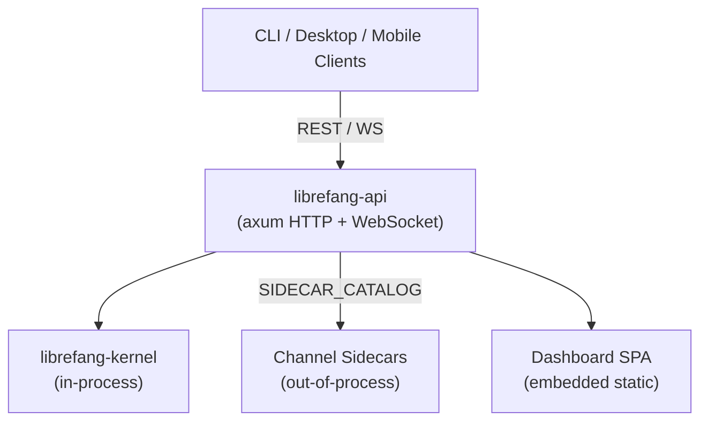

# Other — librefang-api

# librefang-api

HTTP/WebSocket API server for the LibreFang Agent OS daemon. Exposes agent management, sessions, channels, approvals, MCP, peer/A2A networking, and the React dashboard SPA over JSON REST and WebSocket endpoints. The kernel runs in-process; CLI, desktop, and mobile clients connect over this surface.

## Architecture Overview

```mermaid
graph TD
    Clients["CLI / Desktop / Mobile Clients"]
    API["librefang-api<br/>(axum HTTP + WebSocket)"]
    Kernel["librefang-kernel<br/>(in-process)"]
    Sidecars["Channel Sidecars<br/>(out-of-process)"]
    SPA["Dashboard SPA<br/>(embedded static)"]

    Clients -->|REST / WS| API
    API --> Kernel
    API -->|SIDECAR_CATALOG| Sidecars
    API --> SPA
```

The server is an axum application assembled by `server::build_router`. It embeds the kernel directly and communicates with channel adapters through out-of-process sidecars rather than in-process adapters.

## Entry Points

- **`server::build_router(kernel, addr)`** — Assembles the full axum router with all routes, shared `AppState`, middleware stack, and starts listening on the given address.
- **`routes::*`** — Endpoint handlers organized by domain (agents, sessions, channels, approvals, MCP, peers, etc.).
- **`middleware`** — Authentication, rate limiting, and telemetry. Auth is governed by three route-classification lists:
  - `PUBLIC_ROUTES_ALWAYS` — accessible without any auth
  - `PUBLIC_ROUTES_GET_ONLY` — accessible unauthenticated for GET requests only
  - `PUBLIC_ROUTES_DASHBOARD_READS` — read-only dashboard access without auth
- **`ws`** — WebSocket authentication and streaming handlers for real-time session and event communication.

## Dashboard SPA

The React/TypeScript dashboard lives in `dashboard/` and uses TanStack Query. It is built externally via `cargo xtask build-web` and embedded into the binary using `include_dir!` from the `static/react` directory.

The build script (`build.rs`) ensures `static/react` exists at compile time (creating it if absent on fresh clones). When the embedded directory is empty, the runtime falls back to serving assets from `~/.librefang/dashboard/`.

## Channel Adapter Architecture

Channel adapters run exclusively as out-of-process sidecars. The historical in-process features (`core-channels`, `all-channels`, `channel-*`, `mini`, `all-channels-no-email`) have been removed. Sidecar definitions live in `SIDECAR_CATALOG` within `src/routes/channels.rs`, and the corresponding SDK is at `sdk/python/` with the `librefang.sidecar.adapters.*` namespace.

## Features

### Default: `telemetry`

Enabled by default. Pulls in OpenTelemetry tracing export and Prometheus metrics:

- `opentelemetry`, `opentelemetry_sdk`, `opentelemetry-otlp` — OTLP trace export
- `tracing-opentelemetry` — bridges `tracing` spans to OpenTelemetry
- `metrics` + `metrics-exporter-prometheus` — Prometheus metrics endpoint

### Removed features

`channel-*`, `core-channels`, `all-channels`, `all-channels-no-email`, and `mini` no longer exist. All channel adapters are sidecars.

## Build Script (`build.rs`)

The build script performs four tasks before compilation:

1. **Creates the dashboard embed directory** — Ensures `static/react` exists so `include_dir!` compiles on fresh clones where the gitignored build artifacts haven't been produced yet.

2. **Captures the git commit hash** into `GIT_SHA` — Resolution order:
   - `GITHUB_SHA` environment variable (GitHub Actions, full 40-char SHA truncated to 7)
   - `CI_COMMIT_SHA` environment variable (GitLab CI, same truncation)
   - `git rev-parse --short HEAD` with `git` located via `which::which`
   - `"unknown"` if none of the above succeed

3. **Captures the build date** into `BUILD_DATE` — Uses `chrono::Utc::now()` formatted as `%Y-%m-%d` instead of shelling out to the platform-specific `date` command.

4. **Captures the rustc version** into `RUSTC_VERSION` — Via `rustc --version`, falling back to `"unknown"`.

The `resolve_git_sha()` function feeds into `short_sha()` for consistent 7-character truncation. Rebuilds are triggered by changes to `GITHUB_SHA`, `CI_COMMIT_SHA`, or `SOURCE_DATE_EPOCH`.

## Platform-Specific Dependencies

**Unix** — `rustix` (with `process` feature) and `libc` for Unix process operations.

**Windows** — `windows-sys` with `Win32_Foundation`, `Win32_Security`, and `Win32_Security_Authorization` features. Used for SDDL → `SECURITY_DESCRIPTOR` conversion on the ACP named-pipe listener, restricting the pipe DACL to the daemon's owner SID.

## Key Internal Dependencies

| Crate | Role |
|---|---|
| `librefang-kernel` | Core agent OS logic, runs in-process |
| `librefang-kernel-handle` | Handle abstraction for kernel interaction |
| `librefang-types` | Shared type definitions |
| `librefang-acp` | Agent Client Protocol (with `kernel-adapter` feature) |
| `librefang-wire` | Wire protocol types |
| `librefang-llm-driver` / `librefang-llm-drivers` | LLM provider abstraction and driver implementations |
| `librefang-memory` | Agent memory subsystem |
| `librefang-channels` | Channel types (no default features — adapters are sidecars) |
| `librefang-skills` | Skill system |
| `librefang-hands` | Tool/action execution |
| `librefang-extensions` | Extension loading |
| `librefang-import` | Import functionality |
| `librefang-http` | Shared HTTP utilities |
| `librefang-telemetry` | Telemetry infrastructure |

## OpenAPI

The committed `openapi.json` at the workspace root is generated by `cargo xtask codegen --openapi` using `utoipa`. Drift is verified in CI against hash baselines in `xtask/baselines/`.