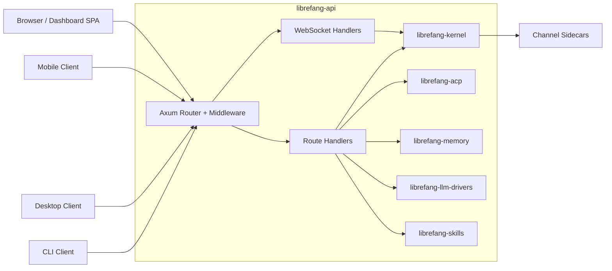

# Other — librefang-api

# librefang-api

HTTP and WebSocket API server for the LibreFang Agent OS daemon. This is the primary network surface through which CLI, desktop, and mobile clients interact with a running agent kernel. The kernel itself executes in-process behind this API layer.

## Architecture Overview


```mermaid
graph LR
    CLI[CLI Client]
    Desktop[Desktop Client]
    Mobile[Mobile Client]
    Browser[Browser / Dashboard SPA]

    CLI --> API
    Desktop --> API
    Mobile --> API
    Browser --> API

    subgraph librefang-api
        API[Axum Router + Middleware]
        API --> Routes[Route Handlers]
        API --> WS[WebSocket Handlers]
        Routes --> Kernel[librefang-kernel]
        WS --> Kernel
        Routes --> ACP[librefang-acp]
        Routes --> Memory[librefang-memory]
        Routes --> LLM[librefang-llm-drivers]
        Routes --> Skills[librefang-skills]
    end

    Kernel --> Sidecars[Channel Sidecars]
```

The server is built on **axum** with **tower-http** middleware. All endpoint handlers are organized by domain under `routes::*`, share state through an `AppState`, and delegate to the kernel and sibling crates for actual logic. The kernel is not a remote service — it is linked directly into the same process.

## Public Entry Points

| Symbol | Purpose |
|---|---|
| `server::build_router(kernel, addr)` | Assembles the complete axum router, shared `AppState`, middleware stack, and binds to the given address. This is the single function callers use to launch the server. |
| `routes::*` | Endpoint handler modules, organized by domain (sessions, channels, approvals, MCP, peer/A2A networking, etc.). |
| `middleware` | Authentication gate (with route-visibility tiers), rate limiting, and telemetry instrumentation. |
| `ws` | WebSocket authentication and streaming message handlers. |

## Dashboard SPA

A TypeScript/React/TanStack Query single-page application lives in the `dashboard/` directory. It is built by `cargo xtask build-web` and embedded into the server binary at compile time via the `include_dir!` macro (pointing at `static/react/`). The build script ensures this directory exists even on fresh clones.

At runtime, if the embedded directory is empty (as it is in development builds without the web build step), the server falls back to serving assets from `~/.librefang/dashboard/`.

## Authentication and Security

The middleware layer implements multiple tiers of route visibility:

- **`PUBLIC_ROUTES_ALWAYS`** — accessible without any credentials (e.g., login, health checks).
- **`PUBLIC_ROUTES_GET_ONLY`** — unauthenticated reads only; writes require auth.
- **`PUBLIC_ROUTES_DASHBOARD_READS`** — dashboard-specific read-only public access.

Authentication uses JWT validation (with optional OIDC discovery and JWKS caching via `jsonwebtoken`), HMAC-SHA256 for webhooks, and Argon2 for password hashing. TOTP-based 2FA is supported in the test suite.

On **Windows**, the ACP named-pipe listener restricts its DACL to the daemon's owner SID using SDDL → `SECURITY_DESCRIPTOR` conversion (via the `windows-sys` dependency), preventing other local users from connecting to the pipe.

## Channel Adapters (Sidecar Model)

All channel adapters (Slack, Discord, email, etc.) run as **out-of-process sidecars**, not in-process. The historical Cargo features `core-channels`, `all-channels`, `channel-*`, and `mini` have been removed. The sidecar catalog is defined in `src/routes/channels.rs` (`SIDECAR_CATALOG`), and the Python SDK at `sdk/python/` provides the `librefang.sidecar.adapters.*` integration layer.

The `librefang-channels` dependency is still present but with `default-features = false` — it provides types and protocol definitions, not adapter implementations.

## Build Script (`build.rs`)

The build script performs three tasks:

1. **Creates the `static/react/` placeholder directory** so `include_dir!` never fails on fresh clones where the dashboard hasn't been built yet.

2. **Captures build metadata** into compile-time environment variables:

   | Variable | Source |
   |---|---|
   | `GIT_SHA` | `GITHUB_SHA` env → `CI_COMMIT_SHA` env → `git rev-parse --short HEAD` → `"unknown"` |
   | `BUILD_DATE` | `chrono::Utc::now()`, formatted as `%Y-%m-%d` |
   | `RUSTC_VERSION` | Output of `rustc --version` |

   The git resolution logic uses `which::which("git")` to locate the binary rather than relying on shell PATH lookup. CI environment variables are preferred because they are authoritative on hosted runners and avoid spawning a subprocess entirely.

3. **Declares rerun-if-env-changed** for `GITHUB_SHA`, `CI_COMMIT_SHA`, and `SOURCE_DATE_EPOCH` so cargo invalidates the build script appropriately when these values change.

## Feature Flags

| Feature | Default | Description |
|---|---|---|
| `telemetry` | Yes | Enables OpenTelemetry trace export (`opentelemetry-otlp`) and Prometheus metrics (`metrics-exporter-prometheus`). |

There are no channel-related feature flags. All channel adapters are sidecar processes.

## Key Dependency Graph

The crate sits near the top of the LibreFang dependency stack, pulling in nearly every sibling crate:

- **`librefang-kernel`** — in-process agent kernel (the core execution engine).
- **`librefang-kernel-handle`** — typed handle/wrapper around kernel interactions.
- **`librefang-acp`** — agent communication protocol (with `kernel-adapter` feature enabled).
- **`librefang-types`** — shared domain types.
- **`librefang-wire`** — wire protocol types for client-server communication.
- **`librefang-memory`** — conversation and context memory subsystem.
- **`librefang-llm-driver` / `librefang-llm-drivers`** — LLM provider abstraction and concrete driver implementations.
- **`librefang-channels`** — channel types and protocol definitions (no in-process adapters).
- **`librefang-skills`** — skill registry and execution.
- **`librefang-hands`** — tool/action execution ("hands").
- **`librefang-extensions`** — extension loading and management.
- **`librefang-import`** — agent/configuration import.
- **`librefang-telemetry`** — shared telemetry infrastructure.
- **`librefang-http`** — shared HTTP client utilities.

## OpenAPI Specification

The crate uses `utoipa` with the `axum_extras` feature to derive OpenAPI schemas from handler signatures and types. The committed `openapi.json` at the workspace root is regenerated by:

```
cargo xtask codegen --openapi
```

Drift detection runs in CI via hash baselines stored in `xtask/baselines/`. Schemas are also derived through `schemars` (with `chrono` and `uuid1` features) for JSON Schema generation where needed.

## Testing

Dev-dependencies include `librefang-testing` for shared test utilities, `librefang-runtime` for tool-exec backend integration tests, `totp-rs` for 2FA flows, and `rsa` for generating in-process RSA keypairs to drive OIDC/JWT validation end-to-end without a live identity provider. `tempfile` and `http-body-util` support general HTTP-level test helpers.