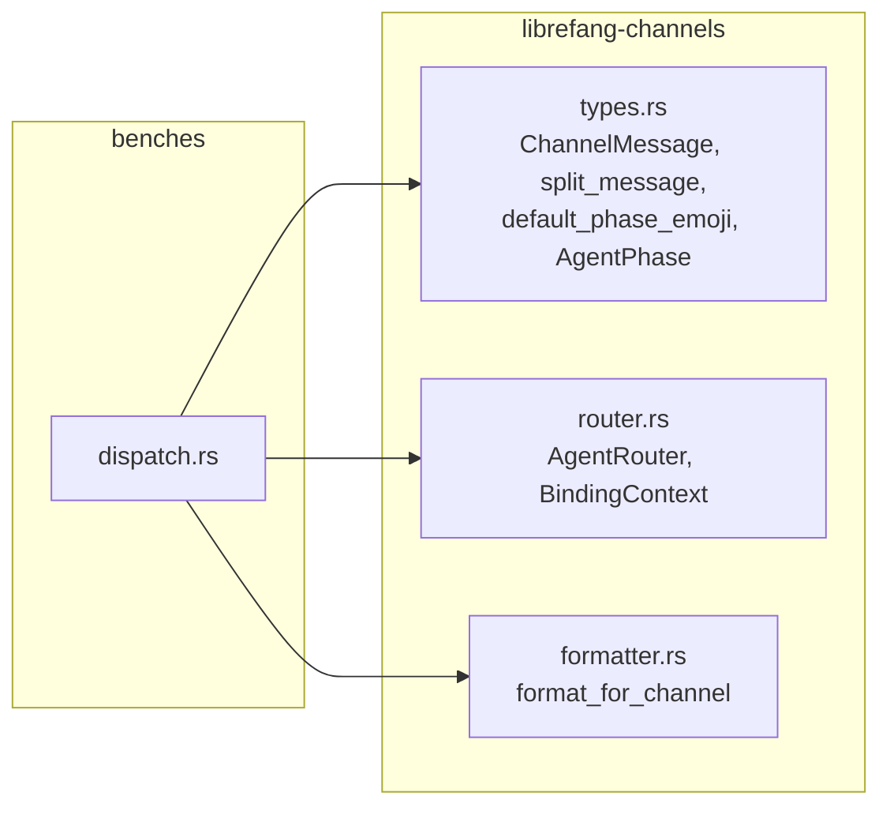

# Other — librefang-channels-benches

# librefang-channels — Dispatch Benchmarks

Benchmarks for the channel message dispatch hot paths in `librefang-channels`, built with [Criterion](https://bheisler.github.io/criterion.rs/). The suite measures serialization overhead, router resolution latency, and message formatting throughput—three operations that execute on every inbound/outbound message and must remain fast.

## Running

```sh
cargo bench -p librefang-channels
```

Reports are written to `target/criterion/`. Criterion groups produce three sub-reports:

| Group | Criterion ID |
|---|---|
| `serialization` | `message_serialize`, `message_deserialize`, `message_roundtrip` |
| `routing` | `router_resolve_direct`, `router_resolve_default_fallback`, `router_resolve_binding_match`, `router_resolve_with_context` |
| `formatting` | `format_*`, `split_message_*`, `default_phase_emoji_all` |

## Benchmark Coverage

### Serialization (`serialization` group)

Exercises `serde_json` on a realistic `ChannelMessage` struct containing a Telegram text payload, sender metadata, and an empty `HashMap` for metadata.

| Benchmark | What it measures |
|---|---|
| `bench_message_serialize` | `ChannelMessage` → JSON string via `serde_json::to_string` |
| `bench_message_deserialize` | JSON string → `ChannelMessage` via `serde_json::from_str` |
| `bench_message_roundtrip` | Serialize then deserialize in a single iteration |

The sample message is built once by `make_sample_message()` and reused across iterations (inside `Bencher::iter` only the serialization work repeats). This isolates the cost of serde itself, not struct construction.

### Routing (`routing` group)

Benchmarks the `AgentRouter` resolution path under four scenarios of increasing complexity:

| Benchmark | Scenario | Key APIs |
|---|---|---|
| `bench_router_resolve_direct` | Exact user-to-agent mapping | `set_default`, `set_direct_route`, `resolve` |
| `bench_router_resolve_default` | No match — falls back to default agent | `set_default`, `resolve` |
| `bench_router_resolve_with_bindings` | Rule-based binding match (channel + peer_id) | `register_agent`, `load_bindings`, `resolve` |
| `bench_router_resolve_with_context` | Binding match with guild and role predicates | `register_agent`, `load_bindings`, `resolve_with_context` |

The direct-route and default-fallback benchmarks measure the common-case lookup path. The binding benchmarks measure the rule-matching engine, including `BindingMatchRule` evaluation against `BindingContext` fields (channel, peer_id, guild_id, roles).

Setup (router construction, route registration) happens outside the timed loop; only `resolve` / `resolve_with_context` is measured.

### Formatting (`formatting` group)

Benchmarks `format_for_channel` across all `OutputFormat` variants, plus supporting utilities:

| Benchmark | Input | Output variant |
|---|---|---|
| `bench_format_markdown_passthrough` | Multi-paragraph markdown | `OutputFormat::Markdown` |
| `bench_format_telegram_html` | Multi-paragraph markdown | `OutputFormat::TelegramHtml` |
| `bench_format_slack_mrkdwn` | Multi-paragraph markdown | `OutputFormat::SlackMrkdwn` |
| `bench_format_plain_text` | Multi-paragraph markdown | `OutputFormat::PlainText` |
| `bench_format_short_text` | `"Hello world!"` | `OutputFormat::TelegramHtml` |
| `bench_split_message_short` | `"Hello!"` (well under 4096 chars) | `split_message(..., 4096)` |
| `bench_split_message_long` | 500-line synthetic text | `split_message(..., 4096)` |
| `bench_default_phase_emoji` | All six `AgentPhase` variants | `default_phase_emoji` |

The long-format input (`SAMPLE_MARKDOWN`) contains bold, italic, inline code, links, and bullet lists to exercise the full markdown parser. The short-text benchmark (`bench_format_short_text`) provides a contrast to identify per-call overhead vs. per-token parsing cost.

`bench_default_phase_emoji` iterates over `AgentPhase::Queued`, `Thinking`, `tool_use("web_fetch")`, `Streaming`, `Done`, and `Error` in a single iteration to measure the cumulative cost of emoji lookup.

## Dependencies on Library APIs



The benchmark does not import from any channel adapter crates (Telegram, Discord, Slack). It works entirely through the shared types and the platform-agnostic formatting/router layer.

## Adding New Benchmarks

1. **Identify the group.** Serialization, routing, and formatting are the existing Criterion groups. Add to the matching group, or define a new one via `criterion_group!` and register it in `criterion_main!`.

2. **Keep setup outside the loop.** Construct structs, register routes, and allocate buffers before the `b.iter(|| ...)` closure so only the hot path is measured.

3. **Use `black_box` on inputs.** Wrap reference arguments in `std::hint::black_box` to prevent the compiler from constant-folding or eliding work. Do not `black_box` the return value inside `iter`—Criterion already consumes it.

4. **Use realistic payloads.** `make_sample_message()` produces a representative `ChannelMessage`. Extend it (or create variants) when benchmarking new fields, but avoid trivially small inputs that hide real allocation/serialization costs.