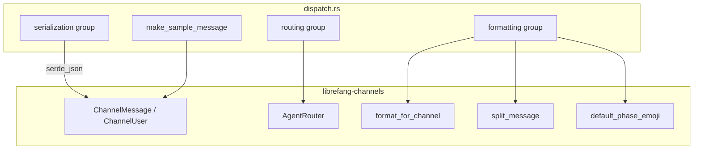

# Other — librefang-channels-benches

# librefang-channels — Dispatch Benchmarks

Location: `librefang-channels/benches/dispatch.rs`

## Purpose

Criterion micro-benchmark suite measuring the performance of three hot-path categories in the channel messaging subsystem:

| Category | What it measures |
|---|---|
| **Serialization** | `serde_json` encode/decode of `ChannelMessage` |
| **Routing** | `AgentRouter::resolve` and `resolve_with_context` under direct, default-fallback, binding-match, and context-aware scenarios |
| **Formatting** | `format_for_channel` across all `OutputFormat` variants, `split_message`, and `default_phase_emoji` |

These benchmarks guard against regressions in the latency-critical path from inbound platform message to agent dispatch.

## Running

```bash
# All benchmark groups
cargo bench -p librefang-channels

# A single group
cargo bench -p librefang-channels -- serialization
cargo bench -p librefang-channels -- routing
cargo bench -p librefang-channels -- formatting
```

Output is written to `target/criterion/` with HTML reports by default.

## Architecture



## Criterion Groups

### `serialization`

| Benchmark function | Underlying operation |
|---|---|
| `bench_message_serialize` | `serde_json::to_string(&ChannelMessage)` |
| `bench_message_deserialize` | `serde_json::from_str::<ChannelMessage>(&json)` |
| `bench_message_roundtrip` | Serialize then immediately deserialize |

All three operate on a sample `ChannelMessage` produced by `make_sample_message()` — a Telegram text message with a sender, timestamp, and empty metadata. The sample is constructed once per benchmark; only the iteration loop pays the (de)serialization cost.

### `routing`

| Benchmark function | Router state | Scenario |
|---|---|---|
| `bench_router_resolve_direct` | One direct route (`Telegram` / `user-42` → agent) | Exact match on channel + peer |
| `bench_router_resolve_default_fallback` | Only a default agent set | No matching route, falls back |
| `bench_router_resolve_binding_match` | One `AgentBinding` with channel + peer_id rule | Binding table lookup |
| `bench_router_resolve_with_context` | One `AgentBinding` with channel + guild_id + roles rule; `BindingContext` with matching roles | Context-aware resolution via `resolve_with_context` |

The routing benchmarks exercise progressively more complex `AgentRouter` paths:

1. **Direct** — `set_direct_route` stores a `(channel, peer_id) → AgentId` mapping. `resolve` performs a map lookup.
2. **Default fallback** — When no route matches, `resolve` returns the agent set via `set_default`.
3. **Binding match** — `load_bindings` feeds `AgentBinding` entries (with `BindingMatchRule` predicates). `resolve` evaluates rules against the incoming channel and peer.
4. **Context-aware** — `resolve_with_context` additionally considers `guild_id` and `roles` from `BindingContext`, enabling guild/role-based dispatch (relevant for Discord).

Each benchmark constructs and configures the router *outside* the timing loop so only the resolution logic is measured.

### `formatting`

| Benchmark function | Input | Format |
|---|---|---|
| `bench_format_markdown_passthrough` | Multi-paragraph markdown | `OutputFormat::Markdown` (identity) |
| `bench_format_telegram_html` | Multi-paragraph markdown | `OutputFormat::TelegramHtml` |
| `bench_format_slack_mrkdwn` | Multi-paragraph markdown | `OutputFormat::SlackMrkdwn` |
| `bench_format_plain_text` | Multi-paragraph markdown | `OutputFormat::PlainText` (strip all formatting) |
| `bench_format_telegram_html_short` | `"Hello world!"` | `OutputFormat::TelegramHtml` |
| `bench_split_message_short` | `"Hello!"` | Split at 4096 chars |
| `bench_split_message_long` | 500 lines (~10 KB) | Split at 4096 chars |
| `bench_default_phase_emoji_all` | All six `AgentPhase` variants | Emoji lookup |

The `SAMPLE_MARKDOWN` constant exercises bold, italic, code spans, links, and list items — the rich subset of Markdown that every formatter must handle. The short-text benchmarks measure baseline overhead on trivial inputs.

`bench_default_phase_emoji_all` iterates over `Queued`, `Thinking`, `tool_use("web_fetch")`, `Streaming`, `Done`, and `Error` in a single measured closure.

## Test Data

### `make_sample_message()`

Returns a `ChannelMessage` with:
- `channel`: `ChannelType::Telegram`
- `platform_message_id`: `"msg-12345"`
- `sender`: `ChannelUser { platform_id: "user-42", display_name: "Alice", librefang_user: None }`
- `content`: `ChannelContent::Text("Hello, how can you help me today?")`
- `target_agent`: `None`
- `timestamp`: `Utc::now()` (captured at construction time)
- `is_group`: `false`
- `metadata`: empty `HashMap`

### `SAMPLE_MARKDOWN`

A 6-line Markdown string containing bold, italic, inline code, links, and a bulleted list — representative of agent output formatting workloads.

### `SHORT_TEXT`

The string `"Hello world!"` — used to measure formatter overhead on minimal input.

## External Dependencies

| Crate | Usage |
|---|---|
| `criterion` | Benchmark framework (`criterion_group!` / `criterion_main!`) |
| `serde_json` | JSON (de)serialization of `ChannelMessage` |
| `chrono` | `Utc::now()` for message timestamps |
| `smallvec` | `BindingContext.roles` is a `SmallVec` — the `smallvec!` macro is used in setup |

## Relationship to Production Code

This benchmark file imports exclusively from:
- `librefang_channels::formatter` — the `format_for_channel` function
- `librefang_channels::router` — `AgentRouter` and `BindingContext`
- `librefang_channels::types` — `ChannelMessage`, `ChannelContent`, `ChannelUser`, `ChannelType`, `AgentPhase`, `default_phase_emoji`, `split_message`
- `librefang_types::agent` — `AgentId`
- `librefang_types::config` — `OutputFormat`, `AgentBinding`, `BindingMatchRule`

Any change to the serializer derived on `ChannelMessage`, the router's binding evaluation logic, or the formatter's markdown parser should be reflected in these benchmarks. Adding a new `OutputFormat` variant or `ChannelType` should be accompanied by a corresponding benchmark here.