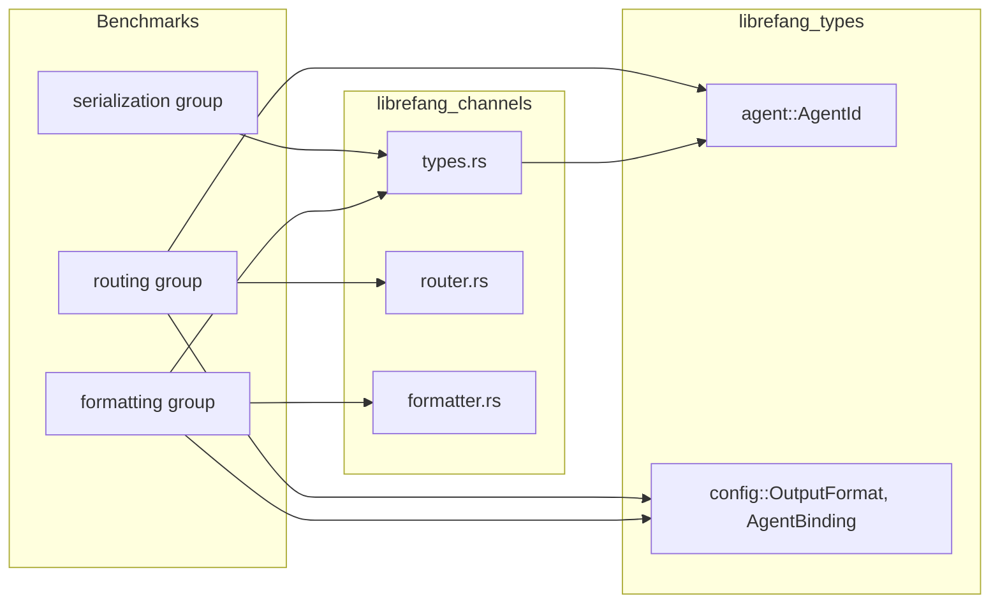

# Other — librefang-channels-benches

# librefang-channels Benchmarks — Dispatch Hot Paths

## Purpose

This benchmark suite measures the performance of the hottest code paths in `librefang-channels`: message (de)serialization, agent routing resolution, and output formatting. These operations run on every inbound and outbound message, so regressions here directly impact end-to-end latency.

The file lives at `librefang-channels/benches/dispatch.rs` and uses [Criterion.rs](https://bheisler.github.io/criterion.rs/book/) for statistically rigorous micro-benchmarking.

## Running

```sh
# All groups
cargo bench -p librefang-channels

# Single group
cargo bench -p librefang-channels -- serialization
cargo bench -p librefang-channels -- routing
cargo bench -p librefang-channels -- formatting
```

## Benchmark Groups

### Serialization (`serialization`)

| Benchmark | What it measures |
|---|---|
| `message_serialize` | `serde_json::to_string` on a `ChannelMessage` |
| `message_deserialize` | `serde_json::from_str` back into `ChannelMessage` |
| `message_roundtrip` | Serialize then deserialize in one iteration |

All three share a single fixture produced by `make_sample_message()` — a `ChannelMessage` with `ChannelType::Telegram`, a text body, a `ChannelUser` with `platform_id` and `display_name`, a UTC timestamp, and empty metadata.

**What to watch for:** any change to `ChannelMessage`, `ChannelUser`, `ChannelContent`, or their `#[serde(...)]` attributes can shift these numbers. Adding optional fields with defaults is usually cheap; nested structs or `HashMap` growth is not.

### Routing (`routing`)

These exercise `AgentRouter` in `librefang_channels::router`.

| Benchmark | Code path |
|---|---|
| `router_resolve_direct` | `set_default` + `set_direct_route`, then `resolve` hits the direct route table |
| `router_resolve_default_fallback` | Only a default agent is set; `resolve` falls through to it |
| `router_resolve_binding_match` | `register_agent` + `load_bindings` with a channel+peer rule, then `resolve` matches it |
| `router_resolve_with_context` | Uses `resolve_with_context` with a `BindingContext` carrying guild/role data — the richest resolution path |

The binding-match and context benchmarks use `librefang_types::config::AgentBinding` / `BindingMatchRule` exactly as they arrive from configuration, making them sensitive to changes in the matching logic.

**What to watch for:** changes to `AgentRouter::resolve`, `AgentRouter::resolve_with_context`, or the binding rule evaluation order. Adding new match fields to `BindingMatchRule` will show up here.

### Formatting (`formatting`)

These exercise `format_for_channel` from `librefang_channels::formatter` and `split_message` / `default_phase_emoji` from `librefang_channels::types`.

| Benchmark | Input | `OutputFormat` |
|---|---|---|
| `format_markdown_passthrough` | Multi-paragraph markdown | `Markdown` |
| `format_telegram_html` | Multi-paragraph markdown | `TelegramHtml` |
| `format_slack_mrkdwn` | Multi-paragraph markdown | `SlackMrkdwn` |
| `format_plain_text` | Multi-paragraph markdown | `PlainText` |
| `format_telegram_html_short` | `"Hello world!"` | `TelegramHtml` |
| `split_message_short` | `"Hello!"`, limit 4096 | — |
| `split_message_long` | 500 lines, limit 4096 | — |
| `default_phase_emoji_all` | All six `AgentPhase` variants | — |

The multi-paragraph sample (`SAMPLE_MARKDOWN`) contains bold, italic, inline code, links, and bullet lists — it is designed to exercise every markdown-to-target conversion branch.

**What to watch for:** any change to the markdown parser or the conversion emitters in `formatter.rs`. The `split_message` benchmarks are sensitive to the splitting heuristic and the chosen limit constant.

## Dependency Map



## Adding a New Benchmark

1. Write a `fn bench_<name>(c: &mut Criterion)` function following the existing pattern.
2. Use `black_box` on every input so the compiler cannot constant-fold the work away.
3. Add the function to the appropriate `criterion_group!` macro, or create a new group and append it to `criterion_main!`.
4. For routing benchmarks, construct the `AgentRouter` state inside the benchmark function (not in setup that runs once) unless the setup cost is genuinely irrelevant — Criterion's iter loop only times the closure body.
5. Re-use `make_sample_message()` or `SAMPLE_MARKDOWN` when the fixture is representative. Create new fixtures only when you need to stress a different code shape.