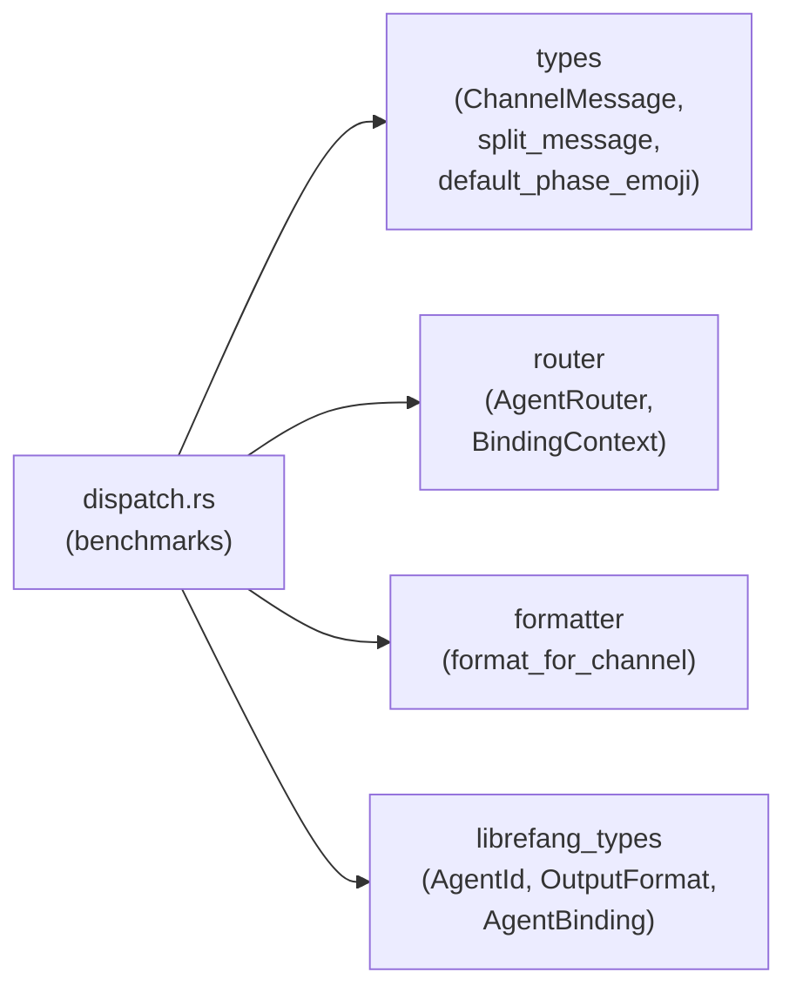

# Other — librefang-channels-benches

# librefang-channels-benches

Criterion benchmarks for the `librefang-channels` crate, targeting the three hottest paths in channel message dispatch: serialization, routing, and formatting.

## Location

`librefang-channels/benches/dispatch.rs`

## Running

```bash
# All benchmark groups
cargo bench -p librefang-channels

# Single group
cargo bench -p librefang-channels -- serialization
cargo bench -p librefang-channels -- routing
cargo bench -p librefang-channels -- formatting

# Single benchmark
cargo bench -p librefang-channels -- "format_telegram_html"
```

Requires the `bench` profile (Criterion does not work with `--release` alone; Cargo's built-in `bench` profile applies optimizations).

## Benchmark Groups

### Serialization (`serialization`)

Measures JSON throughput for `ChannelMessage` using `serde_json`.

| Benchmark | What it measures |
|---|---|
| `message_serialize` | `ChannelMessage` → JSON string |
| `message_deserialize` | JSON string → `ChannelMessage` (pre-serialized) |
| `message_roundtrip` | Serialize then deserialize in one iteration |

All three use the same fixture produced by `make_sample_message()`: a Telegram text message with a sender, platform message ID, timestamp, and empty metadata map. The roundtrip benchmark is the most representative of real-world load since the serialized bytes are not cached between iterations.

### Routing (`routing`)

Measures `AgentRouter::resolve` and `resolve_with_context` under four configurations of increasing complexity.

| Benchmark | Router setup | Resolution path |
|---|---|---|
| `router_resolve_direct` | One direct route (`Telegram` / `user-42` → agent) + default | Direct channel+peer hit |
| `router_resolve_default_fallback` | Default agent only, no matching route | Falls through to default |
| `router_resolve_binding_match` | One `AgentBinding` matching `telegram` + `vip-user` | Binding rule evaluation |
| `router_resolve_with_context` | One `AgentBinding` matching `discord` + `guild-1` + role `admin`, resolved via `BindingContext` | Context-aware binding with guild and role matching |

The direct and default benchmarks isolate the fast-path lookup cost. The binding and context variants measure the overhead of rule matching, which involves checking channel name, peer ID, guild ID, and role intersections. The context benchmark is the most expensive path because it constructs a `BindingContext` with `Cow`-borrowed fields and passes multiple roles through `smallvec`.

### Formatting (`formatting`)

Measures `format_for_channel` across all `OutputFormat` variants, plus `split_message` and `default_phase_emoji`.

| Benchmark | Input | Target format |
|---|---|---|
| `format_markdown_passthrough` | Multi-paragraph markdown | `OutputFormat::Markdown` |
| `format_telegram_html` | Multi-paragraph markdown | `OutputFormat::TelegramHtml` |
| `format_slack_mrkdwn` | Multi-paragraph markdown | `OutputFormat::SlackMrkdwn` |
| `format_plain_text` | Multi-paragraph markdown | `OutputFormat::PlainText` |
| `format_telegram_html_short` | `"Hello world!"` | `OutputFormat::TelegramHtml` |
| `split_message_short` | `"Hello!"` | — (chunk size 4096) |
| `split_message_long` | 500 lines (~13 KB) | — (chunk size 4096) |
| `default_phase_emoji_all` | All 6 phase variants | — |

The multi-paragraph fixture (`SAMPLE_MARKDOWN`) exercises bold, italic, inline code, and link conversion — the worst case for format transformers. The short-text benchmarks (`SHORT_TEXT`) provide a baseline to measure parsing overhead independent of string manipulation cost.

`default_phase_emoji_all` iterates over `Queued`, `Thinking`, `tool_use("web_fetch")`, `Streaming`, `Done`, and `Error` in a single iteration, so the reported time covers all six lookups.

## Dependencies on Library Code



- **`types`** — `ChannelMessage`, `ChannelUser`, `ChannelContent`, `ChannelType`, `AgentPhase`, `split_message`, `default_phase_emoji`
- **`router`** — `AgentRouter`, `BindingContext`; the router methods exercised are `new`, `set_default`, `set_direct_route`, `register_agent`, `load_bindings`, `resolve`, and `resolve_with_context`
- **`formatter`** — `format_for_channel`
- **`librefang_types`** — `AgentId`, `OutputFormat`, `AgentBinding`, `BindingMatchRule`

## Adding New Benchmarks

1. Write a `fn bench_<name>(c: &mut Criterion)` function following the Criterion convention. Use `black_box` on all inputs to prevent the compiler from constant-folding the iteration body.
2. Add the function to the appropriate `criterion_group!` macro invocation (`serialization`, `routing`, or `formatting`), or create a new group and add it to `criterion_main!`.
3. When benchmarking routing, construct the `AgentRouter` setup *outside* the `b.iter()` closure so that only the resolution path is measured — not the initialization. All existing routing benchmarks follow this pattern.
4. For formatting benchmarks, define input text as a `const` or `static` when possible to avoid allocation noise in the measurement loop.