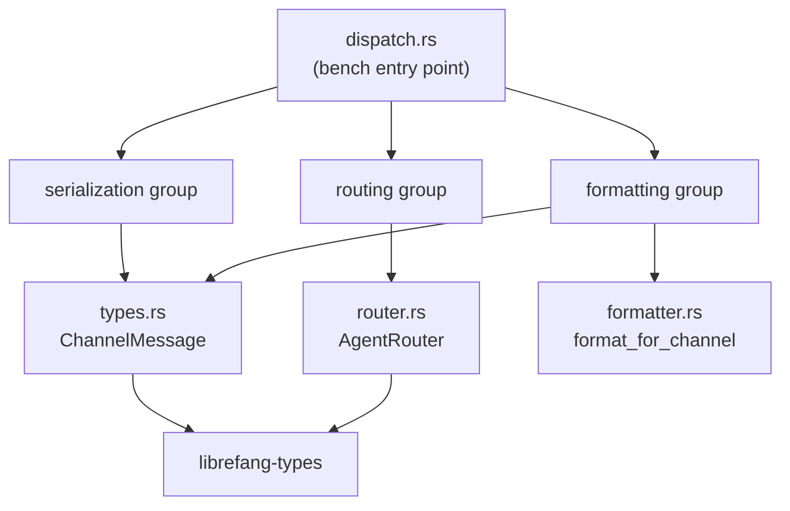

# Other — librefang-channels-benches

# librefang-channels — Dispatch Benchmarks

Benchmarks for the channel message dispatch hot paths, covering serialization, routing, and formatting. Located at `librefang-channels/benches/dispatch.rs`.

## Purpose

This module provides Criterion-based microbenchmarks for the performance-critical operations in `librefang-channels`. It measures throughput and latency of:

- **JSON serialization/deserialization** of `ChannelMessage`
- **Agent routing** resolution (direct, default fallback, binding match, context-aware)
- **Message formatting** across output formats (Markdown, Telegram HTML, Slack mrkdwn, plain text)
- **Message splitting** and phase emoji lookup

## Running

```bash
# All benchmark groups
cargo bench -p librefang-channels

# Specific group
cargo bench -p librefang-channels -- serialization
cargo bench -p librefang-channels -- routing
cargo bench -p librefang-channels -- formatting
```

Results are saved under `target/criterion/` with HTML reports.

## Benchmark Groups

### Serialization Group

Benchmarks `serde_json` operations on a realistic `ChannelMessage` fixture constructed by `make_sample_message()`. The fixture is a Telegram text message with a sender, metadata map, and timestamp.

| Benchmark | What it measures |
|---|---|
| `message_serialize` | `serde_json::to_string` — struct → JSON |
| `message_deserialize` | `serde_json::from_str` — JSON → struct |
| `message_roundtrip` | Serialize then deserialize in one iteration |

The roundtrip benchmark catches regressions where serialization and deserialization share common overhead (e.g., trait object dispatch, string allocation).

### Routing Group

Benchmarks `AgentRouter::resolve` and `resolve_with_context` under four scenarios of increasing complexity:

| Benchmark | Scenario | APIs exercised |
|---|---|---|
| `router_resolve_direct` | Exact match on a pre-registered direct route | `set_default`, `set_direct_route`, `resolve` |
| `router_resolve_default_fallback` | No match — falls back to the default agent | `set_default`, `resolve` |
| `router_resolve_binding_match` | Matches an `AgentBinding` rule on channel + peer_id | `register_agent`, `load_bindings`, `resolve` |
| `router_resolve_with_context` | Context-aware match using guild_id and roles | `register_agent`, `load_bindings`, `resolve_with_context` |

The context-aware variant constructs a `BindingContext` with borrowed `Cow` strings and a `smallvec` of roles to simulate real Discord-style resolution with role-based matching.

### Formatting Group

Benchmarks `format_for_channel` across all `OutputFormat` variants, plus `split_message` and `default_phase_emoji`.

| Benchmark | Input | Format |
|---|---|---|
| `format_markdown_passthrough` | Multi-paragraph markdown | `OutputFormat::Markdown` |
| `format_telegram_html` | Multi-paragraph markdown | `OutputFormat::TelegramHtml` |
| `format_slack_mrkdwn` | Multi-paragraph markdown | `OutputFormat::SlackMrkdwn` |
| `format_plain_text` | Multi-paragraph markdown | `OutputFormat::PlainText` |
| `format_telegram_html_short` | `"Hello world!"` | `OutputFormat::TelegramHtml` |
| `split_message_short` | `"Hello!"` (≤4096 chars) | — |
| `split_message_long` | 500-line repeated text | — |
| `default_phase_emoji_all` | All `AgentPhase` variants | — |

The multi-paragraph sample (`SAMPLE_MARKDOWN`) exercises bold, italic, inline code, links, and list conversion — the most expensive formatting paths.

## Test Fixture

`make_sample_message()` builds a minimal but realistic `ChannelMessage`:

```rust
ChannelMessage {
    channel: ChannelType::Telegram,
    platform_message_id: "msg-12345",
    sender: ChannelUser {
        platform_id: "user-42",
        display_name: "Alice",
        librefang_user: None,
    },
    content: ChannelContent::Text("Hello, how can you help me today?"),
    target_agent: None,
    timestamp: Utc::now(),
    is_group: false,
    thread_id: None,
    metadata: HashMap::new(),
}
```

This fixture is intentionally lightweight. If you add new fields to `ChannelMessage` that affect serialization size (e.g., vectors, nested structs), update this fixture to reflect realistic payloads so benchmarks remain representative.

## Architecture



## Dependencies on Library Code

The benchmarks directly exercise these public APIs from `librefang-channels`:

- **`types` module**: `ChannelMessage`, `ChannelContent`, `ChannelUser`, `ChannelType`, `AgentPhase`, `default_phase_emoji`, `split_message`
- **`router` module**: `AgentRouter`, `BindingContext` — methods `new`, `set_default`, `set_direct_route`, `register_agent`, `load_bindings`, `resolve`, `resolve_with_context`
- **`formatter` module**: `format_for_channel`

External types from `librefang-types`: `AgentId`, `OutputFormat`, `AgentBinding`, `BindingMatchRule`.

## Adding New Benchmarks

When adding functionality to `librefang-channels`, add corresponding benchmarks following the existing pattern:

1. Create a `bench_*` function accepting `&mut Criterion`
2. Use `c.bench_function(name, |b| b.iter(|| ...))` with `black_box` on inputs
3. Add the function to the appropriate `criterion_group!` macro, or create a new group and register it in `criterion_main!`

Keep setup work **outside** the `b.iter()` closure — only the operation being measured should be inside. Use `black_box` on inputs to prevent the compiler from constant-folding or eliminating the work.