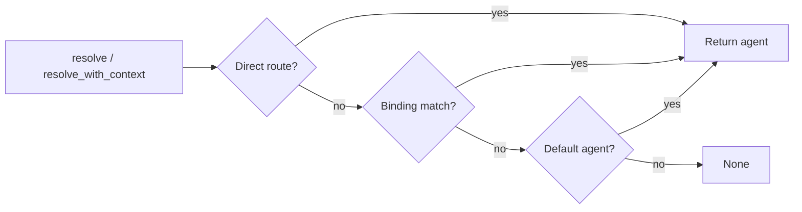

# Other — librefang-channels-benches

# librefang-channels-benches — Dispatch Hot-Path Benchmarks

## Overview

This module contains Criterion-based microbenchmarks that profile the performance-critical paths in `librefang-channels`. It targets three subsystems that execute on every inbound or outbound message: JSON serialization, agent routing resolution, and output format conversion.

The benchmarks live in a single file — `benches/dispatch.rs` — and are organized into three Criterion groups: `serialization`, `routing`, and `formatting`. Each group can be run independently or together via `cargo bench`.

## Benchmark Groups

### Serialization

| Benchmark | What it measures |
|---|---|
| `message_serialize` | `serde_json::to_string` on a typical `ChannelMessage` |
| `message_deserialize` | `serde_json::from_str` parsing the same JSON back |
| `message_roundtrip` | Serialize then deserialize in one iteration |

All three share a single fixture — `make_sample_message()` — which constructs a representative `ChannelMessage` with a Telegram channel, a text content body, a sender with no linked user, and a current UTC timestamp. This fixture exercises the full struct layout including the `metadata` HashMap (empty) and optional fields (`target_agent`, `thread_id`, `librefang_user`) set to `None`.

**What to watch for:** regressions here indicate either `serde_json` version drift or changes to the `ChannelMessage` / `ChannelContent` / `ChannelUser` type definitions that add expensive fields or custom serializers.

### Routing

| Benchmark | Router state | Resolution path |
|---|---|---|
| `router_resolve_direct` | One direct route for Telegram/user-42 + default agent | Hits the direct-route lookup (fastest path) |
| `router_resolve_default_fallback` | Default agent only, querying Discord/unknown-user | Falls through all lookups to the default |
| `router_resolve_binding_match` | One named agent ("support") with a channel+peer binding | Matches binding by channel and peer_id |
| `router_resolve_with_context` | One named agent ("admin-bot") with a guild+role binding | Uses `resolve_with_context` with `BindingContext` including roles |

The routing benchmarks progressively exercise more of `AgentRouter`'s resolution logic:



- **`router_resolve_direct`** exercises only the first hop — a pre-registered direct route map lookup via `set_direct_route`.
- **`router_resolve_default_fallback`** skips direct routes and bindings, landing on the default agent.
- **`router_resolve_binding_match`** loads an `AgentBinding` with a `BindingMatchRule` that constrains on `channel` and `peer_id`, then resolves against a matching query.
- **`router_resolve_with_context`** is the most complete: it registers an agent, loads a binding with `guild_id` and `roles` constraints, constructs a full `BindingContext` with borrowed `Cow` strings and a `smallvec` of roles, then calls `resolve_with_context`.

**What to watch for:** regressions in `router_resolve_with_context` are the most concerning since that path runs on every inbound Discord message with role information. The binding match involves iterating loaded bindings and comparing multiple fields.

### Formatting

| Benchmark | Input | Output format |
|---|---|---|
| `format_markdown_passthrough` | Multi-paragraph markdown | `OutputFormat::Markdown` |
| `format_telegram_html` | Multi-paragraph markdown | `OutputFormat::TelegramHtml` |
| `format_slack_mrkdwn` | Multi-paragraph markdown | `OutputFormat::SlackMrkdwn` |
| `format_plain_text` | Multi-paragraph markdown | `OutputFormat::PlainText` |
| `format_telegram_html_short` | `"Hello world!"` | `OutputFormat::TelegramHtml` |
| `split_message_short` | `"Hello!"` | Chunk threshold 4096 |
| `split_message_long` | 500 repeated lines (~10 KB) | Chunk threshold 4096 |
| `default_phase_emoji_all` | All six `AgentPhase` variants | Emoji lookup |

The `SAMPLE_MARKDOWN` constant is a realistic multi-paragraph string containing bold, italic, inline code, links, and bullet lists — exercising the full markdown parser in `format_for_channel`. The short-text variant (`SHORT_TEXT = "Hello world!"`) measures baseline overhead when there's nothing to convert.

`split_message` is benchmarked at two extremes: a string well under the 4096-character Telegram limit (single-chunk fast path) and a ~10 KB string that forces multiple splits.

`default_phase_emoji_all` iterates through all `AgentPhase` variants — `Queued`, `Thinking`, `tool_use("web_fetch")`, `Streaming`, `Done`, `Error` — to cover both static and dynamic (tool-use) phase emoji resolution.

## Dependencies on Library Code

The benchmarks import from three library modules:

| Library module | Symbols used |
|---|---|
| `librefang_channels::types` | `ChannelMessage`, `ChannelContent`, `ChannelUser`, `ChannelType`, `AgentPhase`, `default_phase_emoji`, `split_message` |
| `librefang_channels::router` | `AgentRouter`, `BindingContext` |
| `librefang_channels::formatter` | `format_for_channel` |
| `librefang_types::agent` | `AgentId` |
| `librefang_types::config` | `OutputFormat`, `AgentBinding`, `BindingMatchRule` |

## Running the Benchmarks

```bash
# All groups
cargo bench -p librefang-channels

# Single group
cargo bench -p librefang-channels -- serialization
cargo bench -p librefang-channels -- routing
cargo bench -p librefang-channels -- formatting

# Single benchmark
cargo bench -p librefang-channels -- router_resolve_with_context
```

Criterion saves baseline results under `target/criterion/`. To compare against a previous run:

```bash
cargo bench -p librefang-channels -- --save-baseline main
# ... make changes ...
cargo bench -p librefang-channels -- --baseline main
```

## Adding New Benchmarks

1. Write the benchmark function following the existing pattern — create state outside the closure, use `black_box` on inputs, call the library function inside `b.iter(...)`.
2. Add the function to the appropriate `criterion_group!` macro, or create a new group and append it to `criterion_main!`.
3. For routing benchmarks, prefer constructing the `AgentRouter` state inside the benchmark function (not in a `lazy_static` or `once_cell`) so the setup cost is excluded from the measured iterations. The router setup happens before `b.iter()` begins.

## Design Notes

- **`black_box` usage:** Every input to the closure is wrapped in `black_box` to prevent the optimizer from constant-folding or eliding the work. Return values are consumed via `black_box` or type-annotated bindings.
- **Realistic fixtures:** `make_sample_message` uses real field values and `Utc::now()` rather than minimal stubs, so serialization benchmarks reflect actual production payloads.
- **Owned vs. borrowed:** The formatting benchmarks pass `&str` literals directly, while routing benchmarks construct `Cow::Borrowed` context values. Both patterns mirror how the library is called in production.