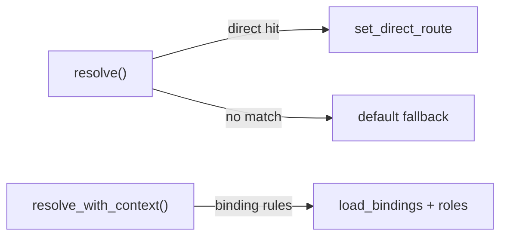

# Other — librefang-channels-benches

# librefang-channels-benches — Dispatch Hot-Path Benchmarks

## Purpose

This module provides Criterion-based microbenchmarks for the performance-critical paths in `librefang-channels`: message (de)serialization, agent routing/dispatch, and output formatting. It lives under `librefang-channels/benches/dispatch.rs` and runs via `cargo bench`.

## Running

```sh
# All benchmark groups
cargo bench -p librefang-channels

# A single benchmark
cargo bench -p librefang-channels -- message_serialize
```

The binary is registered through Criterion's `criterion_main!` macro at the bottom of the file.

## Benchmark Groups

The benchmarks are organized into three Criterion groups, each exercising a distinct subsystem.

### Serialization (`serialization`)

Measures JSON throughput for `ChannelMessage` using `serde_json`.

| Benchmark | What it measures |
|---|---|
| `message_serialize` | `serde_json::to_string` on a typical `ChannelMessage` |
| `message_deserialize` | `serde_json::from_str` parsing the same JSON back |
| `message_roundtrip` | Serialize then deserialize in one iteration (combined overhead) |

All three use a shared `make_sample_message()` helper that constructs a representative Telegram text message with a sender, timestamp, and empty metadata map. This function is the single source of truth for the fixture data—changing it affects all three benches.

### Routing (`routing`)

Exercises `AgentRouter` resolution under four scenarios of increasing complexity.



| Benchmark | Router setup | Resolution path |
|---|---|---|
| `router_resolve_direct` | One direct route (`Telegram` / `user-42`) plus a default | Hits the direct route immediately |
| `router_resolve_default_fallback` | Only a default agent set | Falls through to the default because no specific route matches |
| `router_resolve_binding_match` | An agent registered as `"support"` with a binding matching `telegram` + `vip-user` | Binding-based match via `load_bindings` |
| `router_resolve_with_context` | An agent registered as `"admin-bot"` with a binding matching `discord` + `guild-1` + `admin` role | Full `resolve_with_context` with `BindingContext` containing guild ID and roles |

The context-aware bench constructs a `BindingContext` with `Cow::Borrowed` strings and a `smallvec` of roles to simulate realistic call overhead.

**Key APIs exercised:** `AgentRouter::new`, `set_default`, `set_direct_route`, `register_agent`, `load_bindings`, `resolve`, `resolve_with_context`.

### Formatting (`formatting`)

Benchmarks the `format_for_channel` function from `librefang_channels::formatter` and the `split_message` / `default_phase_emoji` helpers from `types`.

| Benchmark | Input | Output format |
|---|---|---|
| `format_markdown_passthrough` | Multi-paragraph markdown | `OutputFormat::Markdown` |
| `format_telegram_html` | Same markdown | `OutputFormat::TelegramHtml` |
| `format_slack_mrkdwn` | Same markdown | `OutputFormat::SlackMrkdwn` |
| `format_plain_text` | Same markdown | `OutputFormat::PlainText` |
| `format_telegram_html_short` | `"Hello world!"` | `OutputFormat::TelegramHtml` |
| `split_message_short` | `"Hello!"` | N/A — tests split at 4096-char boundary |
| `split_message_long` | 500 repeated lines (~13 KB) | N/A — forces multiple splits |
| `default_phase_emoji_all` | All six `AgentPhase` variants | N/A — lookup overhead only |

The `SAMPLE_MARKDOWN` constant includes bold, italic, inline code, links, and a bullet list—covering the formatter's full conversion surface. The `SHORT_TEXT` constant provides a best-case baseline for short-input formatting paths.

The `default_phase_emoji_all` bench iterates over `Queued`, `Thinking`, `tool_use("web_fetch")`, `Streaming`, `Done`, and `Error` to measure phase-to-emoji mapping cost across all variants.

## Fixture Data

### `make_sample_message()`

Returns a `ChannelMessage` with these characteristics:

- **Channel:** `Telegram`
- **Message ID:** `"msg-12345"`
- **Sender:** `ChannelUser { platform_id: "user-42", display_name: "Alice" }` with no linked LibreFang user
- **Content:** `Text("Hello, how can you help me today?")`
- **Group:** `false`, no thread ID, empty metadata
- **Timestamp:** `Utc::now()` (captured once at construction time)

Since the timestamp is fixed per bench invocation (the message is built once before the timed loop), it does not introduce variance.

## Dependencies on Other Crates

| Crate | Usage |
|---|---|
| `librefang-channels` | Primary crate under test (types, router, formatter) |
| `librefang-types` | `AgentId`, `OutputFormat`, `AgentBinding`, `BindingMatchRule` |
| `criterion` | Benchmark harness |
| `chrono` | `Utc::now()` for message timestamps |
| `serde_json` | Serialization layer being measured |
| `smallvec` | Role list in `BindingContext` |

## Adding New Benchmarks

To add a benchmark to an existing group, define a `fn bench_*(c: &mut Criterion)` function and append it to the relevant `criterion_group!` macro call at the bottom of the file. To create a new group, add another `criterion_group!` and include it in `criterion_main!`.

Use `black_box` on all inputs to prevent the compiler from constant-folding or dead-code-eliminating the work under measurement.