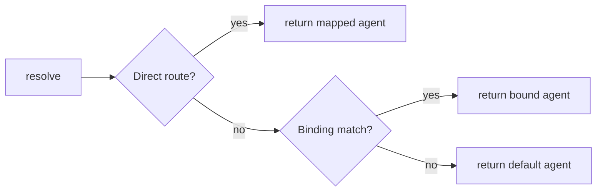

# Other — librefang-channels-benches

# librefang-channels-benches

Criterion benchmarks for channel message dispatch hot paths in `librefang-channels`.

## Purpose

This module provides continuous performance tracking for the three most latency-sensitive operations in the channel subsystem: turning raw platform messages into domain types (`ChannelMessage`), routing them to the correct agent (`AgentRouter`), and formatting agent responses back into platform-native markup. These are the operations that sit on the critical path for every inbound and outbound message, so regressions here directly impact end-user perceived latency.

## Running

```bash
# All benchmark groups
cargo bench -p librefang-channels

# Single group
cargo bench -p librefang-channels -- serialization
cargo bench -p librefang-channels -- routing
cargo bench -p librefang-channels -- formatting
```

Output is standard Criterion HTML reports under `target/criterion/`.

## Benchmark Groups

### Serialization

| Bench function | What it measures |
|---|---|
| `bench_message_serialize` | `serde_json::to_string` on a `ChannelMessage` |
| `bench_message_deserialize` | `serde_json::from_str::<ChannelMessage>` on the same JSON |
| `bench_message_roundtrip` | Serialize then deserialize in one iteration |

All three use a representative sample message built by `make_sample_message` — a Telegram text message with a sender, timestamp, and empty metadata map. The sample deliberately avoids edge-case structures (no `thread_id`, no `metadata` entries, no `target_agent`) to establish a baseline for the common case.

### Routing

| Bench function | `AgentRouter` path exercised |
|---|---|
| `bench_router_resolve_direct` | Direct user-to-agent mapping via `resolve` hitting a `set_direct_route` entry |
| `bench_router_resolve_default` | `resolve` falling through to the `set_default` agent (no direct route match) |
| `bench_router_resolve_with_bindings` | `resolve` matching an `AgentBinding` with `channel` + `peer_id` rules |
| `bench_router_resolve_with_context` | `resolve_with_context` matching a binding that checks `guild_id` and `roles` |

The routing benches form a progression from cheapest to most expensive resolution strategy:



`bench_router_resolve_with_context` is the heaviest because it constructs a `BindingContext` with borrowed `guild_id` and a `smallvec` of roles, then calls `resolve_with_context` which must evaluate the multi-field `BindingMatchRule`.

### Formatting

| Bench function | What it measures |
|---|---|
| `bench_format_markdown_passthrough` | `format_for_channel(..., OutputFormat::Markdown)` — identity-ish path |
| `bench_format_telegram_html` | Markdown → Telegram HTML (bold, italic, code, links) |
| `bench_format_slack_mrkdwn` | Markdown → Slack mrkdwn |
| `bench_format_plain_text` | Markdown → plain text (strip all markup) |
| `bench_format_short_text` | Telegram HTML conversion on a trivially short string |
| `bench_split_message_short` | `split_message` on a string well under the 4096-char limit |
| `bench_split_message_long` | `split_message` on ~8 000 characters of repeated lines (forces at least one split) |
| `bench_default_phase_emoji` | Iterates all `AgentPhase` variants (Queued, Thinking, tool_use, Streaming, Done, Error) calling `default_phase_emoji` on each |

The long-format input (`SAMPLE_MARKDOWN`) exercises every markup construct the formatter handles: bold, italic, inline code, links, and bullet lists. The short-format input (`SHORT_TEXT`) measures per-call overhead when the formatter has nothing to transform.

## Dependencies on Library Crates

The benches import from four locations:

| Import path | Crate | Used for |
|---|---|---|
| `librefang_channels::types` | `librefang-channels` | `ChannelMessage`, `ChannelUser`, `ChannelContent`, `ChannelType`, `AgentPhase`, `default_phase_emoji`, `split_message` |
| `librefang_channels::router` | `librefang-channels` | `AgentRouter`, `BindingContext` |
| `librefang_channels::formatter` | `librefang-channels` | `format_for_channel` |
| `librefang_types::agent` | `librefang-types` | `AgentId` |
| `librefang_types::config` | `librefang-types` | `OutputFormat`, `AgentBinding`, `BindingMatchRule` |

## Adding a New Benchmark

1. Place the function in the appropriate section of `dispatch.rs` (or create a new section with a comment header).
2. Use `black_box` on every input to prevent the compiler from constant-folding the work away.
3. Register the function in the matching `criterion_group!` macro call (or create a new group and add it to `criterion_main!`).
4. Prefer benchmarking the public API directly (`resolve`, `format_for_channel`, `split_message`) rather than internal helpers, so the bench remains valid across refactorings.