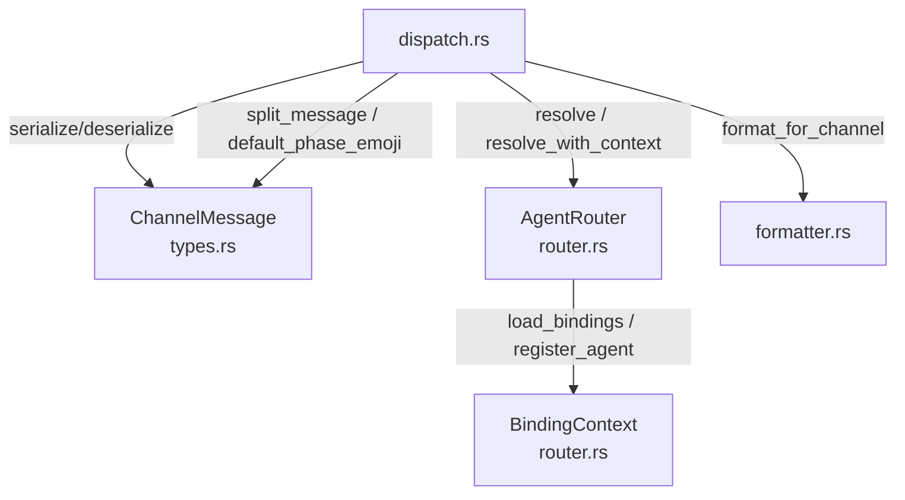

# Other — librefang-channels-benches

# librefang-channels Benchmarks — Dispatch Hot Paths

Location: `librefang-channels/benches/dispatch.rs`

## Purpose

This module provides Criterion microbenchmarks for the performance-critical paths in `librefang-channels`. It measures throughput and latency of three subsystems that execute on every inbound message: JSON serialization, agent routing, and output format conversion.

Run the benchmarks:

```bash
cargo bench -p librefang-channels
```

## Benchmark Groups

The benchmarks are organized into three Criterion groups, which can also be run individually by filtering:

```bash
cargo bench -p librefang-channels -- serialization
cargo bench -p librefang-channels -- routing
cargo bench -p librefang-channels -- formatting
```

### 1. Serialization (`serialization`)

Tests JSON round-trip performance of `ChannelMessage` via `serde_json`.

| Benchmark | What it measures |
|---|---|
| `message_serialize` | `ChannelMessage` → JSON string |
| `message_deserialize` | JSON string → `ChannelMessage` |
| `message_roundtrip` | Serialize then deserialize in one iteration |

All three use a shared `make_sample_message()` helper that constructs a realistic `ChannelMessage` with a Telegram channel, text content, sender info, and a UTC timestamp. The message includes an empty `HashMap` for metadata, matching the common no-extra-metadata case.

### 2. Routing (`routing`)

Tests `AgentRouter` resolution paths with increasing complexity.

| Benchmark | Router setup | Resolution path |
|---|---|---|
| `router_resolve_direct` | One default agent + one direct route (`Telegram`/`user-42` → agent) | Direct route lookup |
| `router_resolve_default_fallback` | One default agent, no specific routes | Falls through to default |
| `router_resolve_binding_match` | Named agent + `AgentBinding` matching `telegram` channel + `vip-user` peer | Binding rule evaluation |
| `router_resolve_with_context` | Named agent + `AgentBinding` matching `discord` channel + `guild_id` + `roles` | Context-aware resolution via `resolve_with_context` with `BindingContext` |

The progression from direct lookup → default fallback → binding match → context-aware resolution reflects the actual resolution hierarchy in `router.rs`. The `resolve_with_context` benchmark is the most expensive path because it constructs a `BindingContext` with borrowed `guild_id` and multiple `roles` and then evaluates them against loaded bindings.

### 3. Formatting (`formatting`)

Tests `format_for_channel` across all `OutputFormat` variants and `split_message` at different input sizes.

| Benchmark | Input | Format |
|---|---|---|
| `format_markdown_passthrough` | Multi-paragraph markdown | `OutputFormat::Markdown` |
| `format_telegram_html` | Multi-paragraph markdown | `OutputFormat::TelegramHtml` |
| `format_slack_mrkdwn` | Multi-paragraph markdown | `OutputFormat::SlackMrkdwn` |
| `format_plain_text` | Multi-paragraph markdown | `OutputFormat::PlainText` |
| `format_telegram_html_short` | 12-character plain string | `OutputFormat::TelegramHtml` |
| `split_message_short` | 6-character string, 4096 limit | N/A |
| `split_message_long` | 500-line text (~12KB), 4096 limit | N/A |
| `default_phase_emoji_all` | All six `AgentPhase` variants | N/A |

The multi-paragraph `SAMPLE_MARKDOWN` constant exercises bold, italic, code, links, and list formatting — the full conversion surface. The short-text benchmarks measure the fast-path overhead when no conversion is needed.

`default_phase_emoji_all` iterates over `Queued`, `Thinking`, `tool_use("web_fetch")`, `Streaming`, `Done`, and `Error` in a single iteration to measure aggregate phase-lookup cost.

## Architecture



## Dependencies on Other Crates

- **`librefang-channels`** (library under test): provides `AgentRouter`, `BindingContext`, `format_for_channel`, `ChannelMessage`, `ChannelContent`, `ChannelType`, `ChannelUser`, `split_message`, `default_phase_emoji`, and `AgentPhase`.
- **`librefang-types`**: provides `AgentId`, `OutputFormat`, `AgentBinding`, and `BindingMatchRule` used to configure the router and formatter.
- **`criterion`**: benchmark harness.
- **`chrono`**: `Utc::now()` for message timestamps.
- **`smallvec`**: used internally by `BindingContext` for the `roles` field.

## Adding New Benchmarks

1. **Identify the group**: serialization, routing, or formatting.
2. **Write the benchmark function** following the existing pattern — call `black_box` on all inputs, use `b.iter(|| ...)` for the measured closure.
3. **Add the function** to the appropriate `criterion_group!` macro invocation at the bottom of the file.
4. Verify the benchmark compiles and runs: `cargo bench -p librefang-channels -- <bench_name>`.

## Caveats

- Router benchmarks construct a fresh `AgentRouter` per benchmark function (in the setup, outside the timed loop). The timed portion measures only the `resolve*` calls, not setup overhead.
- `bench_message_roundtrip` is not simply the sum of `message_serialize` + `message_deserialize` because Criterion's statistical analysis accounts for variance independently per benchmark.
- All benchmarks use `black_box` on inputs to prevent the compiler from constant-folding or eliminating the work.