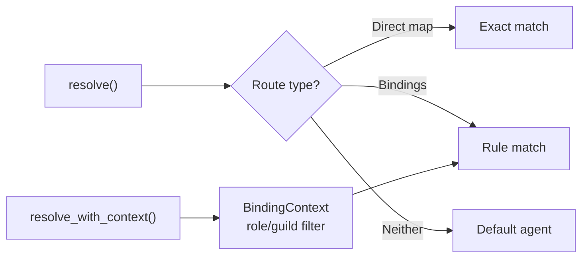

# Other — librefang-channels-benches

# librefang-channels-benches

Criterion benchmarks for channel message dispatch hot paths in the `librefang-channels` crate.

## Purpose

This module provides repeatable microbenchmarks for the three performance-critical layers of the channel dispatch pipeline:

| Layer | What it measures | Impact |
|---|---|---|
| **Serialization** | JSON encode/decode of `ChannelMessage` | Every inbound and outbound message |
| **Routing** | Agent resolution via `AgentRouter` | Per-message dispatch decision |
| **Formatting** | Markdown → platform-specific conversion + message splitting | Every outbound response |

These benchmarks guard against regressions in latency-sensitive paths where the agent OS processes messages from multiple platforms concurrently.

## Running

```bash
# All benchmark groups
cargo bench -p librefang-channels

# Single group
cargo bench -p librefang-channels -- serialization
cargo bench -p librefang-channels -- routing
cargo bench -p librefang-channels -- formatting
```

Results are saved under `target/criterion/` with HTML reports.

## Benchmark Groups

### `serialization` — Message Serde throughput

Three benchmarks exercise `serde_json` on a representative `ChannelMessage` constructed by `make_sample_message()`:

| Benchmark | Operation |
|---|---|
| `message_serialize` | `ChannelMessage` → JSON string |
| `message_deserialize` | JSON string → `ChannelMessage` |
| `message_roundtrip` | Serialize then immediately deserialize |

The sample message uses `ChannelType::Telegram`, a sender with no linked `librefang_user`, plain `Text` content, and an empty `metadata` map — a minimal-but-realistic payload.

### `routing` — Agent resolution

Four benchmarks cover every resolution path in `AgentRouter`:

| Benchmark | Router setup | What it tests |
|---|---|---|
| `router_resolve_direct` | Default + direct route for `(Telegram, user-42)` | Fast-path: exact match on channel + peer |
| `router_resolve_default_fallback` | Default only, query unknown Discord user | Fallback to default agent |
| `router_resolve_binding_match` | Loaded `AgentBinding` for `(telegram, vip-user)` | Binding rule match via `load_bindings` |
| `router_resolve_with_context` | Binding with `guild_id` + `roles` constraints, `BindingContext` provided | Context-aware match including role intersection |

The routing benchmarks exercise `resolve()` and `resolve_with_context()` from `librefang_channels::router`. The context-aware variant constructs a `BindingContext` with `Cow::Borrowed` fields and a `smallvec` of roles to match the shape used at runtime.



### `formatting` — Output conversion and message splitting

| Benchmark | Function under test | Input |
|---|---|---|
| `format_markdown_passthrough` | `format_for_channel(..., Markdown)` | Multi-paragraph markdown |
| `format_telegram_html` | `format_for_channel(..., TelegramHtml)` | Same markdown |
| `format_slack_mrkdwn` | `format_for_channel(..., SlackMrkdwn)` | Same markdown |
| `format_plain_text` | `format_for_channel(..., PlainText)` | Same markdown |
| `format_telegram_html_short` | `format_for_channel(..., TelegramHtml)` | `"Hello world!"` |
| `split_message_short` | `split_message("Hello!", 4096)` | Short string |
| `split_message_long` | `split_message(500-line text, 4096)` | ~7 KB text |
| `default_phase_emoji_all` | `default_phase_emoji()` for all major phases | 6 `AgentPhase` variants |

The long-form markdown input (`SAMPLE_MARKDOWN`) contains bold, italic, code spans, links, and lists to stress the parser across all output formats. `split_message_long` uses 500 lines of repeated text to exercise the chunking boundary logic in `split_message()` from `librefang_channels::types`.

`default_phase_emoji_all` iterates over `Queued`, `Thinking`, `tool_use("web_fetch")`, `Streaming`, `Done`, and `Error` to measure lookup cost across all phase variants including the stringly-typed tool-use case.

## Dependencies on library internals

```
bench function                    →  library symbol
─────────────────────────────────────────────────────────────
make_sample_message               →  ChannelMessage, ChannelUser,
                                     ChannelContent, ChannelType  (types.rs)
bench_router_resolve_*            →  AgentRouter::{new, set_default,
                                     set_direct_route, register_agent,
                                     load_bindings, resolve,
                                     resolve_with_context}        (router.rs)
bench_router_resolve_with_context →  BindingContext                (router.rs)
bench_format_*                    →  format_for_channel            (formatter.rs)
bench_split_message_*             →  split_message                 (types.rs)
bench_default_phase_emoji         →  default_phase_emoji,
                                     AgentPhase::tool_use          (types.rs)
```

## Adding new benchmarks

1. **Identify the hot path** — anything called per-message or per-chunk is a candidate.
2. **Add the bench function** following the existing pattern: construct fixtures outside the closure, use `black_box` on inputs, and call `c.iter(|| ...)`.
3. **Register in the correct group** — `criterion_group!` macro in the relevant group, then ensure the group appears in `criterion_main!`.
4. **Use realistic data** — avoid trivially small inputs that hide allocation costs, and avoid huge inputs that benchmark the allocator rather than the algorithm.