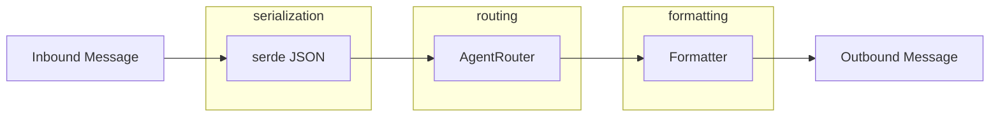

# Other — librefang-channels-benches

# librefang-channels-benches

Criterion microbenchmark suite for the channel dispatch hot paths in `librefang-channels`. Measures serialization overhead, routing resolution latency, and formatter throughput — the three operations that sit on every inbound/outbound message path.

## Benchmarked Surfaces



Every message flows through some combination of these stages. The benchmarks isolate each so regressions can be attributed precisely.

---

## Criterion Groups

The benchmarks are organized into three independent criterion groups, each runnable in isolation:

```
criterion_main!(serialization, routing, formatting);
```

| Group | Bench functions | Target surface |
|---|---|---|
| `serialization` | `bench_message_serialize`, `bench_message_deserialize`, `bench_message_roundtrip` | `ChannelMessage` ↔ JSON via `serde_json` |
| `routing` | `bench_router_resolve_direct`, `bench_router_resolve_default`, `bench_router_resolve_with_bindings`, `bench_router_resolve_with_context` | `AgentRouter::resolve*` |
| `formatting` | `bench_format_markdown_passthrough`, `bench_format_telegram_html`, `bench_format_slack_mrkdwn`, `bench_format_plain_text`, `bench_format_short_text`, `bench_split_message_short`, `bench_split_message_long`, `bench_default_phase_emoji` | `format_for_channel`, `split_message`, `default_phase_emoji` |

---

## Serialization Benchmarks

All three use `make_sample_message()` to construct a representative `ChannelMessage` with a Telegram channel, a text content payload, and a `ChannelUser` sender.

### `bench_message_serialize`

Measures `serde_json::to_string` on a pre-built `ChannelMessage`. Isolates serialization cost without any allocation from message construction by hoisting message creation out of the iteration loop.

### `bench_message_deserialize`

Serializes once at setup, then benchmarks `serde_json::from_str::<ChannelMessage>` on the resulting JSON string. This tests the parser + struct-materialization path.

### `bench_message_roundtrip`

Combines both operations inside the hot loop — serialize then deserialize. Useful as a proxy for the full per-message serde tax when comparing across branches.

---

## Routing Benchmarks

These exercise `AgentRouter` under four increasingly complex resolution strategies. Each benchmark sets up its own router instance with the minimal configuration needed for that scenario.

### `bench_router_resolve_direct`

Pre-registers a direct route via `router.set_direct_route("Telegram", "user-42", agent)`, then benchmarks `router.resolve(ChannelType::Telegram, "user-42", None)`. This is the fastest path — a hashmap lookup on the composite `(channel, peer_id)` key.

### `bench_router_resolve_default_fallback`

Sets only a default agent (`router.set_default(agent)`) and resolves against an unknown channel/user pair (`Discord`, `"unknown-user"`). Measures the fallback-to-default code path.

### `bench_router_resolve_binding_match`

Uses the declarative binding system:

```rust
router.register_agent("support", agent);
router.load_bindings(&[AgentBinding {
    agent: "support".to_string(),
    match_rule: BindingMatchRule {
        channel: Some("telegram".to_string()),
        peer_id: Some("vip-user".to_string()),
        ..Default::default()
    },
}]);
```

Then resolves with a matching query. This exercises the binding-evaluation logic (pattern matching on channel + peer_id) beyond the simple direct-route hashmap.

### `bench_router_resolve_with_context`

The most complex routing benchmark. Constructs a `BindingContext` with guild and role information:

```rust
let ctx = BindingContext {
    channel: Cow::Borrowed("discord"),
    peer_id: Cow::Borrowed("user-1"),
    guild_id: Some(Cow::Borrowed("guild-1")),
    roles: smallvec::smallvec![Cow::Borrowed("admin"), Cow::Borrowed("moderator")],
    ..Default::default()
};
```

Then calls `router.resolve_with_context(ChannelType::Discord, "user-1", None, &ctx)`. This exercises the full matching engine including guild-scoped and role-based rules — the path taken for Discord interactions with role-aware routing.

---

## Formatting Benchmarks

These test `format_for_channel` across all `OutputFormat` variants, plus auxiliary helpers `split_message` and `default_phase_emoji`.

### Input data

- **`SAMPLE_MARKDOWN`**: A multi-paragraph markdown string containing bold, italic, inline code, links, and bullet lists. Used for all `format_for_channel` benchmarks to ensure consistent comparison across output formats.
- **`SHORT_TEXT`**: The string `"Hello world!"`, used to measure formatter overhead on trivially small payloads.

### `format_for_channel` variants

| Benchmark | `OutputFormat` | What it tests |
|---|---|---|
| `bench_format_markdown_passthrough` | `Markdown` | No-op / identity path — measures baseline overhead |
| `bench_format_telegram_html` | `TelegramHtml` | Markdown → Telegram HTML conversion |
| `bench_format_slack_mrkdwn` | `SlackMrkdwn` | Markdown → Slack mrkdwn conversion |
| `bench_format_plain_text` | `PlainText` | Markdown stripping to plain text |
| `bench_format_short_text` | `TelegramHtml` | Telegram HTML on a minimal input |

Comparing `bench_format_markdown_passthrough` against the others reveals the actual conversion cost minus framework overhead. Comparing `bench_format_telegram_html` against `bench_format_short_text` shows how input size scales with conversion time.

### `split_message` variants

- **`bench_split_message_short`**: Splits `"Hello!"` with a 4096-byte limit. Measures the no-split fast path.
- **`bench_split_message_long`**: Splits 500 lines of `"Line of text here.\n"` with a 4096-byte limit. Exercises the actual splitting algorithm.

### `bench_default_phase_emoji_all`

Iterates over all `AgentPhase` variants (Queued, Thinking, `tool_use("web_fetch")`, Streaming, Done, Error) and calls `default_phase_emoji` on each. This function is called on every agent status update that reaches a channel, so it needs to stay fast.

---

## Running

```bash
# All benchmarks
cargo bench -p librefang-channels

# Single group
cargo bench -p librefang-changes -- serialization
cargo bench -p librefang-changes -- routing
cargo bench -p librefang-changes -- formatting

# Individual benchmark (substring match)
cargo bench -p librefang-changes -- router_resolve_direct
```

Results are saved to `target/criterion/` with HTML reports. Use `critcmp` for comparing across branches.