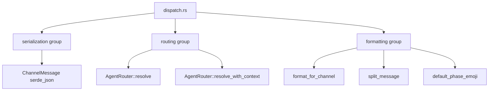

# Other — librefang-channels-benches

# librefang-channels — Dispatch Benchmarks

## Overview

The `benches/dispatch.rs` benchmark suite measures the hot-path performance of three critical subsystems in `librefang-channels` using [Criterion](https://bheisler.github.io/criterion.rs/book/):

| Benchmark Group | What it measures | Primary APIs under test |
|---|---|---|
| **serialization** | JSON round-trip cost of channel messages | `serde_json::to_string` / `from_str` on `ChannelMessage` |
| **routing** | Agent resolution latency under various routing strategies | `AgentRouter::resolve`, `resolve_with_context` |
| **formatting** | Markdown-to-output conversion and message splitting | `format_for_channel`, `split_message`, `default_phase_emoji` |

These represent the per-message overhead on the critical dispatch path — every inbound or outbound channel message passes through at least one of these layers.

## Running

```bash
# All benchmarks
cargo bench -p librefang-channels

# Single group
cargo bench -p librefang-channels -- serialization
cargo bench -p librefang-channels -- routing
cargo bench -p librefang-channels -- formatting

# Individual benchmark (substring match)
cargo bench -p librefang-channels -- router_resolve_direct
```

Criterion reports are saved under `target/criterion/`. Use `--baseline <name>` and `--save-baseline <name>` to compare across commits.

## Architecture



## Test Fixture

`make_sample_message()` constructs a representative `ChannelMessage` used across all serialization benchmarks:

```rust
ChannelMessage {
    channel: ChannelType::Telegram,
    platform_message_id: "msg-12345",
    sender: ChannelUser { platform_id: "user-42", display_name: "Alice", .. },
    content: ChannelContent::Text("Hello, how can you help me today?"),
    timestamp: Utc::now(),
    metadata: HashMap::new(),  // empty
    ..Default::default()
}
```

This is deliberately a "medium-complexity" message — not minimal, but not worst-case either. If you add new optional fields to `ChannelMessage` that are commonly populated, update this fixture to reflect realistic payloads.

## Benchmark Details

### Serialization Group

| Benchmark | Operation | Notes |
|---|---|---|
| `message_serialize` | `serde_json::to_string(&msg)` | Isolates struct → JSON conversion |
| `message_deserialize` | `serde_json::from_str::<ChannelMessage>(&json)` | Pre-serialized JSON; isolates parsing |
| `message_roundtrip` | serialize then deserialize | End-to-end cost; dominated by the slower half |

**What to watch for:** Any regression here directly impacts message throughput. New fields on `ChannelMessage` (especially nested structs or large `HashMap`s) will shift these numbers.

### Routing Group

Four scenarios cover the routing hierarchy from fastest to most complex:

| Benchmark | Routing path | Setup |
|---|---|---|
| `router_resolve_direct` | Direct channel+peer → agent | `set_direct_route("Telegram", "user-42", agent)` |
| `router_resolve_default_fallback` | No match → default agent | Only `set_default(agent)`; queries Discord |
| `router_resolve_binding_match` | Binding rule match | `load_bindings` with channel + peer_id rule |
| `router_resolve_with_context` | Context-aware binding (roles, guild) | `resolve_with_context` with `BindingContext` carrying roles and guild_id |

**Router setup cost** (registration, binding loading) happens once *outside* the benchmark closure and is not measured. Only the `resolve` / `resolve_with_context` call is timed.

Key routing APIs exercised:

- `AgentRouter::new()`
- `set_default`, `set_direct_route`, `register_agent`, `load_bindings`
- `resolve(&ChannelType, &str peer_id, Option<...>)`
- `resolve_with_context(..., &BindingContext)`

The `BindingContext` in `router_resolve_with_context` uses `Cow::Borrowed` strings and a `smallvec` for roles, matching production usage patterns.

### Formatting Group

The `SAMPLE_MARKDOWN` constant provides a multi-paragraph markdown string with bold, italic, inline code, and links — representative of agent output that needs platform-specific rendering.

| Benchmark | Input | Output format | Underlying function |
|---|---|---|---|
| `format_markdown_passthrough` | Full markdown | `OutputFormat::Markdown` | `format_for_channel` |
| `format_telegram_html` | Full markdown | `OutputFormat::TelegramHtml` | `format_for_channel` |
| `format_slack_mrkdwn` | Full markdown | `OutputFormat::SlackMrkdwn` | `format_for_channel` |
| `format_plain_text` | Full markdown | `OutputFormat::PlainText` | `format_for_channel` |
| `format_telegram_html_short` | `"Hello world!"` | `OutputFormat::TelegramHtml` | `format_for_channel` |
| `split_message_short` | `"Hello!"` | N/A (chunk limit 4096) | `split_message` |
| `split_message_long` | 500 lines (~10KB) | N/A (chunk limit 4096) | `split_message` |
| `default_phase_emoji_all` | All 6 `AgentPhase` variants | N/A | `default_phase_emoji` |

The `default_phase_emoji_all` benchmark iterates over all `AgentPhase` variants — `Queued`, `Thinking`, `tool_use("web_fetch")`, `Streaming`, `Done`, `Error` — in a single batch to amortize Criterion overhead and measure the total lookup cost.

`split_message_long` generates a 500-line string at bench initialization time (outside the timed loop), then splits it against the 4096-character Telegram limit inside the closure.

## Adding New Benchmarks

1. **Identify the group.** Serialization, routing, and formatting are the current categories. Add a new `criterion_group!` if the concern is orthogonal.

2. **Use `black_box` on inputs and outputs.** This prevents the compiler from optimizing away the code under test. Wrap all function arguments with `black_box(...)` and consume the return value the same way.

3. **Keep setup outside the closure.** Anything that happens once (construction, serialization, data generation) goes *before* `b.iter(|| ...)`. Only the operation you want to measure goes inside.

4. **Register in the group macro.** Add the function name to the appropriate `criterion_group!` list and ensure it's included in `criterion_main!`.

5. **Match production patterns.** Use realistic message sizes, binding counts, and `Cow`/`smallvec` patterns that mirror how the library is actually called.

## Dependencies on Library Crates

```
librefang-channels (bench target)
├── librefang_channels::formatter    → format_for_channel
├── librefang_channels::router       → AgentRouter, BindingContext
├── librefang_channels::types        → ChannelMessage, ChannelType, ChannelContent,
│                                      ChannelUser, AgentPhase, split_message,
│                                      default_phase_emoji
└── librefang_types::config          → OutputFormat, AgentBinding, BindingMatchRule
    └── librefang_types::agent        → AgentId
```

A regression in these benchmarks signals a performance change in one of the above modules. Use Criterion's HTML reports to pinpoint whether serialization, routing logic, or the markdown parser is responsible.