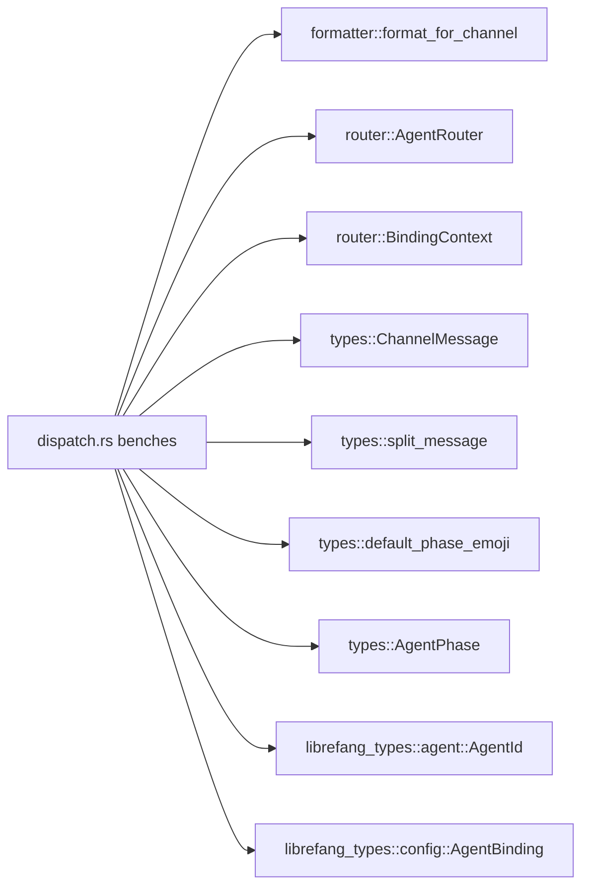

# Other — librefang-channels-benches

# librefang-channels Benchmarks — Dispatch Hot Paths

Location: `librefang-channels/benches/dispatch.rs`

## Overview

Criterion micro-benchmark suite covering the three hottest paths in the channel dispatch pipeline: **message serialization**, **agent routing**, and **output formatting**. These are the operations executed on every inbound/outbound message, so regressions here directly impact perceived latency.

Run with:

```bash
cargo bench -p librefang-channels -- dispatch
```

Results are stored under `target/criterion/` and can be compared across commits using `criterion::Criterion`'s built-in regression detection.

## Benchmark Groups

### 1. Serialization (`serialization`)

| Benchmark | What it measures |
|---|---|
| `message_serialize` | `serde_json::to_string` for a typical `ChannelMessage` |
| `message_deserialize` | `serde_json::from_str` back into `ChannelMessage` |
| `message_roundtrip` | Serialize + deserialize in one iteration |

All three use `make_sample_message()` which constructs a representative Telegram text message with a sender, timestamp, and empty metadata map. The message is realistic enough to exercise all struct fields without inflating timing with large payloads.

**What to watch for:** Any change to `ChannelMessage`, `ChannelUser`, `ChannelContent`, or `ChannelType` derive macros will show up here. Adding fields with expensive `Serialize`/`Deserialize` impls is the most common regression.

### 2. Routing (`routing`)

Four benchmarks covering the `AgentRouter` resolution paths, from fastest to most complex:

```
router_resolve_direct
  └─ router.resolve(channel, peer_id, thread_id)
       with a pre-loaded direct route for telegram:user-42 → agent

router_resolve_default_fallback
  └─ router.resolve(channel, peer_id, thread_id)
       no match found → falls back to the default agent

router_resolve_binding_match
  └─ router.load_bindings(...) → router.resolve(...)
       evaluates loaded AgentBinding rules (channel + peer_id match)

router_resolve_with_context
  └─ router.load_bindings(...) → router.resolve_with_context(..., &BindingContext)
       evaluates binding rules against a full BindingContext including
       guild_id and roles
```

**Key setup patterns:**

- `router_resolve_direct` — Uses `set_default` + `set_direct_route` to create an exact user-to-agent mapping. This is the happy path for returning users.
- `router_resolve_default_fallback` — Queries a channel/user pair with no configured routes, falling through to the default agent. Measures the miss penalty.
- `router_resolve_binding_match` — Registers an agent by name (`register_agent`), loads `AgentBinding` entries with `BindingMatchRule` constraints, then resolves. Exercises the rule-evaluation loop.
- `router_resolve_with_context` — The most expensive path. Constructs a `BindingContext` with `guild_id` and multiple `roles`, then calls `resolve_with_context`. This is the path taken when Discord role-based routing is active.

**What to watch for:** Changes to `BindingMatchRule` evaluation, the binding storage structure, or the context-matching logic in `router.rs`. The binding-match and context benchmarks are sensitive to the number and complexity of rules.

### 3. Formatting (`formatting`)

Benchmarks for `format_for_channel` and helper functions, covering all `OutputFormat` variants:

| Benchmark | Input | Format | Notes |
|---|---|---|---|
| `format_markdown_passthrough` | Full markdown | `Markdown` | Identity case, measures overhead alone |
| `format_telegram_html` | Full markdown | `TelegramHtml` | Converts bold/italic/code/links to HTML |
| `format_slack_mrkdwn` | Full markdown | `SlackMrkdwn` | Converts to Slack's mrkdwn dialect |
| `format_plain_text` | Full markdown | `PlainText` | Strips all formatting |
| `format_telegram_html_short` | `"Hello world!"` | `TelegramHtml` | Short-input overhead (no formatting to convert) |
| `split_message_short` | `"Hello!"` | — (limit 4096) | Single-chunk fast path |
| `split_message_long` | 500 lines | — (limit 4096) | Multi-chunk split, exercises chunking logic |
| `default_phase_emoji_all` | All 6 phases | — | Iterates Queued → Thinking → tool_use → Streaming → Done → Error |

The `SAMPLE_MARKDOWN` constant is a multi-paragraph block containing bold, italic, inline code, and links — representative of typical agent output.

**What to watch for:** Regex changes in the formatter, changes to `split_message`'s chunking strategy, or additions to the `AgentPhase` enum.

## Test Data

### `make_sample_message()`

Returns a `ChannelMessage` with these characteristics:

- **Channel:** `Telegram`
- **Message ID:** `"msg-12345"`
- **Sender:** platform_id `"user-42"`, display_name `"Alice"`, no linked librefang user
- **Content:** `ChannelContent::Text("Hello, how can you help me today?")`
- **Group:** `false`, no thread, empty metadata
- **Timestamp:** `Utc::now()` at construction time

### `SAMPLE_MARKDOWN`

A 6-line markdown string with `**bold**`, `*italic*`, `` `code` ``, and `[links](url)` — exercises every inline formatting rule.

## Dependencies on Library Code


```mermaid
graph LR
    B[dispatch.rs benches] --> F[formatter::format_for_channel]
    B --> R[router::AgentRouter]
    B --> R2[router::BindingContext]
    B --> T[types::ChannelMessage]
    B --> T2[types::split_message]
    B --> T3[types::default_phase_emoji]
    B --> T4[types::AgentPhase]
    B --> C[librefang_types::agent::AgentId]
    B --> C2[librefang_types::config::AgentBinding]
```

The bench depends on `librefang_channels` (the crate under test) and `librefang_types` for shared config/identity types. It does **not** depend on any channel SDK backends — all routing and formatting is tested against in-memory data structures.

## Adding New Benchmarks

1. **New output format** — Add a `bench_format_*` function calling `format_for_channel` with the new `OutputFormat` variant, then add it to the `formatting` group.
2. **New routing scenario** — Construct the `AgentRouter` state you need in the bench setup (outside the `iter` closure), add the bench function, and register it in the `routing` group.
3. **New message type** — If `ChannelContent` gains variants (e.g., `Image`, `File`), add serialize/deserialize benches using a sample message containing that variant.

Keep all setup work **outside** the `b.iter(|| ...)` closure — only the code being measured should run inside it. Use `black_box` on inputs to prevent the compiler from constant-folding or eliminating computations.