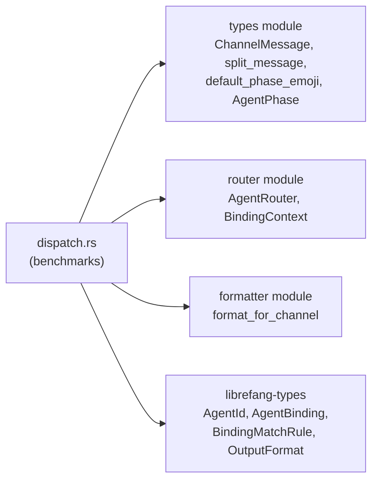

# Other — librefang-channels-benches

# librefang-channels-benches: Dispatch Hot-Path Benchmarks

Criterion microbenchmark suite covering the performance-critical paths in `librefang-channels`: JSON (de)serialization of channel messages, agent routing resolution, and cross-platform message formatting.

**File:** `librefang-channels/benches/dispatch.rs`

## Purpose

These benchmarks guard against regressions in the three operations that execute on every inbound or outbound message:

| Operation | Why it matters |
|---|---|
| `ChannelMessage` serde | Every persisted or transmitted message is serialized at least once |
| `AgentRouter::resolve` / `resolve_with_context` | Runs per-incoming-message to determine which agent handles it |
| `format_for_channel` / `split_message` / `default_phase_emoji` | Runs per-outgoing-message to adapt content for the target platform |

## Running

```bash
# All groups
cargo bench -p librefang-channels

# Single group
cargo bench -p librefang-challenges -- serialization
cargo bench -p librefang-channels -- routing
cargo bench -p librefang-channels -- formatting

# Individual benchmark
cargo bench -p librefang-channels -- router_resolve_direct
```

Results are saved under `target/criterion/` with HTML reports.

## Benchmark Groups

### Serialization (`serialization`)

Measures `serde_json` throughput on `ChannelMessage`.

| Benchmark | What it does |
|---|---|
| `message_serialize` | `serde_json::to_string` on a sample `ChannelMessage` |
| `message_deserialize` | `serde_json::from_str::<ChannelMessage>` from pre-serialized JSON |
| `message_roundtrip` | Serialize then immediately deserialize — catches combined overhead |

**Fixture:** `make_sample_message()` constructs a Telegram `ChannelMessage` with a text payload, a sender (`ChannelUser` with `platform_id` and `display_name`), a timestamp, and empty metadata. The `black_box` wrapper prevents the compiler from eliding the work.

### Routing (`routing`)

Measures `AgentRouter` resolution under increasingly complex configurations.

| Benchmark | Router setup | Resolution path |
|---|---|---|
| `router_resolve_direct` | One default agent + one direct route (`Telegram`/`user-42` → agent) | Direct-route hit — fastest path |
| `router_resolve_default_fallback` | One default agent, no channel/user routes | Falls through to default |
| `router_resolve_binding_match` | Agent registered as `"support"`, binding matches `telegram` + `vip-user` | Binding rule match via `load_bindings` |
| `router_resolve_with_context` | Agent registered as `"admin-bot"`, binding matches `discord` + `guild_id` + `roles` | Context-aware resolution with `BindingContext` including guild and role data |

The progression is intentional: each successive benchmark exercises additional matching logic in the router, so comparing them reveals the marginal cost of binding evaluation and context matching.

### Formatting (`formatting`)

Measures the `format_for_channel` conversion pipeline and related utilities.

| Benchmark | Input | Output format |
|---|---|---|
| `format_markdown_passthrough` | Multi-paragraph markdown (`SAMPLE_MARKDOWN`) | `OutputFormat::Markdown` |
| `format_telegram_html` | Same markdown | `OutputFormat::TelegramHtml` |
| `format_slack_mrkdwn` | Same markdown | `OutputFormat::SlackMrkdwn` |
| `format_plain_text` | Same markdown | `OutputFormat::PlainText` |
| `format_telegram_html_short` | `"Hello world!"` | `OutputFormat::TelegramHtml` |
| `split_message_short` | `"Hello!"` with limit 4096 | No split needed |
| `split_message_long` | 500 repeated lines with limit 4096 | Multiple chunks |
| `default_phase_emoji_all` | All six `AgentPhase` variants | Emoji lookup per phase |

The `SAMPLE_MARKDOWN` constant exercises bold, italic, code spans, links, and bullet lists — the full set of markup constructs the formatter must handle.

## Dependencies on Library Code


```mermaid
graph LR
    dispatch_rs["dispatch.rs<br/>(benchmarks)"]
    dispatch_rs --> types["types module<br/>ChannelMessage, split_message,<br/>default_phase_emoji, AgentPhase"]
    dispatch_rs --> router["router module<br/>AgentRouter, BindingContext"]
    dispatch_rs --> formatter["formatter module<br/>format_for_channel"]
    dispatch_rs --> librefang_types["librefang-types<br/>AgentId, AgentBinding,<br/>BindingMatchRule, OutputFormat"]
```

Key API surfaces exercised:

- **`librefang_channels::types`** — `ChannelMessage`, `ChannelUser`, `ChannelContent`, `ChannelType`, `split_message`, `default_phase_emoji`, `AgentPhase`
- **`librefang_channels::router`** — `AgentRouter::new`, `set_default`, `set_direct_route`, `register_agent`, `load_bindings`, `resolve`, `resolve_with_context`; `BindingContext`
- **`librefang_channels::formatter`** — `format_for_channel`
- **`librefang_types::agent`** — `AgentId`
- **`librefang_types::config`** — `OutputFormat`, `AgentBinding`, `BindingMatchRule`

## Adding New Benchmarks

1. Place the benchmark function in the appropriate section of `dispatch.rs` (or create a new section with a comment header).
2. Add the function to the relevant `criterion_group!` macro invocation, or define a new group and include it in `criterion_main!`.
3. Use `black_box` on all inputs and outputs to prevent dead-code elimination.
4. For router benchmarks, construct the `AgentRouter` setup inside the benchmark function (before the `bench_function` closure) so setup cost is excluded from the measurement. The closure should contain only the `resolve`/`resolve_with_context` call.