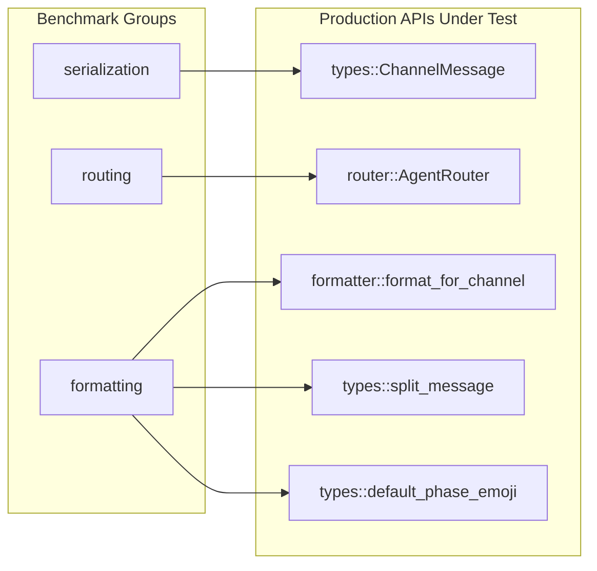

# Other — librefang-channels-benches

# librefang-channels Benchmarks — Dispatch Hot Paths

## Overview

The `dispatch.rs` benchmark suite measures the performance of three critical hot paths in the `librefang-channels` crate:

| Group | Concern | Functions Benchmarked |
|-------|---------|----------------------|
| `serialization` | JSON serde of `ChannelMessage` | serialize, deserialize, roundtrip |
| `routing` | `AgentRouter` agent resolution | direct route, default fallback, binding match, context-aware match |
| `formatting` | `format_for_channel` output conversion | Markdown passthrough, Telegram HTML, Slack mrkdwn, plain text, message splitting, phase emoji |

Run all benchmarks:

```bash
cargo bench -p librefang-channels
```

Run a specific group:

```bash
cargo bench -p librefang-channels -- serialization
cargo bench -p librefang-channels -- routing
cargo bench -p librefang-channels -- formatting
```

## Architecture


```mermaid
graph LR
    subgraph "Benchmark Groups"
        S[serialization]
        R[routing]
        F[formatting]
    end
    subgraph "Production APIs Under Test"
        T[types::ChannelMessage]
        RR[router::AgentRouter]
        FF[formatter::format_for_channel]
        TS[types::split_message]
        TE[types::default_phase_emoji]
    end
    S --> T
    R --> RR
    F --> FF
    F --> TS
    F --> TE
```

Each benchmark constructs the minimum viable fixture in-line, calls `black_box` on inputs to prevent the compiler from optimizing away computation, and iterates via Criterion's `Bencher`.

---

## Serialization Benchmarks

All three serialization benchmarks share a common fixture constructed by `make_sample_message()`. This function builds a realistic `ChannelMessage` with:

- `ChannelType::Telegram`
- A `ChannelUser` with `platform_id: "user-42"` and `display_name: "Alice"`
- `ChannelContent::Text` containing a typical user query
- A live `Utc::now()` timestamp
- Empty metadata `HashMap`

### Benchmarks

| Benchmark | What it measures |
|-----------|-----------------|
| `message_serialize` | `serde_json::to_string` on a `ChannelMessage` |
| `message_deserialize` | `serde_json::from_str::<ChannelMessage>` on the pre-serialized JSON |
| `message_roundtrip` | Serialize then immediately deserialize — captures combined overhead |

The roundtrip benchmark is useful for detecting regressions in either direction that might cancel out when viewed individually.

---

## Routing Benchmarks

These benchmarks exercise `AgentRouter` which lives in `librefang_channels::router`. Four scenarios are tested, escalating in complexity:

### `router_resolve_direct`

The fastest path. A direct mapping from `(ChannelType, peer_id)` to an `AgentId` is registered via `set_direct_route`, then `resolve()` is called with matching parameters.

```
setup: router.set_default(agent) + router.set_direct_route("telegram", "user-42", agent)
call:  router.resolve(&ChannelType::Telegram, "user-42", None)
```

### `router_resolve_default_fallback`

No specific route matches — the router falls back to the default agent set via `set_default`.

```
setup: router.set_default(agent)
call:  router.resolve(&ChannelType::Discord, "unknown-user", None)
```

### `router_resolve_binding_match`

Tests rule-based binding resolution. An agent is registered by name (`"support"`), then a `AgentBinding` is loaded with a `BindingMatchRule` targeting `channel: "telegram"` and `peer_id: "vip-user"`. The benchmark calls `resolve()` which must evaluate the binding rules.

This exercises `router.load_bindings()` during setup and the binding-matching logic in `resolve()` per iteration.

### `router_resolve_with_context`

The most complex routing scenario. Tests `resolve_with_context()` which performs binding matching against a full `BindingContext` including:

- `channel` and `peer_id` (standard)
- `guild_id` for Discord guild scoping
- `roles` — a `SmallVec` of role strings the user holds

The binding is configured to match `channel: "discord"`, `guild_id: "guild-1"`, and `roles: ["admin"]`. The context provides those plus an extra role (`"moderator"`), validating that the router correctly checks role inclusion rather than exact equality.

---

## Formatting Benchmarks

These benchmarks target `format_for_channel()` from `librefang_channels::formatter` and related helper functions from `librefang_channels::types`.

### Input fixtures

- **`SAMPLE_MARKDOWN`** — a 7-line markdown string containing bold, italic, inline code, links, and bullet lists. Designed to exercise every conversion branch.
- **`SHORT_TEXT`** — the string `"Hello world!"` for measuring baseline overhead on trivial input.

### `format_for_channel` variants

| Benchmark | `OutputFormat` variant | Key conversions |
|-----------|----------------------|-----------------|
| `format_markdown_passthrough` | `Markdown` | Minimal work — identity or near-identity |
| `format_telegram_html` | `TelegramHtml` | `**bold**` → `<b>bold</b>`, `*italic*` → `<i>italic</i>`, links to `<a>` tags |
| `format_slack_mrkdwn` | `SlackMrkdwn` | `**bold**` → `*bold*`, inline code unchanged, links to `<url|text>` |
| `format_plain_text` | `PlainText` | Strip all formatting, extract link text |
| `format_telegram_html_short` | `TelegramHtml` | Measures per-call overhead on `"Hello world!"` |

### Message splitting

| Benchmark | Input | Chunk size |
|-----------|-------|------------|
| `split_message_short` | `"Hello!"` | 4096 |
| `split_message_long` | 500 lines (~11 KB) | 4096 |

The long variant exercises the chunking logic that splits on newline boundaries to fit platform message limits (Telegram's 4096-character cap).

### Phase emoji lookup

`default_phase_emoji_all` iterates over all six `AgentPhase` variants — `Queued`, `Thinking`, `tool_use("web_fetch")`, `Streaming`, `Done`, `Error` — calling `default_phase_emoji()` on each. This validates that the enum-match dispatch remains cheap even with the dynamic `tool_use` variant.

---

## Dependencies on Production Code

The benchmark file imports from three modules in `librefang-channels` and one from `librefang-types`:

```
librefang_channels::formatter    → format_for_channel
librefang_channels::router       → AgentRouter, BindingContext
librefang_channels::types        → ChannelMessage, ChannelContent, ChannelUser,
                                   ChannelType, AgentPhase, default_phase_emoji, split_message
librefang_types::agent           → AgentId
librefang_types::config          → OutputFormat, AgentBinding, BindingMatchRule
```

It also depends on `chrono::Utc` for timestamp generation and `smallvec` for the `BindingContext` roles field — matching the production `router` module's use of `SmallVec` for stack-allocated role lists.

---

## Adding New Benchmarks

To benchmark a new hot path:

1. Place the benchmark function in the appropriate section (or create a new one).
2. Register it in the matching `criterion_group!` macro, or define a new group and add it to `criterion_main!`.
3. Use `black_box` on all inputs to prevent dead-code elimination.
4. Construct fixtures inside the benchmark (not in a `lazy_static` or `once_cell`) unless the construction cost is explicitly being excluded — Criterion's `bench_function` iterates the closure, so setup outside the closure runs only once.