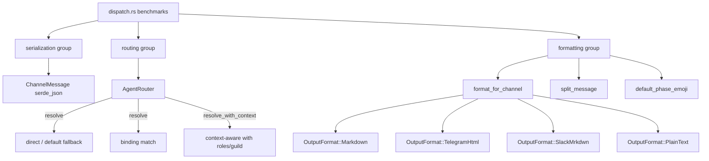

# Other — librefang-channels-benches

# librefang-channels Benchmarks — Dispatch Hot Paths

## Overview

The `dispatch.rs` benchmark suite measures the performance of three critical hot paths in the channel messaging subsystem using [Criterion](https://bheisler.github.io/criterion.rs/):

| Benchmark Group | What It Measures | Target Surface |
|---|---|---|
| `serialization` | `ChannelMessage` serde round-trips | `serde_json` encode/decode of full message structs |
| `routing` | Agent resolution strategies | `AgentRouter::resolve` / `resolve_with_context` |
| `formatting` | Markdown-to-output conversion and message splitting | `format_for_channel`, `split_message`, `default_phase_emoji` |

These cover the per-message overhead that every inbound/outbound channel dispatch must pay.

## Running the Benchmarks

```bash
# All groups
cargo bench -p librefang-channels

# Single group via Criterion filter
cargo bench -p librefang-chables -- "routing"
```

Criterion writes HTML reports to `target/criterion/<bench_name>/`. Use these to detect regressions between commits.

## Architecture


```mermaid
graph TD
    B[dispatch.rs benchmarks] --> S[serialization group]
    B --> R[routing group]
    B --> F[formatting group]

    S --> CM[ChannelMessage serde_json]
    R --> AR[AgentRouter]
    F --> FC[format_for_channel]
    F --> SM[split_message]
    F --> DPE[default_phase_emoji]

    AR -->|resolve| ARD[direct / default fallback]
    AR -->|resolve| ARB[binding match]
    AR -->|resolve_with_context| ARX[context-aware with roles/guild]

    FC --> MD[OutputFormat::Markdown]
    FC --> TH[OutputFormat::TelegramHtml]
    FC --> SL[OutputFormat::SlackMrkdwn]
    FC --> PT[OutputFormat::PlainText]
```

## Benchmark Groups

### Serialization

Three benches exercise `serde_json` on a fully-populated `ChannelMessage`:

| Benchmark | Function | Description |
|---|---|---|
| `message_serialize` | `bench_message_serialize` | `serde_json::to_string` on a `ChannelMessage` |
| `message_deserialize` | `bench_message_deserialize` | `serde_json::from_str` back into `ChannelMessage` |
| `message_roundtrip` | `bench_message_roundtrip` | Serialize then deserialize in one iteration |

The sample message (`make_sample_message`) contains a Telegram `Text` message with a sender, timestamp, empty metadata `HashMap`, and no thread/group context. This represents a typical lightweight inbound message. If you add fields to `ChannelMessage`, the serialization costs will shift—watch the round-trip numbers after schema changes.

### Routing

Four benches cover every resolution path in `AgentRouter`:

| Benchmark | Setup | Resolution Path |
|---|---|---|
| `router_resolve_direct` | One direct route (`telegram` / `user-42` → agent) + default | Direct channel+peer match via `resolve` |
| `router_resolve_default_fallback` | Default agent only, query on unknown channel/peer | Falls through to default agent via `resolve` |
| `router_resolve_binding_match` | One `AgentBinding` matching `telegram` + `vip-user` | Binding rule evaluation via `resolve` |
| `router_resolve_with_context` | Binding on `discord` + `guild-1` + role `admin`; context supplies roles `[admin, moderator]` | Full context-aware match via `resolve_with_context` with `BindingContext` |

Key APIs exercised:
- `AgentRouter::new()`, `set_default()`, `set_direct_route()`, `register_agent()`, `load_bindings()`
- `BindingMatchRule` — channel, peer_id, guild_id, roles fields
- `BindingContext` — `Cow`-borrowed fields for channel, peer_id, guild_id, roles

The `resolve_with_context` path is the most expensive because it must evaluate multi-field match rules including role set intersections. When adding new `BindingMatchRule` fields, add a corresponding bench here to track the cost.

### Formatting

Eight benches cover the `format_for_channel` dispatcher and related utilities:

| Benchmark | Input | Output Format | Notes |
|---|---|---|---|
| `format_markdown_passthrough` | Multi-paragraph markdown | `Markdown` | Identity/no-op path |
| `format_telegram_html` | Multi-paragraph markdown | `TelegramHtml` | Bold, italic, code, links → HTML tags |
| `format_slack_mrkdwn` | Multi-paragraph markdown | `SlackMrkdwn` | Slack's proprietary markup |
| `format_plain_text` | Multi-paragraph markdown | `PlainText` | Strips all formatting |
| `format_telegram_html_short` | `"Hello world!"` | `TelegramHtml` | Short-string fast path |
| `split_message_short` | `"Hello!"` | — | Single-chunk split at 4096-char limit |
| `split_message_long` | 500 lines (~13KB) | — | Multi-chunk split at 4096-char limit |
| `default_phase_emoji_all` | All 6 `AgentPhase` variants | — | Covers `Queued`, `Thinking`, `tool_use`, `Streaming`, `Done`, `Error` |

The `SAMPLE_MARKDOWN` constant exercises bold, italic, inline code, and link conversion—representing a realistic agent response with mixed formatting.

`bench_split_message_long` is the most relevant for detecting allocator pressure since it builds multiple owned `String` chunks from a ~13KB input.

## Test Data Helpers

### `make_sample_message()`

Constructs a canonical `ChannelMessage` for serialization benches:

```rust
ChannelMessage {
    channel: ChannelType::Telegram,
    platform_message_id: "msg-12345",
    sender: ChannelUser { platform_id: "user-42", display_name: "Alice", librefang_user: None },
    content: ChannelContent::Text("Hello, how can you help me today?"),
    target_agent: None,
    timestamp: Utc::now(),
    is_group: false,
    thread_id: None,
    metadata: HashMap::new(),
}
```

`Utc::now()` is called once at construction time per benchmark invocation (outside the measured loop), so timestamp generation does not pollute the numbers.

### Sample Strings

- `SAMPLE_MARKDOWN` — 6-line paragraph with bold, italic, inline code, and two links.
- `SHORT_TEXT` — `"Hello world!"` for fast-path formatting benches.

Both are `const` strings, meaning zero allocation cost in the measured loop.

## Adding New Benchmarks

1. **New `ChannelMessage` fields** — The existing serialization benches will automatically reflect the cost change. No new bench needed unless the field introduces a new code path (e.g., a large nested struct).

2. **New `BindingMatchRule` fields** — Add a dedicated bench in the `routing` group that sets the new field on both `BindingMatchRule` and `BindingContext`, then calls `resolve_with_context`. Mirror the structure of `bench_router_resolve_with_context`.

3. **New `OutputFormat` variants** — Add a bench calling `format_for_channel` with `SAMPLE_MARKDOWN` and the new variant. Register it in the `formatting` group.

4. **New routing strategies** (e.g., regex-based matching) — Create a new bench that loads the appropriate binding config and calls the relevant `resolve` method. Expect it to be slower than the direct-hashmap lookup in `router_resolve_direct`.

All benches use `black_box` on inputs and intermediate values to prevent the compiler from constant-folding or eliminating the measured work.