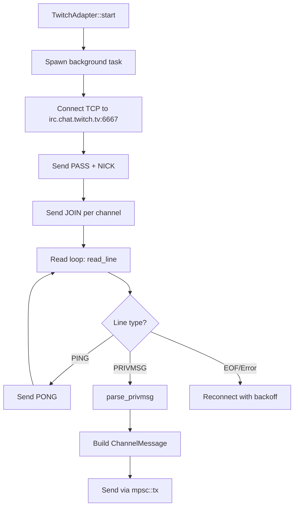

# Other — librefang-channels-src

# Twitch IRC Channel Adapter (`librefang-channels-src`)

## Purpose

This module provides a Twitch chat adapter that bridges Twitch IRC into the LibreFang channel system. It connects to Twitch's IRC gateway (`irc.chat.twitch.tv:6667`) over plain TCP, implements the IRC protocol for sending and receiving chat messages, and translates Twitch messages into the platform-agnostic `ChannelMessage` type.

## Architecture

The adapter operates as a long-lived background task that maintains an IRC connection, handles keepalive, parses incoming messages, and emits them through an `mpsc` channel as a `Stream<ChannelMessage>`.



## Key Types

### `TwitchAdapter`

The main struct implementing the `ChannelAdapter` trait. It holds:

| Field | Purpose |
|---|---|
| `oauth_token` | Twitch OAuth token, wrapped in `Zeroizing<String>` for secure memory handling |
| `channels` | List of Twitch channels to join (stored without `#` prefix) |
| `nick` | Bot's IRC nickname, must match the token owner's Twitch username |
| `account_id` | Optional identifier for multi-bot routing, injected into message metadata |
| `shutdown_tx` / `shutdown_rx` | `watch` channel for graceful shutdown signaling |

Construction uses a builder pattern:

```rust
let adapter = TwitchAdapter::new(token, vec!["channel1".into()], "mybot".into())
    .with_account_id(Some("bot-farm-01".into()));
```

### `parse_privmsg`

```rust
fn parse_privmsg(line: &str) -> Option<(String, String, String)>
```

Parses raw IRC lines matching the format:

```
:nick!user@host PRIVMSG #channel :message text
```

Returns `(nick, channel, message)` on success. Returns `None` for non-PRIVMSG lines, malformed messages, or lines missing the `:` prefix. This is a pure function with no side effects, making it straightforward to test in isolation.

## Connection Lifecycle

### Start (`start()`)

1. Creates an `mpsc::channel<ChannelMessage>(256)` for downstream consumption.
2. Spawns an async task that enters a reconnection loop:
   - **Connect**: Opens a TCP stream to `irc.chat.twitch.tv:6667`.
   - **Authenticate**: Sends `PASS` and `NICK` commands. The `pass_string()` method normalizes the token—whether the caller includes the `oauth:` prefix or not, the output is always `PASS oauth:<token>\r\n`.
   - **Join**: Sends a `JOIN` command for each channel in `self.channels`.
   - **Read loop**: Uses `BufReader::read_line` inside a `tokio::select!` that also watches the shutdown signal. Each line is trimmed and dispatched:
     - `PING` → responds with `PONG` and continues.
     - `PRIVMSG` → parsed by `parse_privmsg`, converted to `ChannelMessage`, sent on the channel.
     - EOF or read error → breaks out for reconnection.
   - **Shutdown**: If `shutdown_rx` changes, sends `QUIT` and exits the task.
3. Returns the receiver end wrapped as `ReceiverStream` (a `Stream<Item = ChannelMessage>`).

### Reconnection

On connection failure or unexpected disconnect, the task applies exponential backoff starting at 1 second, doubling each attempt, capped at 60 seconds. Backoff resets to 1 second after a successful connection and channel join.

### Send (`send()`)

Sends a message to a specific Twitch channel. The current implementation:

1. Opens a fresh TCP connection per call (a production deployment would maintain a persistent write connection).
2. Authenticates with `PASS` and `NICK`.
3. Waits 500ms for Twitch to process authentication.
4. Splits long messages using `split_message(&text, 500)` to respect the 500-character IRC limit.
5. Sends each chunk as `PRIVMSG #channel :<chunk>`.
6. Sends `QUIT` to close the connection.

Only `ChannelContent::Text` is supported for outbound messages. Non-text content results in the placeholder string `"(Unsupported content type)"`.

### Stop (`stop()`)

Sends `true` on the shutdown `watch` channel. The background task detects this in its `select!` loop, sends `QUIT`, and exits cleanly.

## Message Translation

Incoming Twitch messages are classified before wrapping into `ChannelContent`:

| Twitch message | `ChannelContent` variant |
|---|---|
| `Hello world` | `Text("Hello world")` |
| `!help args` | `Command { name: "help", args: ["args"] }` |
| `/command foo bar` | `Command { name: "command", args: ["foo", "bar"] }` |

Messages starting with `/` or `!` are parsed as commands; everything else is plain text.

Each outgoing `ChannelMessage` includes:

- `channel`: `ChannelType::Custom("twitch".to_string())`
- `platform_message_id`: A new UUID v4
- `sender`: `ChannelUser` with `platform_id` set to the channel name and `display_name` set to the sender's nick
- `is_group`: Always `true` (Twitch channels are group chats)
- `metadata`: Contains `"account_id"` if the adapter was configured with one
- `timestamp`: `Utc::now()`

The adapter filters out messages from the bot itself (case-insensitive nick comparison) and skips empty messages.

## Security

- The OAuth token is stored in `Zeroizing<String>`, which zeroizes memory on drop.
- The token prefix is normalized in `pass_string()` so callers don't need to worry about whether they included `oauth:`.
- No TLS is used (port 6667, plain TCP). In production, consider wrapping the connection in TLS or using port 6697 if Twitch supports it.

## Dependencies on `crate::types`

The adapter relies on these shared types from the channel system:

- `ChannelAdapter` trait — the interface this struct implements
- `ChannelMessage`, `ChannelUser`, `ChannelContent`, `ChannelType` — message model types
- `split_message` — utility for chunking messages to fit IRC length limits

## Testing

The module includes unit tests covering:

- Adapter construction and trait method outputs (`name()`, `channel_type()`)
- `pass_string()` normalization with and without the `oauth:` prefix
- `parse_privmsg()` for valid messages, commands, missing message bodies, non-PRIVMSG lines, and lines without the `:` prefix

The `parse_privmsg` function is pure and fully testable without network access. Integration testing of the full connection lifecycle would require mocking the TCP layer or a Twitch IRC stub server.