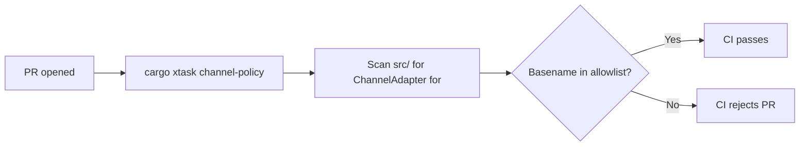

# Other — librefang-channels-src

# librefang-channels-src — Channel Adapter Allowlist

## Overview

`librefang-channels/src/channels-allowlist.txt` is a **policy ratchet** that controls which channel adapters may be compiled in-process. It is the single source of truth enforced by both the pre-commit hook and the CI job `cargo xtask channel-policy`.

The file has no runtime behaviour — it is never loaded at build time or at run time. It exists purely as a static reference consumed by the CI/pre-commit tooling.

## Sidecar-First Policy

LibreFang mandates that **all new channel adapters ship as out-of-process sidecars**. Out-of-process adapters:

- Run in their own process, communicating with the core over a defined IPC protocol.
- Live under `librefang.sidecar.adapters.*` in the SDK, or follow the template in `examples/sidecar-channel-python/adapter.py`.
- Can be written in any language that speaks the sidecar protocol.

The allowlist exists solely to **grandfather** the small set of in-process adapters that predate this policy.

## How Enforcement Works

On every pull request (and locally via pre-commit), the `cargo xtask channel-policy` task performs a static analysis:

1. Scans every file under `crates/librefang-channels/src/` — both `<name>.rs` and `<name>/*.rs` patterns.
2. Looks for Rust `ChannelAdapter for` impl blocks inside those files.
3. Extracts the file's basename (without `.rs`).
4. Rejects the PR if the basename is **not** present in `channels-allowlist.txt.

```mermaid
flowchart LR
    PR[PR opened] --> CI[cargo xtask channel-policy]
    CI --> Scan[Scan src/ for ChannelAdapter for]
    Scan --> Check{Basename in allowlist?}
    Check -- Yes --> Pass[CI passes]
    Check -- No --> Fail[CI rejects PR]
```

## File Format

- **One basename per line**, without the `.rs` extension.
- Lines beginning with `#` are comments; blank lines are ignored.
- Entries must be kept **sorted alphabetically**.

### Current Entries

| Basename | Notes |
|----------|-------|
| `sidecar` | The sidecar bridge adapter itself |

## Policy Rules

### The list only ever shrinks

When an in-process adapter is migrated to a sidecar and its source module is deleted, its entry is removed from the allowlist. This prevents silent reintroduction of in-process adapters in future PRs.

### Adding a name back requires maintainer approval

Re-adding a previously removed entry — or introducing a brand-new one — is not routine and requires explicit sign-off from a maintainer.

### Known limitations

- **Macro-generated impls** are not detected. If a `ChannelAdapter for` impl is produced by a macro invocation inside an already-allowlisted file, the tooling will not flag it.
- **New adapters inside allowlisted files** likewise pass undetected, because enforcement operates at the file-basename level.

This is intentional. The allowlist is a **policy ratchet**, not a security boundary.

## Related Code

| Location | Purpose |
|----------|---------|
| `crates/librefang-channels/src/<name>.rs` | In-process adapter modules under the allowlist's jurisdiction |
| `librefang.sidecar.adapters.*` (SDK) | Out-of-process sidecar adapter interface |
| `examples/sidecar-channel-python/adapter.py` | Generic sidecar adapter template |
| `cargo xtask channel-policy` | CI enforcement task that reads this allowlist |
| Pre-commit hook | Local enforcement before push |