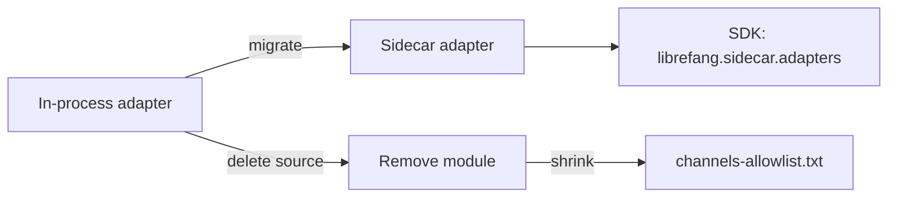

# Other — librefang-channels-src

# librefang-channels-src — Channel Adapter Allowlist

## Purpose

This module contains a single file, `channels-allowlist.txt`, which acts as a **policy ratchet** governing which channel adapters may be compiled in-process within the `librefang-channels` crate. It enforces LibreFang's **sidecar-first architecture**: all new channel adapters must be implemented as out-of-process sidecar adapters, not as in-process modules.

The allowlist exists to grandfather in adapters that predate this policy. It is not a security boundary — it is a development guardrail.

## How It Works

### Enforcement Points

Two mechanisms read this file and reject violations:

1. **Pre-commit hook** — runs locally before a commit is finalized.
2. **`cargo xtask channel-policy`** — executed in CI on every pull request.

Both check every file under `crates/librefang-channels/src/` (both `<name>.rs` and `<name>/*.rs` patterns). If a file contains the token `ChannelAdapter for` and its basename (without `.rs`) is **not** listed in `channels-allowlist.txt`, the check fails.

### Current Allowlist

```
sidecar
```

Only the `sidecar` module is permitted to contain an in-process `ChannelAdapter` implementation. This is the bootstrap/bridge module that connects the in-process world to the sidecar world.

## Policy Rules

| Rule | Detail |
|---|---|
| **List only shrinks** | When an adapter is migrated to a sidecar and its source module deleted, its name is removed from this file. |
| **No re-addition** | Once a name is removed, it can never be reintroduced without explicit maintainer approval. |
| **One name per line** | Basenames only — no `.rs` extension. Entries are kept sorted alphabetically. |

## Known Limitations

The detection is text-based: it looks for the literal string `ChannelAdapter for` in source files. The following cases are **not** caught:

- **Macro-generated implementations.** A proc macro that expands to `impl ChannelAdapter for X` will not trigger the check.
- **New adapters in already-allowlisted files.** Adding a second `ChannelAdapter for Y` inside a file whose basename is already listed will pass the check.

These are accepted gaps. The allowlist is a ratchet to prevent *growth*, not a comprehensive audit tool.

## Migration Path for Contributors

When migrating an in-process adapter to a sidecar:

1. Implement the adapter as an out-of-process sidecar (see `librefang.sidecar.adapters.*` in the SDK or `examples/sidecar-channel-python/adapter.py` for a generic template).
2. Delete the in-process module (`crates/librefang-channels/src/<name>.rs` or `crates/librefang-channels/src/<name>/`).
3. Remove the module's basename from `channels-allowlist.txt`.
4. Verify that `cargo xtask channel-policy` passes.


```mermaid
flowchart LR
    A[In-process adapter] -->|migrate| B[Sidecar adapter]
    A -->|delete source| C[Remove module]
    C -->|shrink| D[channels-allowlist.txt]
    B --> E[SDK: librefang.sidecar.adapters]
```

## Relationship to the Codebase

```
librefang-channels/
└── src/
    ├── channels-allowlist.txt   ← this file (policy)
    ├── sidecar.rs               ← only allowlisted in-process module
    └── ...
```

The allowlist is referenced by:
- **Pre-commit hooks** — local enforcement.
- **`xtask channel-policy`** — CI enforcement.
- **Contributor workflow** — anyone adding or migrating channel adapters.

Out-of-process adapters live outside this crate entirely and are not subject to this allowlist. They interact with LibreFang through the sidecar protocol defined in the SDK.