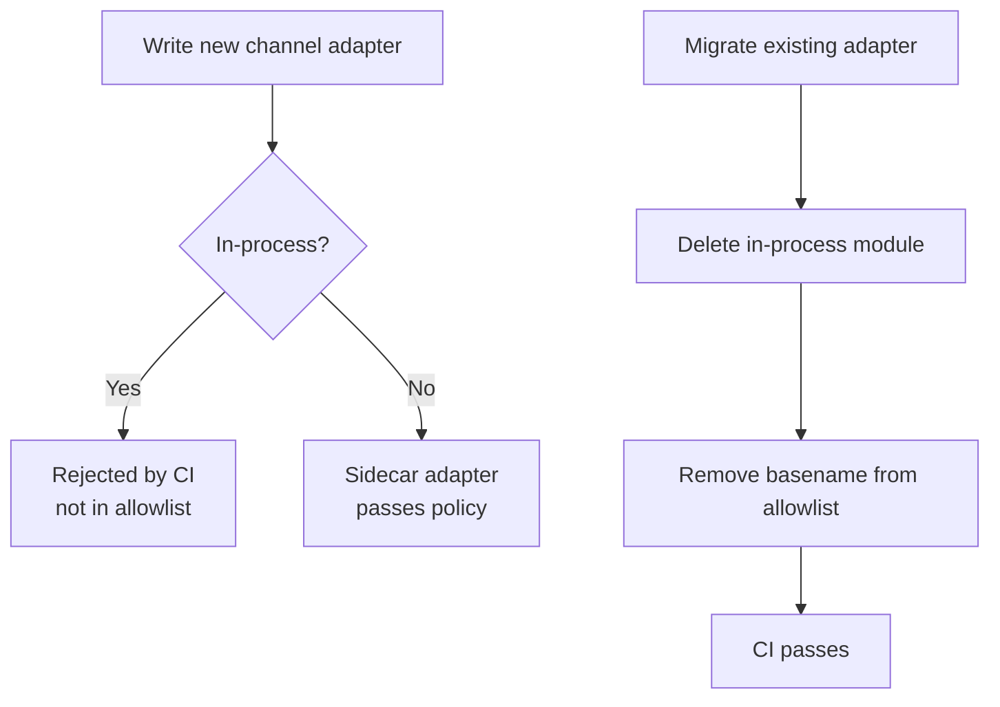

# Other — librefang-channels-src

# librefang-channels-src — Channel Adapter Allowlist

## Purpose

This module enforces LibreFang's **sidecar-first policy** for channel adapters. It contains a single configuration file, `channels-allowlist.txt`, that acts as a policy ratchet: only adapters whose module basenames appear in this file may be compiled as in-process `ChannelAdapter` implementations.

All new channel adapters must ship as out-of-process sidecar adapters. This allowlist grandfathers the adapters that predate the policy and ensures no new in-process adapters are silently reintroduced.

## How Enforcement Works

Two mechanisms read `channels-allowlist.txt` and reject non-compliant code:

1. **Pre-commit hook** — runs locally on every commit.
2. **`cargo xtask channel-policy`** — runs in CI on every pull request.

Both scan files matching the glob patterns:

```
crates/librefang-channels/src/{<name>.rs, <name>/*.rs}
```

If any matched file contains the token sequence `ChannelAdapter for` and its basename (without `.rs`) is **not** listed in `channels-allowlist.txt`, the check fails.

## File Format

`channels-allowlist.txt` is a plain-text file with one basename per line:

```
# One basename per line, no `.rs`. Keep sorted.
sidecar
```

- Lines starting with `#` are comments.
- Blank lines are ignored.
- Basenames must be sorted alphabetically.
- Do **not** include the `.rs` extension.

## Policy Rules

| Rule | Detail |
|---|---|
| **Shrink-only** | Entries are only ever removed, never added. When an adapter is migrated to a sidecar and its source module deleted, remove its basename from the allowlist. |
| **Re-addition requires approval** | Adding a name back is not routine and requires explicit maintainer sign-off. |
| **Not a security boundary** | This is a policy ratchet to prevent accidental growth of in-process adapters. It does not provide runtime security guarantees. |

## Known Limitations

The enforcement is text-based and operates on the source files directly. It will **not** detect:

- **Macro-generated impls** — a macro that expands to `impl ChannelAdapter for ...` in a non-allowlisted file will not be caught.
- **New adapters inside allowlisted files** — adding a second `ChannelAdapter for` impl inside a file whose basename is already allowlisted will pass the check.

These are accepted trade-offs for a lightweight, CI-friendly policy gate. If stricter enforcement is needed, a full AST-based lint should be introduced separately.

## Developer Workflow

### Adding a new channel adapter

Do **not** add the adapter as an in-process module under `crates/librefang-channels/src/`. Instead, implement it as an out-of-process sidecar adapter:

- Reference `docs/` and the `librefang.sidecar.adapters.*` modules in the SDK.
- Use `examples/sidecar-channel-python/adapter.py` as a generic template.
- Do **not** modify `channels-allowlist.txt`.

### Migrating an existing in-process adapter to a sidecar

1. Implement the adapter as a sidecar process.
2. Delete the in-process source module under `crates/librefang-channels/src/`.
3. Remove the corresponding basename from `channels-allowlist.txt`.
4. Verify that `cargo xtask channel-policy` passes.


```mermaid
flowchart TD
    A[Write new channel adapter] --> B{In-process?}
    B -- Yes --> C[Rejected by CI<br/>not in allowlist]
    B -- No --> D[Sidecar adapter<br/>passes policy]
    E[Migrate existing adapter] --> F[Delete in-process module]
    F --> G[Remove basename from allowlist]
    G --> H[CI passes]
```

## Relationship to the Codebase

This module sits inside the `librefang-channels` crate but contains no executable Rust code. It is consumed exclusively by the `xtask` tooling and the pre-commit hook. The `sidecar` entry currently in the allowlist corresponds to the in-process sidecar bridge adapter that connects to out-of-process sidecar instances.