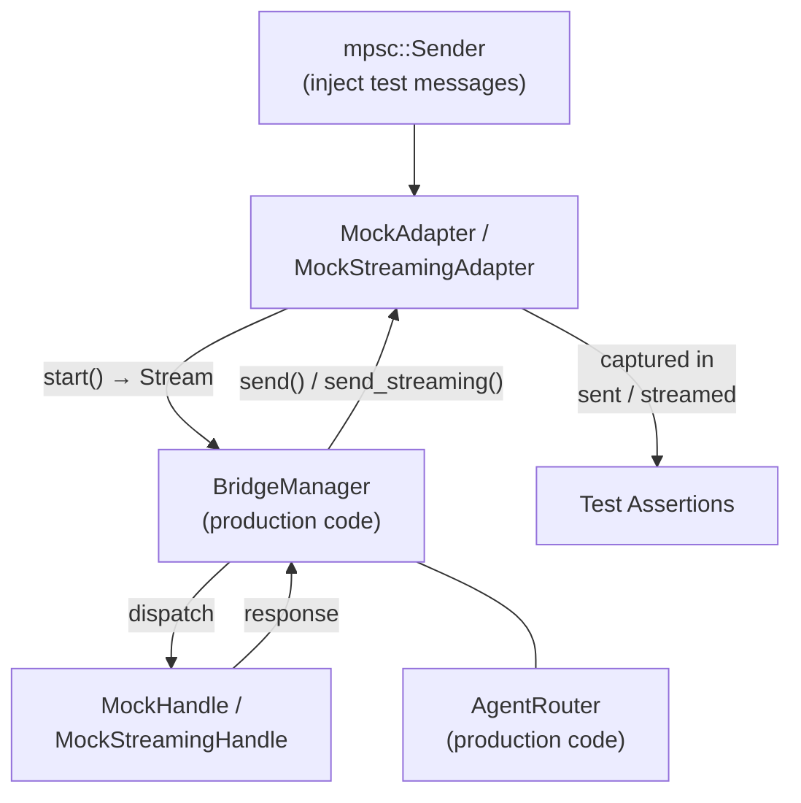

# Other — librefang-channels-tests

# Bridge Integration Tests

## Purpose

This module provides end-to-end integration tests for the `BridgeManager` dispatch pipeline in `librefang_channels::bridge`. Every test wires real production components (`BridgeManager`, `AgentRouter`) against mock implementations of `ChannelAdapter` and `ChannelBridgeHandle`, then injects messages through `mpsc` channels and asserts on the outcomes.

No external services are contacted — all communication is in-process via tokio channels and tasks.

## Architecture



Each test follows the same pattern:

1. Create a mock handle with known agents.
2. Create an `AgentRouter`, optionally pre-routing users to agents via `set_user_default`.
3. Create a mock adapter (returns an `mpsc::Sender` for injecting messages).
4. Construct `BridgeManager::new(handle, router)` and call `start_adapter(adapter)`.
5. Send `ChannelMessage` values through the sender.
6. Poll via `wait_until` until the expected side effects appear.
7. Assert on captured responses, router state, and/or delivery metrics.
8. Call `manager.stop()`.

## Test Infrastructure

### `wait_until`

```rust
async fn wait_until<F>(label: &str, mut cond: F)
where
    F: FnMut() -> bool,
```

Replaces fixed `sleep()` calls with a deadline-bounded poll (2-second timeout, 5ms tick). The generous deadline accommodates CI slowdowns while failing fast on stuck dispatch loops. On timeout, panics with the provided `label` for easy diagnosis.

### Message Factories

- **`make_text_msg(channel, user_id, text)`** — Builds a `ChannelMessage` with `ChannelContent::Text`. Sets `is_group: false`, empty metadata, no `target_agent`, no `thread_id`.
- **`make_command_msg(channel, user_id, cmd, args)`** — Builds a `ChannelMessage` with `ChannelContent::Command { name, args }`. Same defaults as `make_text_msg`.

Both use `"msg1"` as `platform_message_id` and `"TestUser"` as `display_name`.

## Mock Implementations

### `MockAdapter`

Basic `ChannelAdapter` that does **not** support streaming (`supports_streaming()` returns false by default).

| Behavior | Detail |
|---|---|
| **`start()`** | Consumes the `mpsc::Receiver` provided at construction, wraps it in `ReceiverStream`. Can only be called once. |
| **`send(user, content)`** | Extracts text from `ChannelContent::Text` or `ChannelContent::Interactive` (flattens button labels). Appends `(user.platform_id, text)` to `sent`. |
| **`stop()`** | Sends `true` on the internal `watch` channel. |
| **`get_sent()`** | Returns a clone of all captured `(platform_id, text)` pairs. |

Created via `MockAdapter::new(name, channel_type)` which returns `(Arc<Self>, mpsc::Sender<ChannelMessage>)`.

### `MockStreamingAdapter`

`ChannelAdapter` that **does** support streaming.

| Method | Behavior |
|---|---|
| `supports_streaming()` | Returns `true`. |
| `send_streaming(user, delta_rx, _thread_id)` | Collects all deltas from `delta_rx`, then stores `(user.platform_id, full_text)` in `streamed`. |
| `send(user, content)` | Stores text-only content in `sent` (separate from `streamed`). |
| `get_streamed()` / `get_sent()` | Independent accessors for each capture buffer. |

Tests can assert that `send_streaming` was called (by checking `get_streamed()`) and that `send` was **not** called (by asserting `get_sent()` is empty), or vice versa.

### `MockFailingStreamingAdapter`

Streaming-capable adapter whose `send_streaming` always returns `Err("simulated transport failure")`. It drains `delta_rx` completely before failing, so the bridge's tee task can populate `buffered_text` for the fallback path. Used to exercise error-recovery branches.

### `MockHandle`

Basic `ChannelBridgeHandle` implementation.

| Method | Behavior |
|---|---|
| `send_message(agent_id, message)` | Records `(agent_id, message)` in `received`, returns `Ok("Echo: {message}")`. |
| `find_agent_by_name(name)` | Searches the agent list provided at construction. |
| `list_agents()` | Returns the full agent list. |
| `spawn_agent_by_name(_)` | Always returns `Err("mock: spawn not implemented")`. |
| `record_consumer_lag(_, _)` | No-op. |

### `MockStreamingHandle`

Extends the handle contract with streaming support.

| Method | Behavior |
|---|---|
| `send_message_streaming(agent_id, message)` | Records the message, spawns a task that splits `"Echo: {message}"` into word-by-word deltas on an `mpsc::channel(16)`, returns the receiver. |
| `send_message(agent_id, message)` | Falls back to non-streaming echo (same as `MockHandle`). |

### `MockProgressHandle`

Produces synthetic progress markers and prose via `send_message_streaming_with_sender_status`, simulating what `start_stream_text_bridge_with_status` emits in production:

```
"\n\n🔧 `web_search`\n"   →   "Found 3 results."
```

The status oneshot reports `Ok(())`. Used to verify that non-streaming adapters receive progress markers in the consolidated response.

### `MockKernelErrorHandle`

Similar to `MockProgressHandle` but the status oneshot reports `Err("rate limit hit")` after emitting partial deltas. Exercises the path where both the kernel and transport fail.

### `MockKernelOkHandle`

Emits clean text with kernel success on the status oneshot. Records all `record_delivery` calls in a `DeliveryLog` (capturing `(success, Option<String>)` pairs). Used to verify Bug 1 fix: when the kernel succeeds and `send_streaming` fails, `record_delivery` must be called with `success=true, err=None`.

## Test Cases

### Basic Dispatch

| Test | What it verifies |
|---|---|
| `test_bridge_dispatch_text_message` | A text message from a pre-routed user reaches the correct agent; the echo response is delivered back through the adapter. |
| `test_bridge_dispatch_agents_command` | The `/agents` command returns a listing containing all registered agent names. |
| `test_bridge_dispatch_help_command` | The `/help` command returns text mentioning `/agents` and `/agent`. |
| `test_bridge_dispatch_agent_select_command` | The `/agent coder` command updates the router so `resolve()` returns the selected agent; the adapter receives a confirmation message containing `"Now talking to agent: coder"`. |
| `test_bridge_dispatch_status_command` | The `/status` command returns text containing `"{N} agent(s) running"`. |
| `test_bridge_dispatch_no_agent_assigned` | An unrouted user receives a `"No agents available"` message. |
| `test_bridge_dispatch_slash_command_in_text` | Plain text `"/agents"` (not wrapped in `ChannelContent::Command`) is still recognized as a command by the bridge. |

### Lifecycle & Multi-Adapter

| Test | What it verifies |
|---|---|
| `test_bridge_manager_lifecycle` | Sends 5 sequential messages, verifies 5 echo responses with correct ordering, then stops cleanly without hanging. |
| `test_bridge_multiple_adapters` | Runs a Telegram and Discord adapter simultaneously in the same `BridgeManager`; each receives the correct echo for its own user. |

### Streaming

| Test | What it verifies |
|---|---|
| `test_bridge_streaming_adapter_uses_send_streaming` | When both the adapter and handle support streaming, `send_streaming` is called and `send` is not. |
| `test_bridge_non_streaming_adapter_falls_back_to_send` | When the adapter doesn't support streaming (even if the handle does), the bridge falls back to `send()`. |
| `test_default_send_streaming_collects_and_sends` | The default `ChannelAdapter::send_streaming` implementation collects all deltas and passes the assembled text to `send()`. |

### Error Handling & Progress Markers (V2/V3)

| Test | What it verifies |
|---|---|
| `test_bridge_non_streaming_adapter_sees_progress_markers` | Non-streaming adapters (Discord/Slack/Matrix) receive 🔧 progress markers in the consolidated response via the `send_message_streaming_with_sender_status` path. |
| `test_bridge_streaming_adapter_kernel_and_transport_both_fail` | When `send_streaming` returns `Err` and the kernel status is also `Err`, the buffered fallback delivers the partial text including progress markers. |
| `test_bridge_streaming_adapter_kernel_ok_transport_fail_records_clean_success` | Bug 1 regression: when the kernel succeeds but `send_streaming` fails, `record_delivery` must be called with `success=true, err=None` — the transport-side error must not leak into the metric. |

## Adding New Tests

To add a new integration test:

1. **Pick or create a mock handle** — Use `MockHandle` for simple echo behavior. Create a specialized mock if you need to test streaming, progress markers, or error injection.
2. **Pick or create a mock adapter** — Use `MockAdapter` for non-streaming channels, `MockStreamingAdapter` for streaming, or `MockFailingStreamingAdapter` for transport errors.
3. **Wire the pipeline**:
   ```rust
   let handle = Arc::new(MockHandle::new(agents));
   let router = Arc::new(AgentRouter::new());
   router.set_user_default("user1".to_string(), agent_id);
   let (adapter, tx) = MockAdapter::new("name", ChannelType::Telegram);
   let adapter_ref = adapter.clone();
   let mut manager = BridgeManager::new(handle, router);
   manager.start_adapter(adapter).await.unwrap();
   ```
4. **Inject and wait**:
   ```rust
   tx.send(make_text_msg(ChannelType::Telegram, "user1", "hello")).await.unwrap();
   wait_until("description", || !adapter_ref.get_sent().is_empty()).await;
   ```
5. **Assert and clean up**:
   ```rust
   assert_eq!(adapter_ref.get_sent()[0].1, "Echo: hello");
   manager.stop().await;
   ```

## Dependencies on Production Code

This test module imports from:

- `librefang_channels::bridge` — `BridgeManager`, `ChannelBridgeHandle`
- `librefang_channels::router` — `AgentRouter`
- `librefang_channels::types` — `ChannelAdapter`, `ChannelContent`, `ChannelMessage`, `ChannelType`, `ChannelUser`, `SenderContext`
- `librefang_types::agent` — `AgentId`