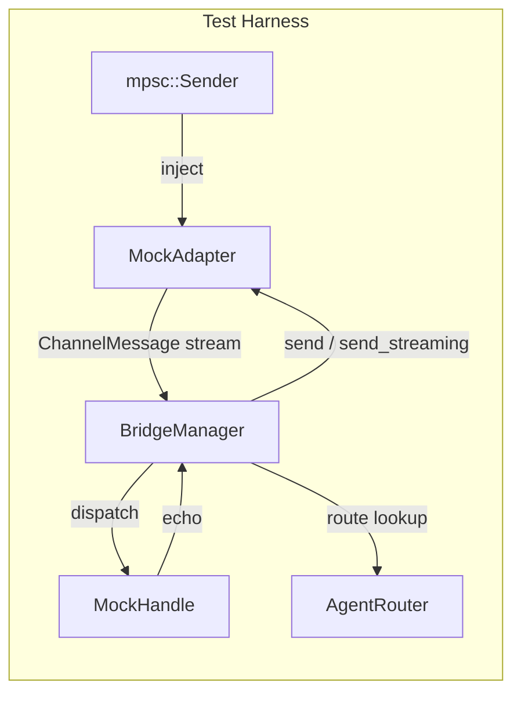

# Other — librefang-channels-tests

# librefang-channels — Bridge Integration Tests

## Purpose

End-to-end integration tests for the `BridgeManager` dispatch pipeline. Tests exercise the full message lifecycle — from adapter ingestion through agent routing to response delivery — using in-process mock components. No external services are contacted; all communication flows through real tokio channels and tasks.

## Architecture



Each test constructs a `BridgeManager` with a mock `ChannelBridgeHandle` (kernel) and one or more mock `ChannelAdapter`s, wires them together, injects messages via `mpsc::Sender`, and polls for delivery using `wait_until`.

## Test Infrastructure

### `wait_until(label, condition)`

Deadline-bounded polling helper (2-second budget, 5ms poll interval). Replaces fixed `sleep()` calls so tests:

- Succeed as fast as the pipeline allows
- Fail quickly on regression (no 2-second waits on success)
- Remain stable on slow CI runners

### Message Constructors

| Function | Purpose |
|---|---|
| `make_text_msg(channel, user_id, text)` | Builds a `ChannelMessage` with `ChannelContent::Text` |
| `make_command_msg(channel, user_id, cmd, args)` | Builds a `ChannelMessage` with `ChannelContent::Command` |

### Mock Adapters

| Struct | Streaming | `send_streaming` | Purpose |
|---|---|---|---|
| `MockAdapter` | No | N/A | Basic text/interactive response capture |
| `MockStreamingAdapter` | Yes (`supports_streaming() → true`) | Collects deltas into `streamed` | Tests streaming dispatch path |
| `MockFailingStreamingAdapter` | Yes | Always returns `Err` | Exercises fallback after transport failure |
| `NotifyingAdapter` | No | N/A | Exposes `notification_recipients()` and `account_id()` for approval listener tests |

All adapters follow the same creation pattern:

```rust
let (adapter, sender) = MockAdapter::new("name", ChannelType::Telegram);
```

The `sender` injects `ChannelMessage`s into the adapter's inbound stream. Responses are captured and read via `adapter.get_sent()` or `adapter.get_streamed()`.

### Mock Kernel Handles

| Struct | Key Behavior |
|---|---|
| `MockHandle` | Echoes messages: `send_message → "Echo: {message}"`. Serves agent lists and name lookups. |
| `MockStreamingHandle` | Emits word-by-word deltas via `send_message_streaming`. |
| `MockProgressHandle` | Emits `🔧 tool_name` progress lines via `send_message_streaming_with_sender_status`. |
| `MockKernelErrorHandle` | Emits partial text then reports `Err("rate limit hit")` on status oneshot. |
| `MockKernelOkHandle` | Emits clean text, reports `Ok(())` on status oneshot. Captures `record_delivery` calls for metric assertion. |
| `EventBusHandle` | Exposes a real `tokio::broadcast` channel as `subscribe_events()` for approval listener tests. |

## Test Categories

### 1. Basic Dispatch Pipeline

| Test | What It Verifies |
|---|---|
| `test_bridge_dispatch_text_message` | Text message routed to correct agent via `AgentRouter`, echo response delivered back through adapter |
| `test_bridge_dispatch_agents_command` | `/agents` command returns list of running agent names |
| `test_bridge_dispatch_help_command` | `/help` command returns help text mentioning `/agents` and `/agent` |
| `test_bridge_dispatch_agent_select_command` | `/agent <name>` updates router and confirms selection to user |
| `test_bridge_dispatch_no_agent_assigned` | Unrouted message produces "No agents available" error |
| `test_bridge_dispatch_slash_command_in_text` | `/agents` embedded in plain text (not `Command` variant) is recognized and handled |
| `test_bridge_dispatch_status_command` | `/status` returns agent count |

### 2. Lifecycle and Multi-Adapter

| Test | What It Verifies |
|---|---|
| `test_bridge_manager_lifecycle` | Start → 5 sequential messages → stop completes without hanging |
| `test_bridge_multiple_adapters` | Two adapters (Telegram + Discord) run simultaneously in one `BridgeManager`, responses route to the correct adapter |

### 3. Streaming Dispatch

Tests for the streaming vs. non-streaming response paths:

| Test | What It Verifies |
|---|---|
| `test_bridge_streaming_adapter_uses_send_streaming` | Streaming-capable adapter receives `send_streaming` (not `send`) |
| `test_bridge_non_streaming_adapter_falls_back_to_send` | Non-streaming adapter uses `send()` even when kernel supports streaming |
| `test_default_send_streaming_collects_and_sends` | Default `send_streaming` impl on `ChannelAdapter` collects all deltas then calls `send()` |
| `test_bridge_non_streaming_adapter_sees_progress_markers` | Non-streaming adapter receives `🔧` progress markers in consolidated reply (V2 contract) |
| `test_bridge_streaming_adapter_kernel_and_transport_both_fail` | When `send_streaming` Err + kernel Err, fallback delivers buffered text with progress markers preserved |
| `test_bridge_streaming_adapter_kernel_ok_transport_fail_records_clean_success` | **Bug 1 fix**: `send_streaming` Err + kernel Ok records `record_delivery(success=true, err=None)` — transport error must not leak into metrics |

### 4. Approval Listener

Regression tests for `BridgeManager::start_approval_listener`, which subscribes to kernel `Event::ApprovalRequested` events and delivers notifications to channel adapters.

#### Core Delivery

| Test | What It Verifies |
|---|---|
| `test_approval_listener_delivers_to_configured_recipients` | Approval event reaches adapters with configured `notification_recipients()` |
| `test_approval_listener_skips_adapter_without_recipients` | Empty recipient list produces no `send()` calls |

#### Agent Scoping (#4985 / #4994)

Pre-#4985, every approval was broadcast to every adapter's recipients regardless of which agent triggered it. The fix scopes delivery through `AgentRouter` bindings.

| Test | What It Verifies |
|---|---|
| `test_approval_listener_scopes_delivery_to_requesting_agent_adapter` | Two account-qualified Telegram bots bound to different agents; approval for agent A only reaches bot A |
| `test_approval_listener_skips_unbound_adapter` | Adapter with no router binding is suppressed, not leaked to |
| `test_approval_listener_drops_malformed_agent_id` | Non-UUID `agent_id` on event drops notification (defense-in-depth) |
| `test_approval_listener_does_not_fall_back_from_qualified_to_bare_key` | Account-qualified adapter (`telegram:bot-b`) must NOT fall back to bare key (`telegram`) when qualified lookup returns `None` |
| `test_approval_listener_scopes_to_non_telegram_multibot_adapter` | Scoping works for any channel type (tested with `ChannelType::Discord`) |

#### Binding-Aware Fallback (#5002)

When an adapter has no `channel_default` (i.e., `default_agent = None` on the adapter), the listener falls back to `AgentRouter::bound_recipients_for_agent` to find delivery targets from `AgentBinding` entries.

| Test | What It Verifies |
|---|---|
| `test_approval_listener_falls_back_to_agent_binding_when_default_unset` | Adapter with `default_agent = None` + `AgentBinding` targeting agent X delivers approval to bound chat |
| `test_approval_listener_binding_fallback_does_not_leak_cross_agent` | Approval for unbound agent Y does not deliver (no regression of #4985) |
| `test_approval_listener_fans_out_to_all_bound_chats` | Agent bound to two chats receives notification in both |
| `test_approval_listener_skips_binding_with_no_peer_id` | Channel-only bindings (no `peer_id`) are skipped — no send to empty `platform_id` |
| `test_approval_listener_binding_respects_account_id_scope` | Binding scoped to `account_id=bot-a` does not fire on `bot-b` |

## Writing New Tests

Follow the established pattern:

1. **Create a mock handle** with the agents you need:
   ```rust
   let handle = Arc::new(MockHandle::new(vec![(agent_id, "my-agent".into())]));
   ```

2. **Create and configure a router**:
   ```rust
   let router = Arc::new(AgentRouter::new());
   router.set_user_default("user1".into(), agent_id);
   ```

3. **Create a mock adapter**:
   ```rust
   let (adapter, tx) = MockAdapter::new("test", ChannelType::Telegram);
   let adapter_ref = adapter.clone();
   ```

4. **Wire up BridgeManager**:
   ```rust
   let mut manager = BridgeManager::new(handle, router);
   manager.start_adapter(adapter).await.unwrap();
   ```

5. **Inject messages and poll**:
   ```rust
   tx.send(make_text_msg(ChannelType::Telegram, "user1", "hello")).await.unwrap();
   wait_until("description", || !adapter_ref.get_sent().is_empty()).await;
   ```

6. **Assert and clean up**:
   ```rust
   let sent = adapter_ref.get_sent();
   assert_eq!(sent[0].1, "Echo: hello");
   manager.stop().await;
   ```

For approval listener tests, use `EventBusHandle` and `NotifyingAdapter`, call `manager.start_approval_listener().await`, wait for `event_tx.receiver_count() >= 1` before emitting events, then poll the adapter's `get_sent()`.

## Dependencies on Production Code

| Crate | Types Used |
|---|---|
| `librefang_channels::bridge` | `BridgeManager`, `ChannelBridgeHandle` |
| `librefang_channels::router` | `AgentRouter` |
| `librefang_channels::types` | `ChannelAdapter`, `ChannelMessage`, `ChannelContent`, `ChannelType`, `ChannelUser`, `SenderContext` |
| `librefang_types::agent` | `AgentId` |
| `librefang_types::event` | `Event`, `EventPayload`, `EventTarget`, `ApprovalRequestedEvent` |
| `librefang_types::config` | `AgentBinding`, `BindingMatchRule` |