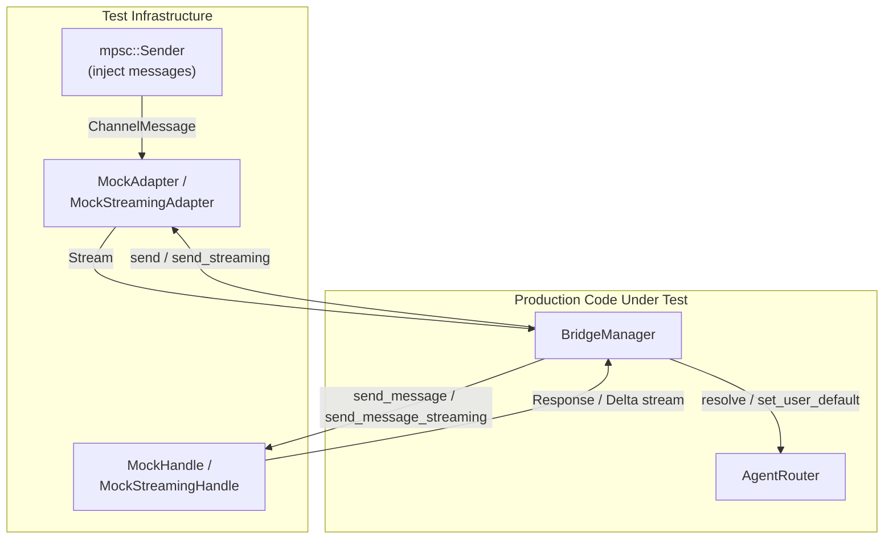

# Other — librefang-channels-tests

# librefang-channels — Bridge Integration Tests

## Overview

The `bridge_integration_test.rs` module provides end-to-end integration tests for the `BridgeManager` dispatch pipeline in `librefang-channels`. Every test runs entirely in-process using real `tokio` channels and tasks — no external services, no network calls. The strategy is to substitute production components with focused mocks that are wired through the **real** `BridgeManager`, `AgentRouter`, and message-dispatch logic.

## Architecture



Each test follows the same pattern:

1. **Create mocks** — a `ChannelAdapter` implementation and a `ChannelBridgeHandle` implementation, each tailored to the scenario.
2. **Wire the router** — optionally pre-route users to agents via `AgentRouter::set_user_default`.
3. **Instantiate `BridgeManager`** with the mock handle and router, then call `start_adapter`.
4. **Inject messages** through the `mpsc::Sender` returned by the mock adapter constructor.
5. **Sleep briefly** to let the async dispatch loop process (typically 100–300ms).
6. **Assert** on captured outputs (sent text, streamed text, delivery metrics).

## Mock Components

### Channel Adapters

All adapters implement `ChannelAdapter` and capture outbound responses for test inspection.

| Mock | `supports_streaming` | `send_streaming` behavior | Purpose |
|---|---|---|---|
| `MockAdapter` | `false` (default) | Default impl (collects deltas → `send`) | Basic non-streaming channels (Discord, Slack, Matrix) |
| `MockStreamingAdapter` | `true` | Collects deltas into `streamed` vec | Streaming-capable channels (Telegram) |
| `MockFailingStreamingAdapter` | `true` | Drains deltas then returns `Err` | Tests fallback when transport fails mid-stream |

Each adapter constructor returns `(Arc<Self>, mpsc::Sender<ChannelMessage>)`. The sender is the injection point for test messages.

### Kernel Handles

All handles implement `ChannelBridgeHandle`.

| Mock | Streaming support | Key behavior |
|---|---|---|
| `MockHandle` | `send_message` only | Echoes `"Echo: {message}"`, records received messages |
| `MockStreamingHandle` | `send_message_streaming` | Emits echo response word-by-word as deltas |
| `MockProgressHandle` | `send_message_streaming_with_sender_status` | Emits `🔧 tool_name` progress line + prose, returns success status |
| `MockKernelErrorHandle` | `send_message_streaming_with_sender_status` | Emits progress deltas, then reports kernel error via status oneshot |
| `MockKernelOkHandle` | `send_message_streaming_with_sender_status` + `record_delivery` | Emits clean text, reports success, logs all `record_delivery` calls as `(bool, Option<String>)` |

## Test Helpers

### `make_text_msg`

```rust
fn make_text_msg(channel: ChannelType, user_id: &str, text: &str) -> ChannelMessage
```

Constructs a `ChannelMessage` with `ChannelContent::Text`. Sets reasonable defaults for all other fields (`platform_message_id: "msg1"`, `display_name: "TestUser"`, `is_group: false`, empty metadata).

### `make_command_msg`

```rust
fn make_command_msg(
    channel: ChannelType,
    user_id: &str,
    cmd: &str,
    args: Vec<&str>,
) -> ChannelMessage
```

Constructs a `ChannelMessage` with `ChannelContent::Command { name, args }`. Used for testing slash-command dispatch (`/agents`, `/help`, `/agent`, `/status`).

## Test Cases

### Basic Dispatch

| Test | What it verifies |
|---|---|
| `test_bridge_dispatch_text_message` | A text message from a pre-routed user reaches the correct agent; the echo response is delivered back through the adapter to the correct `platform_id`. |
| `test_bridge_dispatch_no_agent_assigned` | An unrouted user receives a `"No agents available"` error message instead of a silent drop. |
| `test_bridge_dispatch_slash_command_in_text` | Plain text starting with `/` (e.g., `"/agents"`) is detected and dispatched as a command, even when sent as `ChannelContent::Text`. |

### Command Handling

| Test | Command | Expected behavior |
|---|---|---|
| `test_bridge_dispatch_agents_command` | `/agents` | Response lists all registered agent names (e.g., `"coder"`, `"researcher"`). |
| `test_bridge_dispatch_help_command` | `/help` | Response mentions `/agents` and `/agent`. |
| `test_bridge_dispatch_agent_select_command` | `/agent coder` | Confirms selection (`"Now talking to agent: coder"`), updates the router so subsequent `resolve` calls return the chosen agent. |
| `test_bridge_dispatch_status_command` | `/status` | Reports running agent count (e.g., `"2 agent(s) running"`). |

### Lifecycle and Multi-Adapter

| Test | What it verifies |
|---|---|
| `test_bridge_manager_lifecycle` | Start → send 5 messages → receive 5 echo responses → stop without hanging. Validates ordering and completeness of sequential dispatch. |
| `test_bridge_multiple_adapters` | Two adapters (Telegram + Discord) registered on the same `BridgeManager`. Each receives messages only for its own channel, and responses route back correctly. |

### Streaming Dispatch

| Test | What it verifies |
|---|---|
| `test_bridge_streaming_adapter_uses_send_streaming` | When both the adapter and handle support streaming, `send_streaming` is called (not `send`). The streamed output contains the echo text. |
| `test_bridge_non_streaming_adapter_falls_back_to_send` | When the adapter does not support streaming but the handle does, the bridge falls back to the non-streaming `send` path. |
| `test_default_send_streaming_collects_and_sends` | The default `ChannelAdapter::send_streaming` implementation (which non-streaming adapters inherit) collects all deltas from the receiver and calls `send` with the assembled text. |

### Progress Markers and Error Paths

These tests exercise the V2/V3 dispatch pipeline that routes streaming-with-status through non-streaming adapters and handles failure cascades.

| Test | Scenario | Expected outcome |
|---|---|---|
| `test_bridge_non_streaming_adapter_sees_progress_markers` | Non-streaming adapter + handle that emits `🔧 tool_name` progress via `send_message_streaming_with_sender_status` | Progress markers and post-tool prose appear in the consolidated `send` response. |
| `test_bridge_streaming_adapter_kernel_and_transport_both_fail` | Streaming adapter whose `send_streaming` always errors + handle that reports kernel error | Fallback `send` delivers buffered partial text including progress markers. |
| `test_bridge_streaming_adapter_kernel_ok_transport_fail_records_clean_success` | Failing streaming adapter + handle that reports kernel success | `record_delivery` is called with `(success=true, err=None)`. The transport-side stream error does not leak into the error field. |

## Relationship to Production Code

```
bridge_integration_test.rs
  ├── BridgeManager      ← librefang-channels/src/bridge.rs
  ├── AgentRouter        ← librefang-channels/src/router.rs
  ├── ChannelAdapter     ← librefang-channels/src/types.rs
  ├── ChannelBridgeHandle ← librefang-channels/src/bridge.rs
  ├── ChannelMessage     ← librefang-channels/src/types.rs
  ├── ChannelContent     ← librefang-channels/src/types.rs
  ├── ChannelUser        ← librefang-channels/src/types.rs
  ├── ChannelType        ← librefang-channels/src/types.rs
  ├── AgentId            ← librefang-types/src/agent.rs
  └── SenderContext       ← librefang-channels/src/types.rs
```

The tests exercise these production call paths:

- `BridgeManager::new` → `start_adapter` → internal dispatch loop → `stop`
- `AgentRouter::set_user_default` and `AgentRouter::resolve`
- `ChannelBridgeHandle::send_message`, `send_message_streaming`, `send_message_streaming_with_sender_status`, `record_delivery`, `find_agent_by_name`, `list_agents`
- `ChannelAdapter::start`, `send`, `send_streaming`, `supports_streaming`, `stop`

## Adding New Tests

To add a new integration test:

1. **Pick or create a mock**. For most cases, `MockAdapter` + `MockHandle` suffice. For streaming scenarios, use `MockStreamingAdapter` + `MockStreamingHandle`. For error/failure paths, use `MockFailingStreamingAdapter` or create a new handle that returns specific error conditions.

2. **Set up routing**. If the test requires a user to be routed to an agent, call `router.set_user_default(user_id, agent_id)` before creating the `BridgeManager`.

3. **Inject and assert**. Send messages via the `mpsc::Sender`, sleep for 100–300ms, then inspect the adapter's `get_sent()` / `get_streamed()` or the handle's `received` / `deliveries()`.

4. **Clean up**. Always call `manager.stop().await` at the end of the test to tear down spawned tasks.