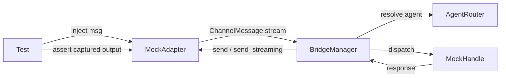

# Other — librefang-channels-tests

# Bridge Integration Tests (`librefang-channels/tests/bridge_integration_test.rs`)

Integration tests for the `BridgeManager` dispatch pipeline. Tests exercise the full message flow — from adapter ingestion through routing, kernel dispatch, and response delivery — using in-process mocks. No external services are contacted.

## Architecture

Every test follows the same pattern:
1. Create a mock handle (kernel side) and an `AgentRouter`.
2. Optionally pre-route users to agents via `router.set_user_default()`.
3. Create a mock adapter (channel side), returning an `mpsc::Sender` for message injection.
4. Construct a `BridgeManager`, call `start_adapter()`, inject messages, sleep briefly, then assert on captured output.
5. Call `manager.stop()` to clean up.

## Mock Adapters

### `MockAdapter`

Basic `ChannelAdapter` implementation. Does **not** support streaming.

| Method | Behavior |
|--------|----------|
| `start()` | Returns a `ReceiverStream` from an injectable `mpsc::Receiver` |
| `send()` | Captures `(platform_id, text)` into `sent: Arc<Mutex<Vec<...>>>` |
| `stop()` | Signals shutdown via `watch::Sender` |

**Construction:** `MockAdapter::new(name, channel_type) → (Arc<Self>, mpsc::Sender<ChannelMessage>)`

The returned sender is used to inject test messages. Call `adapter.get_sent()` to inspect responses delivered through `send()`.

### `MockStreamingAdapter`

Streaming-capable adapter. `supports_streaming()` returns `true`.

| Method | Behavior |
|--------|----------|
| `send_streaming()` | Assembles all deltas from the receiver, captures the full text into `streamed` |
| `send()` | Captures into the separate `sent` buffer |

This separation lets tests assert whether the streaming or non-streaming path was taken. Use `get_streamed()` and `get_sent()` respectively.

### `MockFailingStreamingAdapter`

Claims streaming support but always returns `Err` from `send_streaming()`. Drains the delta channel before failing so the bridge's `buffered_text` is populated for the fallback path. Used to exercise error recovery and metric recording.

## Mock Kernel Handles

All implement `ChannelBridgeHandle`.

### `MockHandle`

Returns `Echo: {message}` from `send_message()`. Maintains a `received` log of `(AgentId, String)` pairs. Agent list is provided at construction.

### `MockStreamingHandle`

Implements `send_message_streaming()` by splitting the echo response into word-by-word deltas over an `mpsc::channel(16)`. Used to verify that streaming adapters receive deltas rather than a single assembled response.

### `MockProgressHandle`

Implements `send_message_streaming_with_sender_status()`. Emits a synthetic progress marker (`🔧 tool_name`) followed by prose text, then reports `Ok(())` via the status oneshot. Tests the V2 contract that non-streaming adapters (Discord, Slack, Matrix) see progress markers in the consolidated response.

### `MockKernelErrorHandle`

Sends partial text deltas then reports `Err("rate limit hit")` on the status oneshot. Exercises the "send_streaming Err + kernel Err" Telegram-path outcome.

### `MockKernelOkHandle`

Kernel succeeds (`Ok(())` on status oneshot). Additionally implements `record_delivery()`, logging each call as `(success: bool, err: Option<String>)` into a `DeliveryLog`. Used to verify the Bug 1 fix: when kernel succeeds, `record_delivery` must be called with `(true, None)` even if the transport-side `send_streaming` fails.

## Helper Functions

### `make_text_msg(channel, user_id, text) → ChannelMessage`

Creates a text message with sensible defaults (platform_message_id: `"msg1"`, display_name: `"TestUser"`, no thread, no metadata).

### `make_command_msg(channel, user_id, cmd, args) → ChannelMessage`

Creates a `ChannelContent::Command` message from a command name and string arguments.

## Test Suite

### Basic Dispatch

| Test | Command / Content | Asserts |
|------|-------------------|---------|
| `test_bridge_dispatch_text_message` | Text: `"Hello agent!"` | Routed agent receives message; adapter receives `Echo: Hello agent!` |
| `test_bridge_dispatch_agents_command` | `/agents` | Response lists all registered agent names |
| `test_bridge_dispatch_help_command` | `/help` | Response mentions `/agents` and `/agent` |
| `test_bridge_dispatch_agent_select_command` | `/agent coder` | Confirmation message sent; `router.resolve()` returns the correct agent |
| `test_bridge_dispatch_no_agent_assigned` | Text (no route) | Error message contains `"No agents available"` |
| `test_bridge_dispatch_slash_command_in_text` | Text: `"/agents"` | Slash-in-text is parsed as a command; agents are listed |
| `test_bridge_dispatch_status_command` | `/status` | Response contains agent count |

### Lifecycle & Multi-Adapter

| Test | What it verifies |
|------|-----------------|
| `test_bridge_manager_lifecycle` | Send 5 messages, receive 5 echo responses in order, stop completes without hanging |
| `test_bridge_multiple_adapters` | Two adapters (Telegram + Discord) run concurrently; each receives only its own responses |

### Streaming Paths

| Test | Configuration | Expected behavior |
|------|--------------|-------------------|
| `test_bridge_streaming_adapter_uses_send_streaming` | Streaming adapter + streaming handle | `send_streaming()` called; `send()` **not** called |
| `test_bridge_non_streaming_adapter_falls_back_to_send` | Non-streaming adapter + streaming handle | `send()` called with assembled response |
| `test_default_send_streaming_collects_and_sends` | Direct call to default `send_streaming` on `MockAdapter` | Deltas assembled into `"Hello world!"` and delivered via `send()` |

### Error & Progress Paths

| Test | Configuration | Expected behavior |
|------|--------------|-------------------|
| `test_bridge_non_streaming_adapter_sees_progress_markers` | `MockProgressHandle` + non-streaming adapter | Response contains `🔧` progress marker and post-tool prose |
| `test_bridge_streaming_adapter_kernel_and_transport_both_fail` | `MockKernelErrorHandle` + `MockFailingStreamingAdapter` | Fallback `send()` delivers buffered text including progress markers |
| `test_bridge_streaming_adapter_kernel_ok_transport_fail_records_clean_success` | `MockKernelOkHandle` + `MockFailingStreamingAdapter` | Fallback delivers text; `record_delivery` called with `(success=true, err=None)` — the transport error must not leak into metrics |

## Key Design Decisions

**100ms–300ms sleeps** are used instead of explicit synchronization. This keeps tests simple but makes them sensitive to system load. The sleeps are intentionally generous for CI environments.

**`Arc<Mutex<Vec<...>>>`** is used for captured output rather than async primitives because the mocks are accessed from both async tasks and synchronous test assertions. The critical sections are trivial (clone/append), so contention is negligible.

**Separate mock structs** rather than a single configurable mock keep each test's intent clear. Reading `MockFailingStreamingAdapter` immediately signals "this adapter fails streaming," whereas a flag-based approach would require tracing flag values back through test setup.