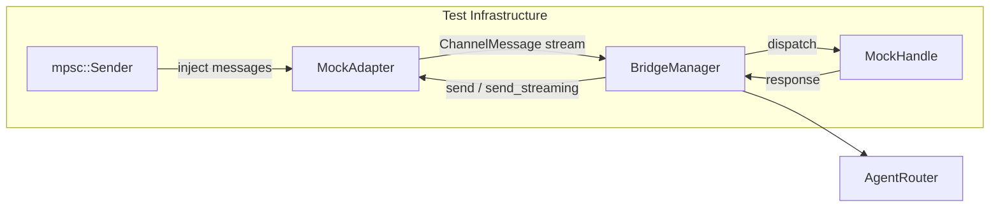

# Other — librefang-channels-tests

# librefang-channels Integration Tests

Bridge dispatch pipeline tests that verify the full message lifecycle from adapter ingestion through routing, agent dispatch, and response delivery — all in-process with no external service dependencies.

## Architecture

The tests wire **real production components** (`BridgeManager`, `AgentRouter`) against **mock implementations** of the two integration boundaries:



- **`ChannelAdapter`** mock — replaces real platform adapters (Telegram, Discord, etc.)
- **`ChannelBridgeHandle`** mock — replaces the real kernel connection

Communication flows through real `tokio` channels and tasks, making these true integration tests rather than unit tests with mocked dependencies.

## Mock Components

### Channel Adapters

| Adapter | Streaming | Behavior |
|---------|-----------|----------|
| `MockAdapter` | No | Echoes responses; captures sent text and interactive button labels |
| `MockStreamingAdapter` | Yes | Implements `send_streaming`; captures streamed deltas separately from non-streaming sends |
| `MockFailingStreamingAdapter` | Yes | `send_streaming` always returns `Err`; drains the delta channel to populate `buffered_text` before failing |

All adapters use an `mpsc::Receiver<ChannelMessage>` as their message source, allowing tests to inject arbitrary messages through a paired `mpsc::Sender`. Sent responses are captured in an `Arc<Mutex<Vec<_>>>` for post-assertion inspection.

### Kernel Handles

| Handle | Key Methods | Behavior |
|--------|-------------|----------|
| `MockHandle` | `send_message` | Returns `Echo: {message}`; records received messages |
| `MockStreamingHandle` | `send_message_streaming` | Splits echo response into word-by-word deltas over `mpsc::Receiver<String>` |
| `MockProgressHandle` | `send_message_streaming_with_sender_status` | Emits progress marker `🔧 tool_name` followed by prose; reports kernel success |
| `MockKernelErrorHandle` | `send_message_streaming_with_sender_status` | Emits partial text + progress, then reports `Err("rate limit hit")` via status oneshot |
| `MockKernelOkHandle` | `send_message_streaming_with_sender_status` + `record_delivery` | Emits clean text, reports `Ok(())`, logs all `record_delivery` calls for metric assertion |

### Message Constructors

- **`make_text_msg(channel, user_id, text)`** — builds a `ChannelMessage` with `ChannelContent::Text`
- **`make_command_msg(channel, user_id, cmd, args)`** — builds a `ChannelMessage` with `ChannelContent::Command`

Both set sensible defaults for unused fields (`platform_message_id: "msg1"`, `is_group: false`, `thread_id: None`).

## Test Coverage

### Basic Dispatch

| Test | What it verifies |
|------|-----------------|
| `test_bridge_dispatch_text_message` | A text message from a pre-routed user reaches the correct agent; the echo response is delivered back to the adapter |
| `test_bridge_dispatch_no_agent_assigned` | An unrouted user receives a "No agents available" error message instead of a silent failure |
| `test_bridge_dispatch_slash_command_in_text` | Plain text starting with `/` (e.g., `"/agents"`) is detected and handled as a command, not forwarded to an agent |

### Command Handling

| Test | Command | Expected behavior |
|------|---------|-------------------|
| `test_bridge_dispatch_agents_command` | `/agents` | Lists all registered agents by name |
| `test_bridge_dispatch_help_command` | `/help` | Returns help text mentioning `/agents` and `/agent` |
| `test_bridge_dispatch_agent_select_command` | `/agent coder` | Confirms selection; updates `AgentRouter` so future messages from that user route to the selected agent |
| `test_bridge_dispatch_status_command` | `/status` | Returns uptime info including running agent count |

### Lifecycle and Multi-Adapter

| Test | What it verifies |
|------|-----------------|
| `test_bridge_manager_lifecycle` | Start → send 5 sequential messages → all 5 echo responses received → clean stop without hanging |
| `test_bridge_multiple_adapters` | Two adapters (Telegram + Discord) run concurrently on the same `BridgeManager`; messages on each adapter receive independent correct responses |

### Streaming Dispatch

| Test | What it verifies |
|------|-----------------|
| `test_bridge_streaming_adapter_uses_send_streaming` | When both adapter and handle support streaming, `send_streaming` is called (not `send`); full streamed text is reassembled |
| `test_bridge_non_streaming_adapter_falls_back_to_send` | When the adapter doesn't support streaming, `send()` is called with the complete response even though the handle provides a streaming API |
| `test_default_send_streaming_collects_and_sends` | The default `send_streaming` implementation on `ChannelAdapter` collects all deltas and forwards the assembled text to `send()` |

### Progress Markers and Error Recovery

| Test | What it verifies |
|------|-----------------|
| `test_bridge_non_streaming_adapter_sees_progress_markers` | Non-streaming adapters (Discord/Slack/Matrix) receive `🔧` progress markers in their consolidated response via the streaming-with-status pipeline |
| `test_bridge_streaming_adapter_kernel_and_transport_both_fail` | When both `send_streaming` and the kernel status report errors, the buffered fallback delivers accumulated partial text including progress markers |
| `test_bridge_streaming_adapter_kernel_ok_transport_fail_records_clean_success` | **Bug 1 regression test**: When kernel succeeds but transport `send_streaming` fails, `record_delivery` is called with `(success=true, err=None)` — the transport stream error must not leak into the metric's error field |

## Test Pattern

Every test follows the same structure:

```rust
// 1. Set up routing
let router = Arc::new(AgentRouter::new());
router.set_user_default("user1".to_string(), agent_id);

// 2. Create mock components
let (adapter, tx) = MockAdapter::new("test", ChannelType::Telegram);
let handle = Arc::new(MockHandle::new(agents));

// 3. Wire through real BridgeManager
let mut manager = BridgeManager::new(handle, router);
manager.start_adapter(adapter).await.unwrap();

// 4. Inject a message
tx.send(make_text_msg(ChannelType::Telegram, "user1", "hello")).await.unwrap();

// 5. Wait for async processing
tokio::time::sleep(Duration::from_millis(100)).await;

// 6. Assert on captured outputs
let sent = adapter_ref.get_sent();
assert_eq!(sent[0].1, "Echo: hello");

// 7. Clean shutdown
manager.stop().await;
```

The `tokio::time::sleep` calls allow the async dispatch loop to process messages. Tests use 100–300ms depending on the number of async steps involved (streaming tests need more time for delta propagation).

## Relationship to Production Code

These tests exercise three production modules end-to-end:

- **`bridge::BridgeManager`** — adapter lifecycle, message dispatch, response delivery, streaming negotiation
- **`router::AgentRouter`** — user-to-agent routing via `set_user_default` and `resolve`
- **`types`** — `ChannelAdapter` trait, `ChannelBridgeHandle` trait, `ChannelMessage`, `ChannelContent`, `ChannelUser`

No production code from this test module is called by other modules — it is purely a verification layer.