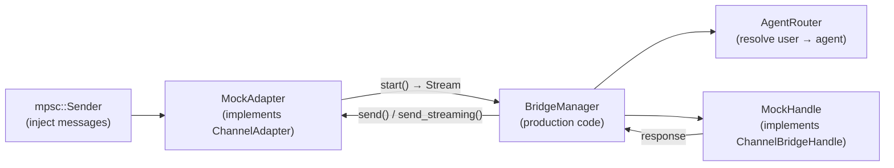

# Other — librefang-channels-tests

# librefang-channels Integration Tests

## Overview

The `bridge_integration_test.rs` module provides end-to-end validation of the `BridgeManager` dispatch pipeline. Tests wire real production components (`BridgeManager`, `AgentRouter`) to mock adapters and kernel handles, verifying the full message lifecycle — from injection through routing, dispatch, and response delivery — entirely in-process via tokio channels. No external services are contacted.

## Architecture



Every test follows this pattern:
1. Create a `MockHandle` (or variant) with known agents.
2. Create an `AgentRouter`, optionally pre-routing users to agents.
3. Create a `MockAdapter` (or variant), obtaining an `mpsc::Sender` for message injection.
4. Construct a `BridgeManager` and call `start_adapter()`.
5. Inject messages via the sender.
6. Poll with `wait_until` until the adapter captures the expected response.
7. Assert on response content and side effects.
8. Call `manager.stop()`.

## Test Infrastructure

### `wait_until` — Condition-Based Polling

```rust
async fn wait_until<F>(label: &str, mut cond: F) where F: FnMut() -> bool
```

Replaces fixed `sleep()` waits with a 2-second deadline-bounded poll loop (5ms interval). Tests fail fast on regression rather than flaking on slow CI runners. The `label` parameter appears in the timeout panic message for quick diagnosis.

**When to use**: Every async assertion in this suite. Never use raw `tokio::time::sleep`.

### Message Constructors

- **`make_text_msg(channel, user_id, text)` → `ChannelMessage`** — Builds a text content message with sensible defaults (single sender, no group, no thread, no metadata).
- **`make_command_msg(channel, user_id, cmd, args)` → `ChannelMessage`** — Builds a `ChannelContent::Command` variant. Used for `/agents`, `/help`, `/agent`, `/status`.

## Mock Adapters

### `MockAdapter`

Basic adapter that captures `send()` calls as `(platform_id, text)` pairs in `self.sent`. The `send()` implementation flattens `Interactive` content button labels into the text for test inspection.

| Method | Behavior |
|--------|----------|
| `new(name, channel_type)` | Returns `(Arc<Self>, mpsc::Sender<ChannelMessage>)`. Use the sender to inject messages. |
| `get_sent()` | Returns a clone of all captured `(platform_id, text)` pairs. |
| `start()` | Converts the `mpsc::Receiver` into a `ReceiverStream`. Can only be called once. |
| `supports_streaming()` | Returns `false`. |

### `MockStreamingAdapter`

Streaming-capable variant that overrides `supports_streaming() → true` and `send_streaming()`. Accumulates streamed deltas into `self.streamed` as `(platform_id, full_text)` pairs. Non-streaming `send()` writes to a separate `self.sent` vector, allowing tests to verify which path was taken.

| Method | Behavior |
|--------|----------|
| `get_streamed()` | Captured streaming deliveries. |
| `get_sent()` | Captured non-streaming deliveries. |
| `send_streaming(user, delta_rx, _thread_id)` | Reads all deltas from `delta_rx`, concatenates, and stores in `streamed`. |

### `MockFailingStreamingAdapter`

Reports `supports_streaming() → true` but `send_streaming()` always returns `Err("simulated transport failure")`. Drains `delta_rx` before failing so the bridge's internal tee task can populate `buffered_text` for the fallback path. Used to exercise error recovery branches.

## Mock Kernel Handles

All implement `ChannelBridgeHandle`. Each variant targets a specific dispatch scenario.

### `MockHandle`

Basic handle. `send_message` records the `(agent_id, message)` in `self.received` and returns `"Echo: {message}"`. Supports `find_agent_by_name`, `list_agents`. `spawn_agent_by_name` returns `Err`.

### `MockStreamingHandle`

Adds `send_message_streaming` which emits the echo response as individual word deltas over an `mpsc::Receiver<String>`. Used to verify that streaming-capable adapters receive deltas token-by-token.

### `MockProgressHandle`

Implements `send_message_streaming_with_sender_status`. Synthesizes a progress marker line (`🔧 tool_name`) followed by prose text — mirroring what `start_stream_text_bridge_with_status` produces in production. Returns a status oneshot reporting `Ok(())`.

### `MockKernelErrorHandle`

Like `MockProgressHandle` but the status oneshot reports `Err("rate limit hit")`. Exercises the path where the kernel fails after streaming partial content.

### `MockKernelOkHandle`

Streaming-with-status handle that emits clean text and reports kernel success (`Ok(())`). Also implements `record_delivery`, logging each call as `(success, Option<error_string>)` into a `DeliveryLog`. Used to verify the Bug 1 fix — that `success=true` is never paired with a non-empty error string.

## Test Suite

### Basic Dispatch

| Test | What it validates |
|------|-------------------|
| `test_bridge_dispatch_text_message` | Text messages route through the pre-configured user→agent mapping, the kernel receives the message, and the echo response is delivered back via `send()`. |
| `test_bridge_dispatch_no_agent_assigned` | Unrouted users receive a "No agents available" message instead of silent failure. |

### Command Dispatch

| Test | What it validates |
|------|-------------------|
| `test_bridge_dispatch_agents_command` | `/agents` lists all running agents by name. |
| `test_bridge_dispatch_help_command` | `/help` returns text mentioning `/agents` and `/agent`. |
| `test_bridge_dispatch_agent_select_command` | `/agent coder` updates the router so subsequent messages from that user route to the selected agent. Verifies both the confirmation message and `router.resolve()` state. |
| `test_bridge_dispatch_status_command` | `/status` returns a message containing the agent count. |
| `test_bridge_dispatch_slash_command_in_text` | Plain text `/agents` (not `ChannelContent::Command`) is still parsed and handled as a command. |

### Lifecycle and Multi-Adapter

| Test | What it validates |
|------|-------------------|
| `test_bridge_manager_lifecycle` | Start, send 5 sequential messages, verify all 5 echo responses arrive in order, then `stop()` completes without hanging. |
| `test_bridge_multiple_adapters` | Two adapters (Telegram + Discord) run simultaneously on the same `BridgeManager`. Messages injected into each adapter produce responses on the correct adapter only. |

### Streaming

| Test | What it validates |
|------|-------------------|
| `test_bridge_streaming_adapter_uses_send_streaming` | When both the adapter and handle support streaming, `send_streaming` is called (not `send()`). The streamed text contains the echo. `sent` remains empty. |
| `test_bridge_non_streaming_adapter_falls_back_to_send` | When the adapter doesn't support streaming, `send()` is used even with a streaming-capable handle. |
| `test_default_send_streaming_collects_and_sends` | The default `send_streaming` implementation on `ChannelAdapter` collects all deltas and calls `self.send()` with the assembled text. Tested by directly invoking the method on a `MockAdapter`. |

### Progress Markers (V2 Contract)

| Test | What it validates |
|------|-------------------|
| `test_bridge_non_streaming_adapter_sees_progress_markers` | Non-streaming adapters (Discord, Slack, etc.) receive progress markers (🔧) as part of the consolidated response text. Verifies the V2 pipeline: `send_message_streaming_with_sender_status` → default `send_streaming` fallback → `send()`. |

### Error Paths

| Test | What it validates |
|------|-------------------|
| `test_bridge_streaming_adapter_kernel_and_transport_both_fail` | When `send_streaming` returns `Err` and the kernel status is also `Err`, the fallback path delivers buffered partial content via `send()`. Progress markers and partial text are preserved. |
| `test_bridge_streaming_adapter_kernel_ok_transport_fail_records_clean_success` | **Bug 1 regression test.** When the kernel succeeds but `send_streaming` fails, the fallback delivers buffered text and `record_delivery` is called with `(success=true, err=None)`. The transport-side stream error must not leak into the err field. |

## Adding New Tests

1. **Choose your mock**: Pick or create a mock adapter/handle combination that produces the behavior you need.
2. **Set up routing**: Call `router.set_user_default(user_id, agent_id)` if the test requires a resolved agent.
3. **Inject messages**: Use `tx.send(make_text_msg(...))` or `make_command_msg(...)`.
4. **Poll for results**: Always use `wait_until` with a descriptive label.
5. **Assert on side effects**: Check `adapter.get_sent()`, `adapter.get_streamed()`, `handle.received`, or `handle.deliveries()` as appropriate.
6. **Clean up**: Call `manager.stop().await`.

## Dependencies on Production Code

| Production type | Usage |
|----------------|-------|
| `BridgeManager` | The system under test. Tests construct it with mocks and call `start_adapter` / `stop`. |
| `AgentRouter` | Real router instance. Tests call `set_user_default` and `resolve` directly. |
| `ChannelAdapter` trait | Implemented by all mock adapters. Tests may call `send_streaming` directly for unit-level verification. |
| `ChannelBridgeHandle` trait | Implemented by all mock handles. Defines the kernel-side contract. |
| `ChannelMessage`, `ChannelUser`, `ChannelContent`, `ChannelType` | Message types from `librefang_channels::types`. |
| `AgentId` | Agent identifier from `librefang_types::agent`. |